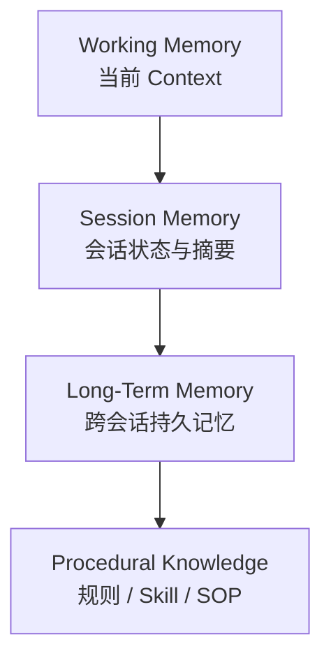
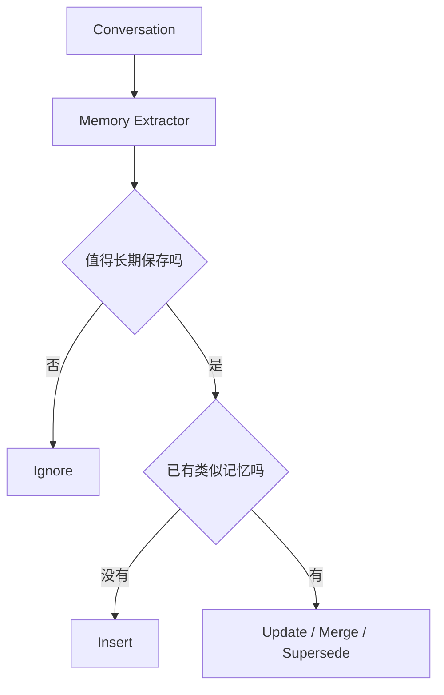
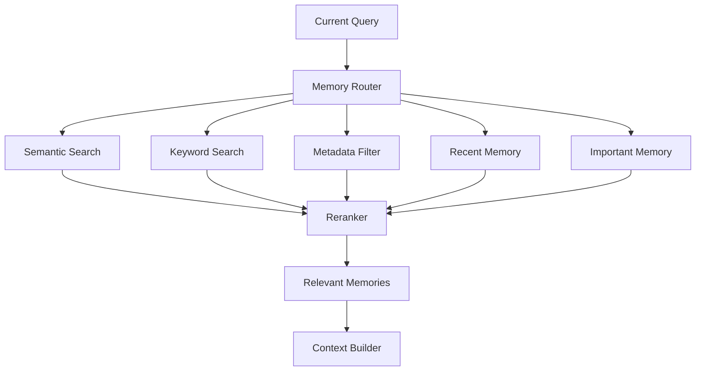
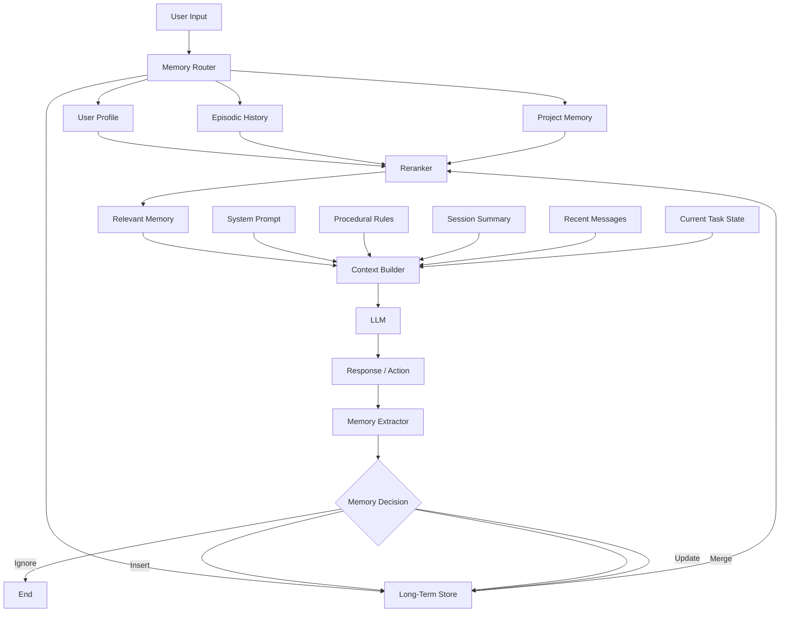

# Agent 长期记忆是如何实现的：从 Context Window 到真正可用的 Memory System

## 一句话理解

**Agent 的长期记忆通常不是“模型自己永久记住了过去”，而是把重要信息存到模型之外，在未来需要时重新检索并注入当前 Context。**

因此：

```text
长期记忆
≠
无限长聊天记录

长期记忆
≈
持久化存储
+
记忆提取
+
检索
+
上下文注入
+
更新与遗忘
```

理解这一点，是理解现代 Agent Memory 的关键。

---

## 为什么不能直接把全部历史对话塞给模型

最直接的记忆方案是：

```text
第 1 轮消息
第 2 轮消息
第 3 轮消息
...
第 1000 轮消息
      ↓
全部塞给 LLM
```

这种方法看起来最简单，但很快会遇到几个问题。

### Context Window 有限

任何模型都有上下文窗口限制。

随着历史增长：

```text
messages ↑
tokens ↑
cost ↑
latency ↑
```

最终一定需要处理旧信息。

### 长 Context 不等于高质量记忆

即使模型能够接收非常长的 Context，也不意味着应该把所有历史全部塞进去。

大量旧内容会带来：

- 无关信息干扰；
- 已过时信息；
- 相互冲突的旧结论；
- 重复内容；
- 更高推理成本；
- 更慢响应。

所以真正的问题不是：

> 如何让 Context 无限长？

而是：

> **如何在当前任务中只提供真正有价值的历史信息？**

这就是 Memory System 与 Context Engineering 的交界处。

---

## Memory 和 Context 是两个不同概念

可以把二者理解成：

```text
Memory
=
系统长期保存了什么

Context
=
这一轮真正给模型看什么
```

例如系统可能保存：

```text
10000 条长期记忆
```

但这一轮只检索：

```text
6 条最相关记忆
```

然后与：

- System Prompt；
- 当前任务；
- 最近对话；
- 相关文件；
- Tool Result；

一起组成最终 Context。

因此，一个成熟 Agent 的目标不是：

```text
让模型看到所有东西
```

而是：

```text
在正确时间
给模型看到正确的信息
```

---

## Agent Memory 的分层模型

一个比较实用的理解方式是把记忆分成多个层次。



实际工程里，这些层通常承担不同职责。

---

## Working Memory：当前正在想什么

Working Memory 可以理解为：

```text
模型当前这一轮真正能够看到的信息
```

包括：

```text
System Prompt
最近消息
当前 Goal
当前 Plan
Tool Result
相关代码
检索出的 Memory
```

它非常像计算机中的：

```text
RAM
```

特点是：

- 访问快；
- 与当前任务高度相关；
- 容量有限；
- 会不断变化。

例如一个 Coding Agent 正在修复登录问题：

```text
Goal:
修复 JWT 登录失败

Current Plan:
1. 检查 Token 生成
2. 检查 Filter
3. 运行测试

Recent Observation:
JwtAuthenticationFilter 返回 401
```

这些都属于当前 Working Memory。

---

## Session Memory：当前会话发生过什么

一次 Agent 会话可能很长：

```text
200 条消息
几十次 Tool Call
数万 Token
```

不可能永久全部保留在 Context 中。

因此常见做法是：

```text
完整历史
   ↓
压缩 / Summarization
   ↓
Session Summary
```

例如：

```text
当前项目：
Tingwu 智能会议系统

已完成：
- 登录注册
- 会议 CRUD
- 状态机

当前正在解决：
- WebSocket 音频推流

关键决策：
- 前后端分离
- 后端 Spring Boot
- 前端 Vue
```

下一轮只需要：

```text
Session Summary
+
Recent Messages
```

而不是重新加载整个历史。

---

## Checkpoint：它和聊天摘要不是一回事

在长任务 Agent 中，还经常存在：

```text
Checkpoint
```

Checkpoint 保存的是：

> Agent 在某一个执行节点上的完整状态快照。

例如：

```json
{
  "task_id": "task-123",
  "status": "executing",
  "current_step": 4,
  "completed_steps": [1, 2, 3],
  "artifacts": ["report.md"],
  "errors": []
}
```

它主要用于：

- 中断恢复；
- Human-in-the-loop；
- 故障恢复；
- 长时间任务；
- 状态回放。

这与“对话摘要”不同。

可以简单理解：

```text
Conversation Summary
=
我们聊过什么

Checkpoint
=
程序现在执行到哪里
```

LangGraph 的 Persistence 设计就是一个很好的工程例子：Checkpointer 用于保存 thread 范围内的状态，而 Store 用于保存跨 thread 的长期信息。

---

## Long-Term Memory：跨会话真正保留下来的信息

例如用户曾经告诉 Agent：

```text
主要使用 Windows + WSL2 开发
常用 VS Code
Java 项目偏好 Maven
图片统一放到 figures/
```

这些信息不应该只存在当前聊天中。

可以持久化成：

```json
{
  "namespace": ["user", "123", "preferences"],
  "key": "development-environment",
  "value": {
    "host": "Windows",
    "dev_environment": "WSL2",
    "ide": "VS Code"
  }
}
```

未来用户说：

```text
帮我创建一个 Python 项目环境。
```

Agent 可以：

```text
当前 Query
   ↓
Memory Retrieval
   ↓
找到：
Windows + WSL2
   ↓
注入 Context
   ↓
回答更符合用户环境
```

用户体验上感觉是：

> Agent 记得我。

工程上实际发生的是：

> 系统重新找到了以前存下来的信息。

---

## 长期记忆的三种核心类型

一种很常见的分类方式是：

```text
Semantic Memory
Episodic Memory
Procedural Memory
```

LangGraph 当前的记忆设计文档也采用了这三类来解释 Agent Long-Term Memory。

---

## Semantic Memory：事实与概念

Semantic Memory 回答的是：

> **我知道什么？**

例如：

```text
用户使用 WSL2
用户偏好 VS Code
项目使用 Spring Boot
数据库是 MySQL
服务器使用 Ubuntu
```

它适合保存：

- 用户事实；
- 偏好；
- 项目信息；
- 稳定配置；
- 领域事实。

---

### Profile 模式

一种实现方式是保存完整 Profile：

```json
{
  "user": {
    "development": {
      "host": "Windows",
      "environment": "WSL2",
      "ide": "VS Code"
    },
    "preferences": {
      "java_build": "Maven"
    }
  }
}
```

优点：

```text
结构集中
读取简单
```

缺点：

```text
每次更新可能需要修改整个 Profile
结构越来越大
并发修改复杂
```

---

### Collection 模式

另一种方式是保存原子记忆：

```text
Memory 001
用户主要使用 WSL2。

Memory 002
用户常用 VS Code。

Memory 003
Java 项目优先使用 Maven。
```

优点：

```text
容易新增
容易检索
容易局部更新
```

缺点：

```text
容易重复
容易冲突
需要更好的检索和合并
```

实际系统经常同时使用：

```text
Profile
+
Atomic Memory Collection
```

---

## Episodic Memory：过去经历过什么

Episodic Memory 回答：

> **以前发生过什么？**

例如：

```text
问题：
Nginx WebSocket 代理失败

现象：
WebSocket Upgrade 不成功

原因：
缺少必要的代理配置

最终处理：
增加 HTTP/1.1 和 Upgrade / Connection 配置
```

未来再次遇到：

```text
WebSocket connection failed
```

Agent 可以检索过去类似经历：

```text
Current Problem
      ↓
Episodic Search
      ↓
找到历史排错经验
      ↓
作为参考案例
      ↓
检查类似原因
```

这很像：

```text
“从经验中学习”
```

但要注意：

这里通常没有重新训练模型。

真正发生的是：

```text
经验被保存
+
未来重新检索
```

---

## Procedural Memory：应该怎么做

Procedural Memory 回答：

> **我应该按照什么规则做事？**

例如：

```text
AGENTS.md
CLAUDE.md
GEMINI.md
Coding Rules
SOP
Skills
System Prompt
```

假设 `AGENTS.md` 写：

```text
所有图片必须统一放入 figures/<note-slug>/
```

Agent 每次工作前读取该规则：

```text
AGENTS.md
    ↓
Context
    ↓
Agent Behavior
```

这就是一种非常典型的：

```text
外部程序性长期记忆
```

与 Vector Memory 相比，这类规则有一个巨大优势：

```text
它是确定性加载的
```

而不是：

```text
“可能检索出来”
```

因此，对于：

- Coding Rules；
- 项目规范；
- 安全规则；
- 写作规范；
- 部署 SOP；

通常更适合：

```text
显式配置文件 / Skills
```

而不是只扔进向量数据库。

---

## 什么东西值得进入长期记忆

这是 Agent Memory 最难的问题之一。

最粗糙的方法是：

```text
用户说一句
   ↓
永久保存
```

这种系统很快会产生大量垃圾：

```text
今天吃了什么
临时计划
已失效配置
重复事实
错误推测
聊天寒暄
```

因此需要：

```text
Memory Extractor
```

一个典型流程：



判断维度可以包括：

```text
稳定性
重要性
未来复用概率
置信度
是否明确表达
是否属于用户偏好
是否属于关键决策
```

例如：

```text
“今天中午吃了拉面”
```

通常没有长期价值。

但：

```text
“以后我的 Java 项目统一使用 Maven”
```

明显更值得保存。

---

## Memory Write：什么时候写入

主要有两种策略。

### Hot Path

在当前交互过程中立即写入。

```text
用户输入
   ↓
Agent 判断
   ↓
Memory Upsert
   ↓
当前回答
```

优点：

```text
立即生效
```

缺点：

```text
增加延迟
增加 Token
可能误记
```

---

### Background Consolidation

主任务完成后再整理。

```text
Conversation
      ↓
Background Memory Job
      ↓
总结
去重
合并
冲突处理
重要性判断
      ↓
Long-Term Store
```

优点：

```text
不阻塞主流程
可以整体判断
更适合批量整理
```

缺点：

```text
新记忆不会立即生效
实现更复杂
```

实际系统可以组合：

```text
高置信度重要信息
→ Hot Path

普通历史
→ 后台 Consolidation
```

---

## Memory Retrieval：为什么不能只有 Vector Search

早期常见方案：

```text
Query
   ↓
Embedding
   ↓
Vector DB
   ↓
Top K
```

这只是最基本的 RAG Memory。

成熟系统应该考虑：

```text
语义相似度
关键词匹配
Memory Type
User Scope
Project Scope
时间
重要性
置信度
实体关系
```

一个更完整的流程：



例如用户问：

```text
我的 tools 项目之前怎么部署的？
```

除了语义相似，还应该考虑：

```text
user_id
project = tools
memory_type = project
time
```

否则可能检索出另一个项目的部署经验。

---

## Memory Scope：必须避免串项目

成熟系统必须有：

```text
Memory Namespace
```

例如：

```text
user/<user-id>

user/<user-id>/project/zglab-daily

user/<user-id>/project/tingwu

organization/<org-id>

agent/<agent-id>
```

这样才能避免：

```text
Project A 的记忆
错误影响
Project B
```

对于个人知识库尤其重要。

例如：

```text
道路材料论文
```

和：

```text
Java 软件开发
```

即使属于同一个用户，也不应该默认混成同一份项目上下文。

---

## Memory Conflict：旧记忆和新记忆冲突怎么办

假设：

旧记忆：

```text
主要使用 Qoder。
```

新信息：

```text
现在主要使用 Codex。
```

错误做法：

```text
Memory 1：主要使用 Qoder
Memory 2：主要使用 Codex
```

以后随机检索。

正确做法应该支持：

```text
Create
Update
Merge
Supersede
Delete
```

例如：

```json
{
  "content": "当前主要使用 Codex",
  "valid_from": "2026-07",
  "supersedes": "memory-017"
}
```

而旧信息保留为历史：

```text
曾主要使用 Qoder
```

于是系统可以区分：

```text
Current State
vs
Historical State
```

---

## Forgetting：成熟记忆系统必须会忘

长期记忆不是：

```text
只增不减
```

否则几年后会积累：

- 无效信息；
- 重复信息；
- 过时事实；
- 冲突版本；
- 无意义细节。

因此可以建立：

```text
Decay
Archive
Merge
Delete
```

一些可参考的信号：

```text
长期未使用
重要性低
被新记忆替代
已经明确失效
用户主动要求删除
```

这里尤其要注意：

> **用户主动删除记忆，应具有最高优先级。**

---

## Memory 和 Knowledge Base 不要混淆

例如：

```text
Memory：
用户当前使用 Spring Boot 3。

Knowledge：
Spring Boot 官方文档。
```

两者不同。

Memory 更偏：

```text
这个用户
这个 Agent
这个项目
过去发生过什么
```

Knowledge Base 更偏：

```text
外部世界知识
文档
代码库
论文
规范
```

它们都可能使用：

```text
Vector Search
```

但数据语义完全不同。

---

## 一个完整的 Agent Memory Architecture



这个图里最值得注意的是：

```text
Memory 不是一个 Vector DB
```

Vector DB 只是其中一个组件。

真正的 Memory System 至少还包含：

```text
Write Policy
Retrieval
Scope
Reranking
Conflict Resolution
Lifecycle
Context Injection
```

---

## 一个适合个人 Notes + Agent 的记忆方案

假设有：

```text
notes/
├── agents.md
├── knowledge/
├── problems/
├── projects/
├── conversations/
└── daily/
```

其实已经天然具备一种：

```text
Human-readable Long-Term Memory
```

可以进一步设计为：

```text
AGENTS.md
    ↓
Procedural Memory

knowledge/
    ↓
Semantic Knowledge

problems/
    ↓
Episodic Problem-solving Memory

projects/
    ↓
Project Memory

conversations/
    ↓
Learning / Interaction Memory

daily/
    ↓
Raw Short-term Records
```

然后让 Agent：

```text
Daily / Conversation Raw Notes
       ↓
定期整理
       ↓
Problems / Knowledge / Projects
       ↓
索引
       ↓
未来检索
```

这比单纯把所有聊天历史扔进向量库更容易：

- 阅读；
- 修改；
- 审计；
- Git 管理；
- 迁移博客；
- 人工纠错。

---

## 常见误区

### 误区一：Memory 就是 Vector DB

Vector DB 是：

```text
检索工具
```

不是完整 Memory System。

Memory 还需要：

```text
写什么
何时写
怎么更新
如何冲突处理
什么时候删除
如何控制 Scope
```

---

### 误区二：Context 越长，记忆越好

不一定。

真正重要的是：

```text
Relevant Context
```

而不是：

```text
Maximum Context
```

---

### 误区三：所有信息都应该自动记忆

这是危险的。

容易导致：

- 隐私问题；
- 垃圾记忆；
- 错误长期传播；
- 过时信息影响决策。

成熟系统必须：

```text
Selective Memory
```

---

### 误区四：项目规则适合放 Vector DB

例如：

```text
禁止提交 Secret
所有图片统一放 figures/
必须运行测试
```

这种确定性规则更适合：

```text
AGENTS.md
System Prompt
Policy
Skill
```

而不是依赖“能不能搜出来”。

---

## 总结

理解 Agent Memory，可以记住这个类比：

```text
LLM Context
≈
RAM

Session Summary
≈
Working Set

Checkpoint
≈
程序状态快照

Long-Term Memory Store
≈
持久化数据库

Search Index
≈
索引系统

AGENTS.md / Skills
≈
程序性规则

Memory Manager
≈
记忆管理器
```

未来真正强大的 Agent，不一定依赖无限增长的 Context。

更合理的方向是：

```text
有限但高质量的 Context
+
大量外部长期记忆
+
准确的 Retrieval
+
自动整理
+
冲突处理
+
遗忘机制
```

最终目标可以概括为一句话：

> **该记住的长期记住，该忘掉的及时忘掉，需要的时候恰好能够想起来。**

这才是 Agent 长期记忆真正困难、也真正有价值的地方。

---

## 延伸阅读

- [LangChain / LangGraph Memory Overview](https://docs.langchain.com/oss/python/concepts/memory)，访问于 2026-07-24。
- [LangGraph Persistence](https://docs.langchain.com/oss/python/langgraph/persistence)，访问于 2026-07-24。
