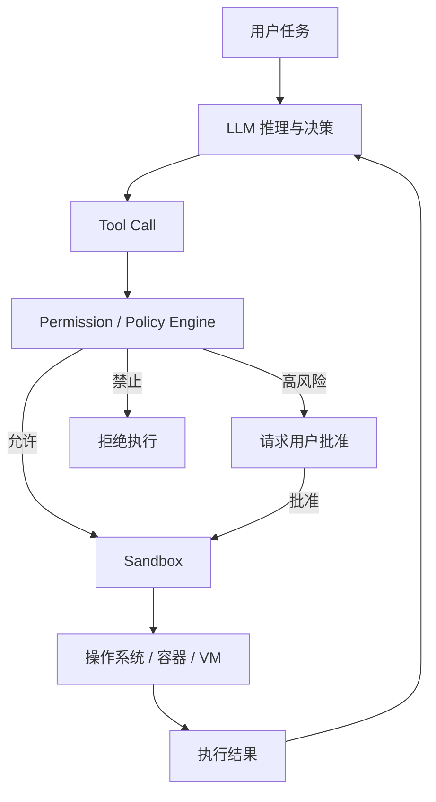
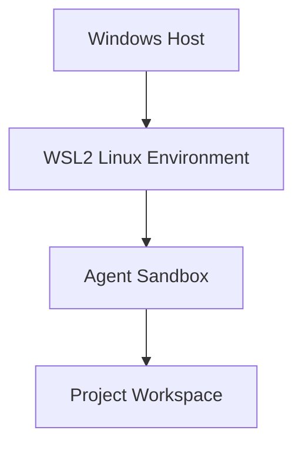
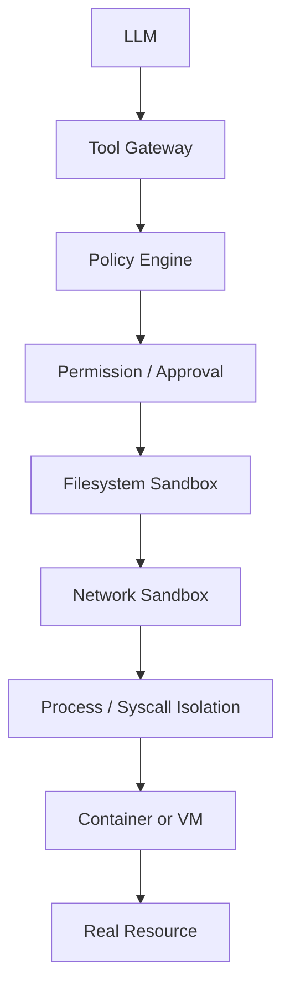

# AI Agent 的沙箱机制：模型为什么能执行命令，却不能随意控制你的电脑

## 一句话理解

**Agent 沙箱的本质，是在大模型和真实操作系统之间增加一道由操作系统、容器或虚拟机强制执行的安全边界。**

大模型可以“提出”要运行什么命令，但它最终能够读哪些文件、写哪些目录、访问哪些网络、调用哪些系统能力，不应该由模型自己决定，而应该由沙箱和权限系统决定。

可以先记住一个最重要的关系：

```text
LLM 负责决定“想做什么”
Tool 负责把意图转成操作
Permission 负责判断“允不允许做”
Sandbox 负责保证“即使想越界，也做不到”
```

这也是理解现代 Coding Agent 安全机制的起点。

---

## 为什么 Agent 必须有沙箱

普通聊天模型的输出通常只是文本：

```text
用户 → LLM → 文本回答
```

即使模型回答错误，影响通常停留在“给出了错误信息”这一层。

但 Agent 不一样。一个具备工具能力的 Coding Agent 可能拥有：

- 读取和修改文件；
- 执行 Shell 命令；
- 安装软件包；
- 调用 Git；
- 访问网络；
- 启动浏览器；
- 操作数据库；
- 调用外部 API；
- 连接 MCP Server；
- 部署应用。

于是系统从：

```text
“模型说错一句话”
```

升级成了：

```text
“模型可能真的执行一个错误操作”
```

例如，一个未经约束的 Agent 理论上可能尝试执行：

```bash
rm -rf <some-path>
```

也可能读取：

```text
~/.ssh/
~/.aws/
.env
云服务器凭据
公司内部配置
```

甚至通过网络把敏感信息发送出去。

因此，成熟 Agent 的安全不能建立在一句 Prompt 上：

> 请不要删除重要文件。

Prompt 只能约束模型行为倾向，**不能作为真正的安全边界**。

真正可靠的限制必须落到操作系统、容器、虚拟机和权限策略上。

---

## 核心概念：Agent 并不是直接控制操作系统

一个典型 Agent 的执行链路可以抽象为：



关键点在于：

**LLM 不是最终权限拥有者。**

例如模型可能产生：

```text
我需要读取 ~/.ssh/id_rsa
```

但 Tool Gateway 和 Sandbox 可以直接拒绝：

```text
Permission denied
```

所以一个成熟系统应该做到：

```text
模型的意图 ≠ 系统最终允许的行为
```

---

## 沙箱主要限制什么

### 1. 文件系统

最常见的策略是：

```text
项目工作区
├── src/           可读写
├── tests/         可读写
├── package.json   可读写
└── .git/          可能受额外限制

工作区之外
├── ~/.ssh/        禁止或受限
├── ~/.aws/        禁止或受限
├── /etc/          只读或禁止
└── 其他项目        默认不可写
```

这种设计体现的是一个重要原则：

> **最小权限原则（Least Privilege）**

Agent 完成当前任务需要什么，就只开放什么。

例如让 Agent 修改当前项目代码，一般没有必要同时给它整个 Home 目录的写权限。

---

### 2. 进程和系统调用

Agent 执行：

```bash
npm test
python script.py
mvn test
```

表面上只是启动程序，但程序最终都需要通过系统调用与 Linux 内核交互，例如：

```text
open()
read()
write()
socket()
connect()
mount()
ptrace()
```

Linux 可以通过 `seccomp` 等机制限制允许调用的系统能力。

可以粗略理解为：

```text
程序
  ↓
系统调用
  ↓
seccomp 过滤
  ↓
Linux Kernel
```

某些正常操作可以允许：

```text
read
write
open
```

某些危险能力则可以限制：

```text
mount
ptrace
特权相关 syscall
```

因此，安全边界不是“AI 记得不能调用”，而是：

> **操作系统内核真正不允许它调用。**

---

### 3. 网络

文件隔离做得再好，如果 Agent 可以任意访问网络，仍然存在明显风险。

例如：

```text
读取敏感数据
      ↓
访问任意公网地址
      ↓
发送出去
```

因此现代沙箱通常还会控制：

```text
Agent
├── github.com        允许
├── npmjs.com         允许
├── pypi.org          允许
├── localhost         默认限制或按需开放
├── 私有网段           默认限制
└── 未授权域名         禁止
```

网络限制经常采用：

- 网络 Namespace；
- Firewall；
- Proxy；
- Domain Allowlist；
- 私有地址阻断。

一个重要原则是：

**“可以运行命令”和“可以任意联网”应该是两个独立权限。**

---

### 4. 资源

Agent 还可能因为错误代码消耗大量资源，例如：

- 无限循环；
- Fork Bomb；
- 内存泄漏；
- 无限生成临时文件；
- 长时间占满 CPU。

容器和云端执行环境通常可以限制：

```text
CPU
Memory
Process Count
Disk
Execution Time
```

这里常见的基础机制之一就是 Linux `cgroups`。

---

## Permission 和 Sandbox 不是一回事

这是非常容易混淆的概念。

假设 Agent 想执行：

```bash
sudo apt install nginx
```

界面弹出：

```text
Agent wants to run this command.

Allow once
Always allow
Deny
```

这属于：

**Permission / Approval System**

它解决的是：

> 这个行为是否需要用户批准？

而 Sandbox 解决的是：

> 即使 Agent 尝试越过边界，系统是否能强制阻止？

二者区别可以概括为：

```text
Permission：
“先问你能不能做。”

Sandbox：
“即使想做，也只能在规定范围内做。”
```

成熟系统通常同时使用二者。

---

## 主流沙箱实现方式

### OS 原生沙箱

这一类方案直接利用操作系统安全能力。

典型机制包括：

```text
Linux Namespace
seccomp
Landlock
Filesystem Permission
macOS Seatbelt
Windows Integrity / ACL / Firewall
```

优点是：

- 启动速度快；
- 与本地开发环境结合自然；
- 不一定需要额外启动完整容器或虚拟机。

缺点是：

- 不同操作系统能力不一致；
- 策略实现复杂；
- 必须正确处理大量边界情况。

---

### Container Sandbox

另一种常见方案是：

```text
Agent Tool
    ↓
Docker / Podman Container
    ↓
挂载指定 Workspace
```

例如：

```text
Host
├── ~/.ssh/                 不挂载
├── personal-files/         不挂载
└── project/                挂载到 Container
        ↓
Container
└── project/                Agent 可操作
```

容器主要依赖：

```text
Namespaces
+
cgroups
+
Capabilities
+
seccomp
+
Mount Isolation
+
Network Namespace
```

它最大的优势是环境隔离清晰，而且非常适合：

- 编译代码；
- 安装依赖；
- 运行不可信程序；
- 构建临时测试环境。

需要注意：

> **Docker 本身不是绝对安全边界。**

如果把下面这些能力直接暴露给容器：

```text
/var/run/docker.sock
宿主机根目录
特权模式 --privileged
高权限设备
敏感凭据
```

容器隔离效果会显著下降。

---

### VM Sandbox

对于更高自治程度的 Agent，一种更强的思路是：

```text
用户任务
    ↓
创建独立 VM
    ↓
Agent 在 VM 中工作
    ↓
任务完成
    ↓
保留结果 / 销毁 VM
```

这种方式适合：

- 长时间自主执行；
- 浏览器操作；
- 大规模代码修改；
- 运行复杂依赖；
- 高风险实验。

因为即使环境被破坏，理论上主要损失的是：

```text
这台临时 VM
```

而不是直接破坏用户真实主机。

代价则是：

- 启动更慢；
- 成本更高；
- 环境管理更复杂。

---

## Tool Sandbox：只隔离真正危险的工具

现代 Agent 还有一种很实用的思路：

```text
Agent 主程序
├── UI                 宿主机
├── Context Manager    宿主机
├── 配置读取            宿主机
└── Shell Tool
       ↓
    Sandbox
```

也就是说：

**不一定把整个 Agent 都塞进沙箱，而是重点隔离具有副作用的工具。**

例如：

- Shell；
- 代码执行器；
- 浏览器；
- 文件写入；
- 外部 API。

这样可以兼顾：

```text
安全性
+
性能
+
开发体验
```

---

## 真实产品中的实现例子

> 以下内容描述的是查阅于 2026-07-24 的官方公开实现，产品后续版本可能发生变化。

### OpenAI Codex

OpenAI 当前文档说明：

- macOS 使用 Seatbelt sandbox profile；
- Linux 和 WSL 使用 `bubblewrap` 与 `seccomp`，并存在 Landlock 兼容路径；
- 原生 Windows 可以使用较低权限的 Sandbox 用户、文件系统权限边界以及防火墙等机制；
- 权限配置可以限制文件系统读写范围和网络目标。

这说明 Codex 的核心思路不是：

```text
Prompt 告诉模型“不要越界”
```

而是：

```text
Codex
  ↓
Permission Profile
  ↓
OS Sandbox
  ↓
Kernel Enforcement
```

### Claude Code

Claude Code 的官方安全文档将：

```text
Permission
```

和：

```text
Sandboxed Bash
```

作为两个不同的安全层。

其默认权限架构强调敏感操作审批，同时可以通过 Sandbox 对 Bash 增加文件系统和网络隔离。

这再次说明：

**“用户批准机制”和“底层强制隔离”应该组合使用。**

### Gemini CLI

Gemini CLI 官方文档提供多种 Sandbox Provider，包括容器化方案。

Docker / Podman 模式会把当前工作目录挂载到容器中，让 Agent 能够修改项目，同时与宿主机其他区域隔离。

其文档还提供 gVisor / `runsc` 方案，通过用户态内核进一步增强系统调用隔离。

---

## 为什么我的 Windows + WSL2 开发方式很适合理解 Agent 沙箱

对于常见的：

```text
Windows 11
   ↓
WSL2
   ↓
Ubuntu
   ↓
Coding Agent
   ↓
Project Workspace
```

可以看到至少存在多个边界：



不过这里要避免一个误区：

> **WSL2 并不等于“Agent 一定无法影响 Windows”。**

因为 WSL 默认可能访问：

```text
/mnt/c
/mnt/d
```

如果 Agent 被授予这些目录的读写权限，那么它仍然可能操作 Windows 文件。

同样，如果向 Agent 暴露：

- Docker Socket；
- SSH Key；
- 云平台凭据；
- 整个 Home；
- Windows 挂载盘；

安全边界都会明显扩大。

所以真正决定风险的不是：

```text
“我用了 WSL”
```

而是：

```text
Agent 最终获得了哪些能力
```

---

## 一个成熟 Agent 的安全执行链

推荐把安全设计成多层防御：



每一层解决不同问题。

### Tool Gateway

统一所有外部操作。

不要让模型直接：

```python
os.system(...)
```

而应该经过：

```text
run_command
read_file
write_file
browser
database
```

等受控接口。

### Policy Engine

判断：

```text
谁
在什么上下文
想调用什么工具
访问什么资源
风险是多少
```

### Permission

控制高风险行为是否需要人工确认。

### Sandbox

真正执行强制隔离。

### Audit

记录：

```text
谁在什么时间
执行了什么
访问了什么
结果是什么
```

---

## 常见误区

### 误区一：有 Docker 就一定安全

错误。

如果：

```bash
docker run --privileged ...
```

或者挂载：

```text
/
docker.sock
敏感目录
```

那么容器可能拥有非常大的宿主机能力。

Docker 是隔离工具，但安全性取决于：

```text
具体配置
```

---

### 误区二：让用户点击“允许”就足够了

不够。

用户可能产生：

```text
Permission Fatigue
```

连续看到几十个确认框后开始无脑批准。

因此更合理的是：

```text
低风险
    自动允许

中风险
    规则控制

高风险
    人工批准

极高风险
    默认禁止
```

---

### 误区三：System Prompt 可以代替权限系统

不能。

Prompt：

```text
不要访问 ~/.ssh
```

属于行为指导。

Filesystem Policy：

```text
~/.ssh = deny
```

才属于安全控制。

---

### 误区四：沙箱越严格越好

也不完全正确。

如果 Agent：

```text
不能安装依赖
不能访问 GitHub
不能运行测试
不能写文件
```

虽然非常安全，但也基本失去了 Agent 的价值。

真正的问题是：

> **如何在能力和风险之间建立最小必要权限。**

---

## 实际应用：设计自己的 Agent 应该怎么做

假设使用 LangGraph 开发一个能够修改项目文件的 Agent，可以采用：

```text
LangGraph
   ↓
Tool Gateway
   ├── read_file
   ├── write_file
   ├── run_command
   └── browser
          ↓
Policy Engine
          ↓
Sandbox
          ↓
Workspace
```

至少应该实现：

### 文件限制

```text
允许：
/workspace/**

禁止：
~/.ssh/**
~/.aws/**
/etc/**
```

### 网络限制

```text
允许：
github.com
pypi.org

默认：
deny
```

### 高风险命令审批

例如：

```text
rm
sudo
git push --force
数据库 DELETE / DROP
生产部署
```

### Secret 隔离

Agent 不应该直接拥有：

```text
真实长期 Credential
```

更合理的是：

```text
Agent
   ↓
Scoped Credential Proxy
   ↓
临时、最小权限 Token
```

---

## 总结

理解 Agent Sandbox，可以记住四句话：

**第一，LLM 不是安全边界。**

模型再聪明，也不能依赖它“自觉不做危险操作”。

**第二，Permission 和 Sandbox 是两个不同概念。**

```text
Permission = 是否允许
Sandbox = 能力边界
```

**第三，现代 Agent 通常采用多层隔离。**

```text
Tool
+
Policy
+
Permission
+
Filesystem
+
Network
+
Process
+
Container / VM
```

**第四，最好的安全策略不是“完全不给权限”，而是最小权限。**

未来 Agent 越来越自治，真正重要的问题将从：

```text
模型能不能完成任务？
```

逐渐扩展成：

```text
模型在完成任务的同时，
是否始终被限制在正确的权限边界内？
```

这也是生产级 Agent 与普通 Demo 之间非常重要的一条分界线。

---

## 延伸阅读

- [OpenAI Codex Permissions](https://developers.openai.com/codex/permissions)，访问于 2026-07-24。
- [Claude Code Security](https://docs.anthropic.com/en/docs/claude-code/security)，访问于 2026-07-24。
- [Gemini CLI Sandboxing](https://geminicli.com/docs/cli/sandbox/)，访问于 2026-07-24。
