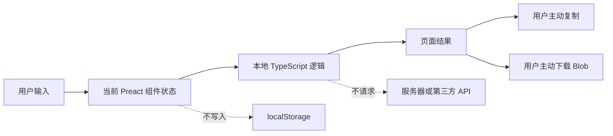
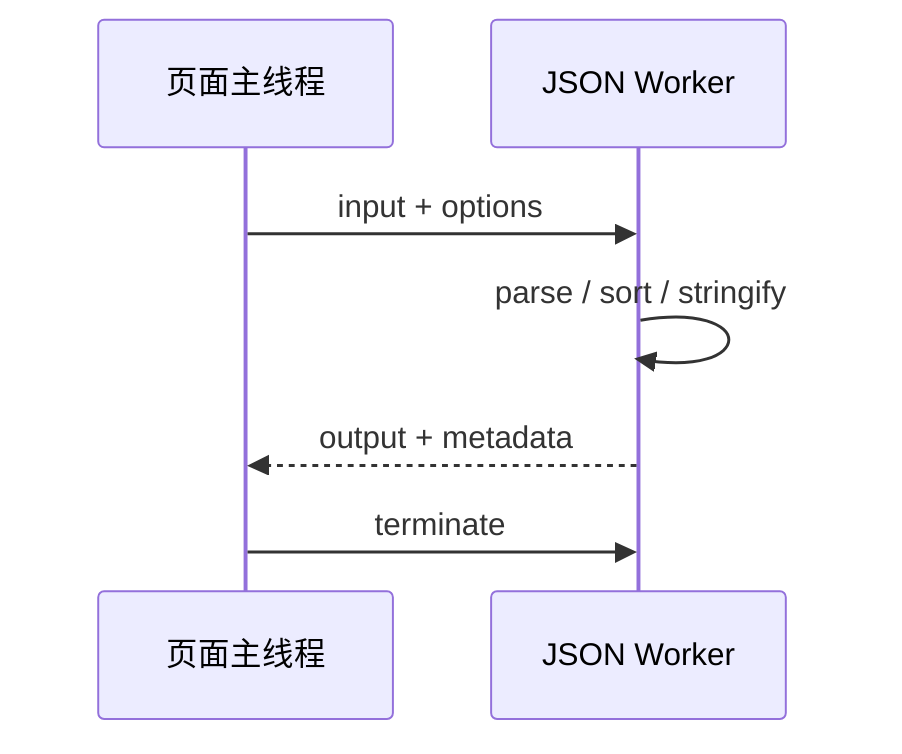

# 浏览器本地处理不等于天然安全：工具网站的数据与隐私边界

## 一句话理解

“浏览器本地处理”只表示网站不会主动把输入发送到自己的服务器或第三方接口，并不表示数据脱离了浏览器、操作系统、扩展程序和本地设备的安全边界。

设计本地工具时，需要明确回答四个问题：

1. 输入数据进入了哪些内存对象；
2. 是否发送了网络请求；
3. 是否写入持久化存储；
4. 复制和下载时由谁接管数据。

## 本地优先工具的数据生命周期

ZGLab Tools 的正文数据流如下：



页面关闭或刷新后，组件状态自然丢失。网站不会把 JSON、文本、Wi-Fi 密码或二维码正文写入 localStorage。

## “没有后端”还不够

一个网站即使没有自己的 API，也可能通过以下方式把数据发送出去：

- 调用第三方格式化或二维码接口；
- 加载带查询参数的远程图片；
- 将输入放进统计或错误上报；
- 使用第三方分析脚本采集表单信息；
- 把内容拼入 URL 后导航；
- 在日志中输出用户输入，再由日志平台收集。

因此，“纯前端”不是隐私结论。更可靠的判断需要检查：

- 是否存在 `fetch`、XHR 或 `sendBeacon`；
- 是否加载外部运行时脚本；
- 是否把用户正文写入日志；
- 第三方库是否已经打包进本地静态资源；
- 页面卸载后是否仍能恢复输入正文。

ZGLab Tools 的源码检查没有发现工具正文的网络请求路径，也没有接入广告、Cookie 追踪或第三方分析。

## localStorage 只保存非敏感偏好

当前允许持久化两类数据：

```text
zglab-tools:theme
zglab-tools:recent
```

它们分别记录主题偏好和最近使用的工具 ID，不包含用户输入内容。

```ts
const next = [toolId, ...ids.filter((id) => id !== toolId)].slice(0, 5);
localStorage.setItem("zglab-tools:recent", JSON.stringify(next));
```

这种设计采用“字段白名单”而不是“发现敏感字段再排除”。如果未来增加工具偏好，应逐项判断：

- 它是否只描述界面行为；
- 是否可能泄露输入内容；
- 是否包含账号、路径、URL、密码或 Token；
- 用户是否能够清除；
- 存储失败时页面是否仍可用。

localStorage 在隐私模式或受限环境中可能抛出异常，所以主题和最近记录必须是可失败的增强，而不能决定工具是否可用。

## 剪贴板是一次明确的数据交接

复制首先调用 Clipboard API：

```ts
await navigator.clipboard.writeText(text);
```

API 不可用时，页面临时创建隐藏 textarea，选中文本并调用浏览器兼容复制能力，最后移除元素。

这条链路仍然需要注意：

- 复制必须由用户主动触发；
- 成功和失败不能用阻塞式 `alert`；
- 空输出不提供复制；
- 临时 DOM 节点必须清理；
- 网站无法控制剪贴板管理器、输入法或其他本地软件如何保存内容。

因此，不应把“复制成功”理解为数据仍只存在当前页面。复制之后，数据已经进入操作系统剪贴板边界。

## 下载文件如何保持在本地

文本和 JSON 下载使用：

```ts
const blob = new Blob([content], { type: "text/plain;charset=utf-8" });
const url = URL.createObjectURL(blob);
```

随后创建带 `download` 属性的临时链接，触发下载并释放 Object URL：

```ts
anchor.click();
anchor.remove();
setTimeout(() => URL.revokeObjectURL(url), 0);
```

关键点包括：

- 文件内容不上传服务器；
- 文件名带工具名和本地时间；
- Object URL 使用后释放；
- 下载后的文件由用户设备和浏览器下载策略管理；
- 不把大文件长期保留在组件状态之外。

二维码 PNG 的 Data URL 也在本地解码为 `Uint8Array` 和 Blob，不使用网络请求读取。

## 二维码的隐私边界

二维码只是对字符串编码，不会让内容自动变得安全。Wi-Fi 二维码会把 SSID 和密码编码为类似：

```text
WIFI:T:WPA;S:Example;P:<password>;H:false;;
```

即使生成过程完全本地，任何能够看到或扫描二维码的人都可能读取其中内容。因此页面需要：

- 不自动打开 URL；
- 不把用户内容通过 `innerHTML` 渲染；
- 不记录 Wi-Fi 密码；
- 不保存二维码内容；
- 明确提醒用户不要处理真实高敏感凭据；
- 对低对比度和透明背景给出扫码可靠性提示。

本地生成解决的是“内容是否发送给在线二维码服务”，不能解决“二维码被谁看到”。

## Web Worker 解决性能，不改变隐私结论

JSON 格式化可能处理超过 1 MB 的输入。把 `JSON.parse`、键排序和序列化放进 Web Worker，可以减少主线程卡顿。



Worker 仍然运行在当前浏览器中，没有把数据发送到服务器。但它会复制或传递数据，仍然消耗浏览器内存。Worker 不是无限文件处理器，也不是安全沙箱的完整替代。

## 不能承诺的安全范围

本地优先工具无法完全控制：

- 恶意或权限过高的浏览器扩展；
- 设备上的恶意软件；
- 系统剪贴板记录；
- 输入法和辅助软件；
- 浏览器自身漏洞；
- 用户主动下载后的文件传播；
- 屏幕录制和旁观者。

因此，合理的隐私说明应同时表达两个结论：

1. 网站不会主动上传和保存输入；
2. 用户仍应避免处理生产密码、私钥、私有 Token 和其他高敏感信息。

只写第一条会让“本地运行”变成过度安全承诺。

## 本地工具的检查清单

新增工具时至少检查：

- 核心处理是否可以断网完成；
- 是否存在不必要的网络请求；
- 用户正文是否进入 localStorage、日志或 URL；
- 第三方库是否在本地打包；
- 空输入是否阻止无意义操作；
- 错误信息是否泄露正文；
- 复制和下载是否由用户触发；
- Blob 和 Object URL 是否清理；
- 页面卸载后是否保留输入；
- 隐私说明是否与真实实现一致。

## 总结

本地优先不是一句产品文案，而是一组可以检查的数据边界：

- 正文只进入当前页面状态；
- 核心算法不依赖网络；
- 持久化只保存明确的非敏感偏好；
- 复制和下载由用户主动触发；
- 第三方库在本地静态资源中运行；
- 页面诚实说明浏览器与设备层面的剩余风险。

这套边界同样适用于 Base64、URL 编解码、Diff、Markdown 预览、图片压缩和 RAG 切片预览等未来工具。

相关笔记：

- [从五个小工具到可扩展平台](../projects/building-local-first-astro-tool-platform.md)
- [静态网站也需要工程化](static-site-release-and-runtime-boundaries.md)
