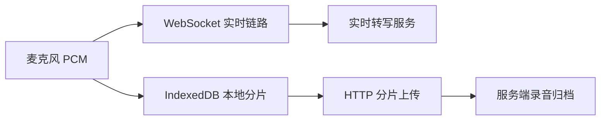
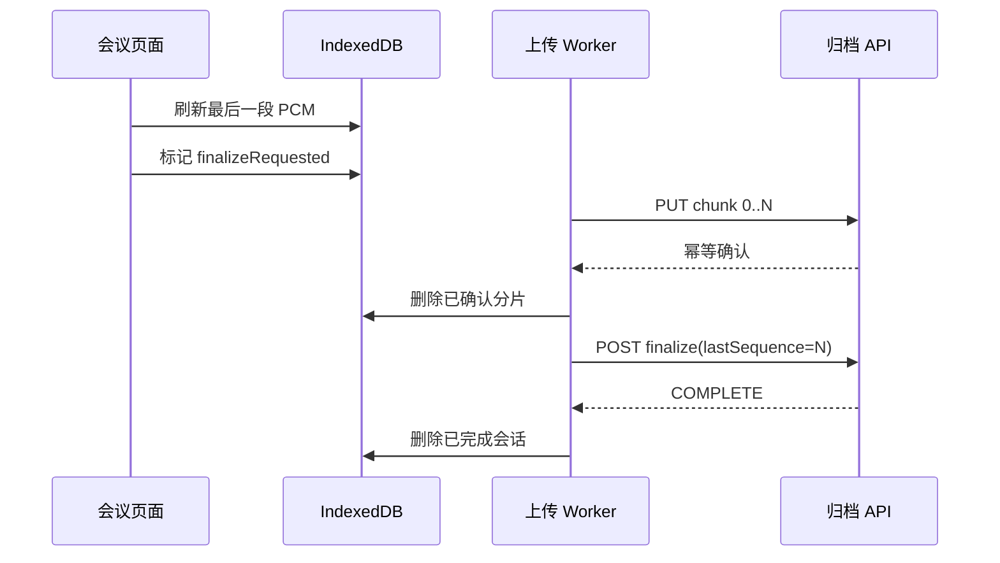

# 结束按钮不是最后一步：移动 H5 录音分片持久化与后台续传

## 一句话理解

实时转写成功，只能证明音频曾经通过 WebSocket 到达识别服务；它不能证明原始录音已经可靠保存。要让移动 H5 在弱网、页面切换和 WebView 被重建后仍能补齐录音，需要把音频同时写入 IndexedDB，按编号幂等上传，并把“结束会议”和“录音归档完成”设计成两个可以协调、但不能混为一谈的状态。

## 为什么实时链路正常仍可能丢录音

一场实时会议通常同时存在两条数据链路：



WebSocket 追求低延迟，偶发丢失和重连由实时会话处理；HTTP 归档追求完整性，需要编号、校验、幂等和补传。两条链路的健康状态不能互相替代。

例如，页面显示“实时录音链路正常”，只说明服务端近期仍收到 WebSocket 音频。此时 HTTP PUT 可能因为 401、超时、服务器磁盘问题或弱网退避而积压。若界面只展示一个“录音正常”，排障时就会得到相互矛盾的结论。

## 两类典型故障

### finalize 早于第一个分片

假设前端每 5 秒形成一个分片。用户只录了 4 秒便点击结束，剩余音频会在结束时被刷新成最后一个短分片。

错误顺序可能是：

```text
把剩余 PCM 放入 IndexedDB
        ↓
立即请求 /finalize
        ↓
开始上传第 0 个分片
```

如果后端只在收到首个分片时创建归档会话，`/finalize` 会先返回“会话不存在”。稍后分片可能仍上传成功，但页面已经留下一个看似严重且不会自动消失的错误。

### 结束等待超时后页面被销毁

较长录音会产生多个分片。若前端串行上传，某次失败后按 1、2、5、10、30 秒退避，15 秒的结束等待很容易耗尽。

仅显示“尚有 6 个分片等待补传”还不够。如果页面离开时直接关闭上传器，而应用没有全局恢复任务，那么“网络恢复后自动补传”只是界面承诺，并不是实际能力。

## 本地数据模型

浏览器端可以用两个 IndexedDB Object Store 表示归档任务。

会话记录以会议 ID 为 Key，保存：

```javascript
{
  meetingId,
  streamId,
  nextSequence,
  pendingBytes,
  finalizeRequested,
  finalSequence,
  updatedAt
}
```

分片记录保存：

```javascript
{
  key: `${streamId}:${sequence}`,
  meetingId,
  streamId,
  sequence,
  checksum,
  durationMs,
  bytes,
  createdAt
}
```

`streamId` 用于区分同一会议的不同录音流，`sequence` 用于判断顺序和缺口，`checksum` 用于发现传输或落盘损坏。

保存分片和更新会话计数应在同一个 IndexedDB 事务中完成。否则浏览器可能只写入分片，却没有增加 `pendingBytes`，或者只推进了 `nextSequence`，却没有真正保存音频。

## 正确的结束状态机

结束会议时，推荐顺序是：



核心约束是：

```text
finalize 只能由上传循环在“本地待上传分片为 0”时发出
```

页面可以等待一段有限时间，但等待超时不等于取消后台任务。它只表示 UI 不再阻塞业务结束流程。

## 后端为什么还要容忍乱序

修复前端时序并不能保证所有旧客户端立即升级。移动宿主可能缓存旧 H5，也可能在灰度期间同时存在多个版本。

因此后端可以增加一层兼容：

1. `/finalize` 找不到会话时，创建一个占位会话；
2. 保存 `expectedLastSequence`；
3. 当前分片不完整时返回 `INCOMPLETE`，而不是 404；
4. 后续 PUT 到达后重新计算连续序号；
5. 序号 `0..N` 全部存在且校验通过后变为 `COMPLETE`。

这不是放松完整性，而是把 API 从“严格要求请求时序”提升为“允许乱序、最终收敛”。

每个 PUT 还应满足幂等条件。同一个 `streamId + sequence` 重试时：

- 校验值和长度一致：返回已有结果；
- 内容不一致：拒绝覆盖并返回冲突；
- 文件缺失但数据库元数据存在：可根据校验值修复落盘文件。

## 页面级上传器为什么不够

Vue 组件的生命周期通常短于录音归档任务。用户结束会议后会进入详情页，路由切换触发组件卸载；移动 WebView 还可能重建整个页面。

更合理的职责分层是：

- 会议页面负责把 PCM 交给上传器、展示进度和触发 finalize；
- 应用级 Worker 按会议 ID 管理上传任务；
- 页面卸载只解除 UI 回调，不停止仍有分片的 Worker；
- H5 启动时扫描 IndexedDB，为无人接管的历史任务恢复 Worker。

共享 Worker 还需要避免一个竞态：应用启动扫描和当前会议页面可能同时发现同一任务。恢复逻辑应先检查活动 Worker，已有页面接管时跳过，不能覆盖页面的完成和错误回调。

## 重试策略和用户提示

分片上传适合有限退避，例如：

```text
1 秒 → 2 秒 → 5 秒 → 10 秒 → 30 秒
```

每次成功上传后重置退避次数；浏览器收到 `online` 事件时可以提前唤醒重试。上传仍应串行或限制并发，避免弱网下多个大请求同时争抢连接。

界面需要区分两类信息：

- 红色错误：本地无法保存、校验失败、权限失败等需要用户关注的问题；
- 黄色提示：会议可以结束，但仍有分片在后台补传。

补传完成后，活动页面应自动清除提示。页面已经离开时无需强行弹窗，任务状态由 IndexedDB 和服务端共同保存。

## 容量和安全边界

本地持久化不是无限缓存。应设置明确上限，例如按待上传字节总量限制，并在超过上限前暂停继续录音或提示恢复网络。

服务端也需要：

- 限制单个分片大小；
- 校验 SHA-256；
- 校验会议归属和用户身份；
- 将存储路径约束在指定根目录；
- 检查磁盘剩余空间；
- 在数据库中只保存元数据，PCM 写入专用持久化目录；
- 对已完成归档设置明确的保留和清理策略。

IndexedDB 中的录音属于敏感业务数据。登出、切换用户和长期失败任务的清理规则必须由产品与安全策略共同决定，不能简单地无限保留。

## 验证矩阵

至少覆盖以下场景：

1. 录音不足 5 秒后立即结束，首个短分片先上传再 finalize；
2. 录音 30 秒以上，全部分片连续上传并完成归档；
3. 上传中断网，恢复网络后从原序号继续；
4. 结束等待超时后进入详情页，补传任务仍运行；
5. 刷新或重新打开 H5，未完成任务从 IndexedDB 恢复；
6. 重复 PUT 同一分片，服务端幂等返回；
7. 相同序号上传不同内容，服务端拒绝覆盖；
8. 旧客户端先 finalize，后端创建占位会话并在补齐后完成；
9. 本地空间达到上限时停止继续积压；
10. WebSocket 实时链路正常但 HTTP 上传失败时，后台能分别展示两种状态。

自动化测试可以覆盖后端乱序、缺口和幂等逻辑；IndexedDB、页面卸载和移动 WebView 重建仍需要目标设备上的集成测试。

## 常见误区

### 点击结束就立即 finalize

结束按钮表示用户意图，不代表所有异步音频已经持久化。必须先刷新缓冲、等待本地事务完成，再由上传循环决定何时 finalize。

### 把 15 秒等待改成 60 秒

延长等待只能降低提示出现概率，不能解决弱网、页面卸载和重新打开后的恢复问题。

### 页面卸载时关闭所有任务

组件已经结束，不代表归档任务结束。二者生命周期不同，应解除 UI，而不是丢弃后台工作。

### 只修前端，不兼容旧客户端

移动 H5 存在缓存和版本滞后。后端允许乱序收敛，可以显著降低升级窗口中的故障。

## 总结

可靠录音归档的核心不是“多调用几次上传接口”，而是建立一套可恢复协议：本地先持久化、分片有编号和校验、上传可幂等、finalize 有明确前置条件、页面离开不终止任务、应用重开能够恢复。

这套设计与实时 WebSocket 链路互补。实时链路保证用户立刻看到转写，持久化链路保证会议结束后仍能获得完整、可审计的录音。关于实时会话恢复，可继续阅读[断线不等于结束：实时会议录音的可恢复会话设计](../projects/recoverable-realtime-recording-session.md)。
