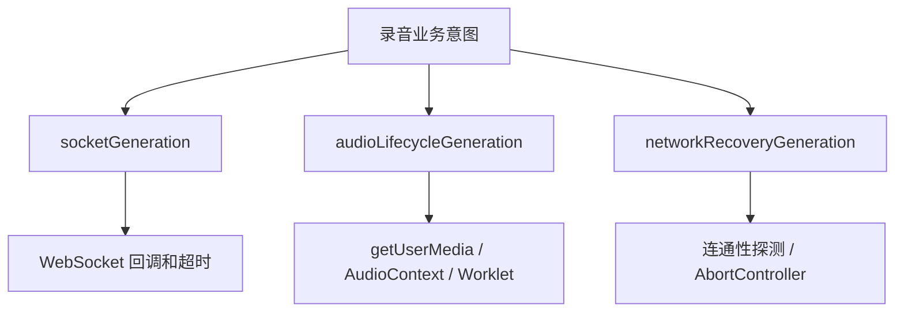

# 页面没有线程锁，为什么仍会发生竞态：用 Generation Fencing 管理浏览器实时生命周期

## 浏览器里的竞态并不少

JavaScript 业务代码通常运行在单线程事件循环中，但“单线程”不等于“没有并发问题”。只要一次操作跨过 `await`、定时器、WebSocket 回调或媒体事件，用户的新操作就可能先完成，旧操作再回来覆盖结果。

例如，用户点击开始录音后，页面依次执行：

1. 请求麦克风权限；
2. 创建 `AudioContext`；
3. 加载 `AudioWorklet`；
4. 建立节点并更新 UI。

如果用户在第 1 步等待系统授权时已经点击结束，`getUserMedia()` 仍可能随后成功返回。若代码只看 Promise 是否成功，旧流程就会重新打开麦克风，把已经结束的页面改回“录音中”。

这不是数据竞争意义上的同时写内存，而是**不同意图的异步延续顺序发生了反转**。

## Generation Fencing 的核心

Generation Fencing 可以翻译为“代际隔离”。每类可被替代的生命周期维护一个单调递增编号：

```js
let generation = 0

async function start() {
  const mine = generation
  const resource = await acquireResource()
  if (mine !== generation) {
    release(resource)
    return
  }
  publish(resource)
}

function stop() {
  generation += 1
  releaseCurrentResource()
}
```

`stop()` 不需要真正取消所有已经发出的异步调用。它只要递增 generation，旧调用即使返回，也不再有资格提交结果。

这个模式本质上是“最新意图获胜”：

```text
异步任务可以继续运行
≠
异步任务回来后仍有权修改当前状态
```

## 为什么一个全局 generation 不够

实时会议页面至少有三类相互关联、但生命周期不同的任务：

- WebSocket 连接；
- 麦克风和 Web Audio 图；
- 网络恢复探测。

如果所有任务共用一个计数器，重连 WebSocket 可能无意中取消一个仍然有效的麦克风启动，或者一次音频自愈会使网络探测结果失效。更好的做法是按资源所有权拆分代际。



三个计数器服务于不同的问题，但都要额外检查共同的业务意图，例如 `recordingIntent` 是否仍为真、页面是否正在结束。

## WebSocket：让旧连接的回调自动失效

WebSocket 重连最常见的竞态包括：

- 旧连接的 `onclose` 晚于新连接的 `onopen`；
- 旧连接的连接超时定时器在新连接成功后触发；
- 旧连接收到迟到的业务消息；
- 用户结束会议后，重连回调仍继续启动麦克风。

每次建立连接时递增 `socketGeneration`，并在所有边界回调中校验：

```js
const generation = ++socketGeneration
const ws = new WebSocket(url)

ws.onopen = () => {
  if (generation !== socketGeneration || ws !== currentSocket) return
  // 只有当前连接可以提交状态
}

ws.onmessage = (event) => {
  if (generation !== socketGeneration || ws !== currentSocket) return
  handleMessage(event)
}

ws.onclose = () => {
  if (generation !== socketGeneration) return
  scheduleRecovery()
}
```

结束或主动废弃连接时，先递增 generation，再解绑/关闭旧连接。这样即使浏览器把旧回调排进了事件队列，它也会在入口处被挡住。

连接超时和“等待上游服务 ready”的超时也必须带 generation。只校验事件回调、不校验定时器，仍会出现新连接被旧定时器误关的情况。

## 麦克风：校验每一个 `await`，并回收半成品

媒体启动不是一个原子动作。当前项目的流程会跨过至少三个异步边界：

```text
getUserMedia
  -> AudioContext.resume
  -> audioWorklet.addModule
  -> 创建并连接节点
  -> 发布为当前资源
```

正确做法不是只在开头检查一次，而是在每个 `await` 后重新验证：

```js
const openingGeneration = audioLifecycleGeneration
const stillCurrent = () =>
  openingGeneration === audioLifecycleGeneration
  && recordingIntent
  && !ending

stream = await navigator.mediaDevices.getUserMedia(constraints)
requireCurrent(stillCurrent)

await context.resume()
requireCurrent(stillCurrent)

await context.audioWorklet.addModule('/pcm-worklet.js')
requireCurrent(stillCurrent)
```

这里还有一个容易漏掉的细节：旧任务失效后，它已经获得的资源不能泄漏。`catch` 或 `finally` 必须回收尚未发布的半成品：

- 停止新拿到的 `MediaStreamTrack`；
- 断开尚未成为当前节点的 source、worklet 和 gain；
- 关闭尚未发布的 `AudioContext`。

资源发布也应尽量延后。只有整条音频图构建完成且最后一次校验通过，才能把局部变量赋给全局 `mediaStream`、`audioContext` 和节点引用。这相当于一个轻量的“准备—提交”过程。

## 网络恢复：AbortController 负责节省资源，generation 负责正确性

网络切换时，`navigator.onLine === true` 只说明浏览器认为存在网络接口，并不代表业务 API 已经可达。页面往往需要循环探测真实 API，再尝试恢复录音。

这类探测应该同时使用 `AbortController` 和 generation：

```js
const recoveryGeneration = ++networkRecoveryGeneration
const controller = new AbortController()

try {
  await waitForApiReachability({ signal: controller.signal })
  if (recoveryGeneration !== networkRecoveryGeneration) return
  if (!recordingIntent) return
  await reconnect()
} finally {
  if (recoveryGeneration === networkRecoveryGeneration) {
    networkRecoveryController = null
    networkRecoveryInFlight = false
  }
}
```

二者的职责不同：

- `AbortController` 尽快停止已经过时的请求和轮询，减少资源消耗；
- generation 防止无法取消、取消较晚或已经完成的 Promise 提交旧结果。

`finally` 同样要检查 generation。否则旧任务结束时可能把新任务的 `inFlight` 标志清掉，让页面误以为当前没有恢复流程。

## 前端代际还要延伸到服务端所有权

页面内的 generation 只能隔离本页面的对象。刷新、重复标签页或移动网络切换后，服务端可能同时看到旧连接和新连接。

一种实用协议是发送：

- `clientSessionId`：一次页面会话内稳定不变；
- `connectionGeneration`：每次连接递增。

服务端仅允许同一用户的以下连接接管：

1. `clientSessionId` 相同，且新 generation 更大；或
2. 旧连接已经超过活动超时，可视为陈旧所有者。

不同用户不能接管，同一页面的旧 generation 也不能覆盖新 generation。这样，客户端的“最新意图获胜”才能穿过网络边界成为服务端可验证的所有权规则。

## 不适合只靠 generation 的情况

Generation Fencing 很有效，但它不是事务系统：

- 它不能撤销已经发送到服务端的非幂等请求；
- 它不能替代服务端的鉴权、幂等键和状态机校验；
- 多标签页之间若没有共享协议，彼此不知道对方的本地 generation；
- 多实例服务端还需要分布式 fencing token 或权威租约，不能只靠 JVM 内存编号。

对于 `POST /end-meeting` 这类操作，前端代际只能避免重复触发 UI 流程，真正的“只结束一次”仍需由服务端保证。

## 验证清单

这类代码建议用可控 Promise 和假定时器覆盖以下时序：

- 麦克风授权未返回时点击结束，授权返回后轨道被立即释放；
- 旧 WebSocket 的连接超时晚于新连接 `onopen`，新连接不受影响；
- 两次网络恢复重叠，旧任务的 `finally` 不清理新任务状态；
- 结束会议后任何迟到的 ready、message、onclose 都不能重启录音；
- 同一 `clientSessionId` 的更高 connection generation 可以接管；
- 更低 generation 或其他用户无法接管仍活跃的连接。

## 总结

浏览器实时应用最危险的状态错误，往往不是某个 Promise 失败，而是一个**已经失去业务意义的 Promise 成功了**。

Generation Fencing 不要求底层所有 API 都支持取消。它通过一个简单规则建立提交权限：任务开始时领取代际，任务提交前证明自己仍属于当前代际。再配合资源回收、AbortController 和服务端所有权校验，就能把大量偶发的重连、暂停和网络切换竞态变成可推理、可测试的行为。

关于长会议中的有界状态和音频自愈，可继续阅读[长会议 H5 如何避免越用越卡](long-running-h5-memory-and-download-optimization.md)；关于业务层恢复窗口，可参考[断线不等于结束](../projects/recoverable-realtime-recording-session.md)。
