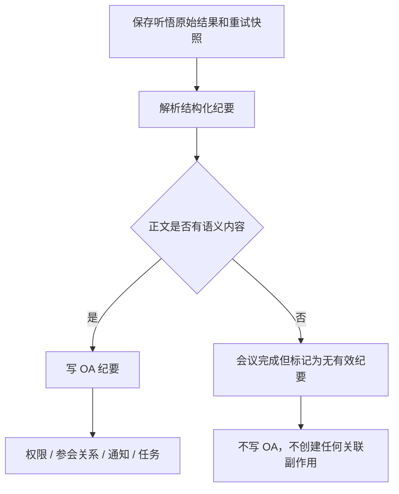

# 短会议不是不能生成纪要：如何同时控制幻觉与业务副作用

## 问题不是“短”，而是证据不足

一次只有十几秒或二十秒的会议，可能只包含“测试一下”“能听到吗”之类的内容。大模型收到这些稀疏输入后，仍被要求输出完整的会议概览、议题、结论和待办，很容易用常见会议模式补齐空白，生成与原文无关的人名、计划或结论。

但“会议很短”不能直接等价为“纪要无效”。例如一句十秒钟的语音也可能明确表达：

> 明天下午三点发布，由张三负责。

这句话虽短，却同时包含时间、动作和责任人，完全有生成和推送纪要的业务价值。因此，按录音时长一刀切地禁止生成或禁止推送 OA，会把降低幻觉变成数据丢失。

更准确的区分是：

```text
时长短：一个风险信号
语义稀疏：模型应保守输出的条件
语义为空：下游副作用应停止的条件
```

## 为什么完整模板会诱发补全

模型不仅会参考转写内容，也会参考 Prompt 中的格式要求和示例。如果输入只有几个无意义词，而输出格式要求四个章节、若干结论和一张待办表，模型面临的是“证据不足但必须填满结构”的冲突。

尤其要谨慎对待带具体人名、日期、项目名称的示例。即使说明“以下只是示例”，这些词仍然进入上下文，可能在稀疏输入时成为强锚点。与其提供一份内容丰富的示范纪要，不如只声明结构、约束和空值策略。

这类任务的 Prompt 应优先回答：

- 什么内容可以成为事实？
- 什么内容不算有效会议信息？
- 没有足够证据时应该输出什么？
- 什么条件下可以生成待办？

而不是只展示“理想纪要长什么样”。

## 第一层：Prompt 中建立证据约束

当前会议纪要 Prompt 使用了几条明确规则：

- 每条事实、议题、结论和待办都必须能在原始转写中找到直接依据；
- 不得根据常见会议模板、上下文常识或输出格式补全内容；
- 问候、测试语句、语气词、重复识别和无法理解的片段不算有效内容；
- 有效转写很少或没有形成议题时，只做保守摘录；
- 只有原文同时表达任务内容和执行意图时，才生成待办；
- 字段定义和格式说明本身绝不是会议内容。

当有效转写少于一个经验阈值，例如约 50 个中文字符时，Prompt 不要求模型“什么都不写”，而是给出可接受的保守落点：明确提示内容较少，只复述原文明示的信息，没有结论就写“暂无明确结论”，风险部分提醒结合录音和转写确认。

这种设计解决了两个问题：

1. 结构化输出仍保持稳定，前端和 OA 格式化器不需要处理大量特殊分支；
2. 模型不必为了满足章节要求而发明内容。

需要强调，字符数只是启发式信号，不是事实判定器。真正的约束仍是“每一项能否由原文支持”。

## 第二层：前端提示风险，但不代替用户做决定

对于已经结束、有效时长大于零且不足一分钟的会议，详情页展示“短会议准确性提示”。它的作用是校准用户预期：

- 纪要可能因内容较少而不够准确；
- 用户应结合转写和录音核对；
- 合法的短会议仍可以按正常流程推送 OA。

提示不应该出现在仍在录音的会议，也不应把 `0 ms` 的误创建会议包装成“短会议纪要风险”。零时长更接近“没有发生录音”的独立状态，需要由空内容和业务状态处理。

前端提示与后端规则不能互相替代。提示只解决认知问题，不保证数据正确；后端仍要保证无论用户是否看到提示，都不会把语义空结果扩散到 OA。

## 第三层：判断语义为空，而不是字符串为空

大模型或上游服务返回的“空”不一定是空字符串，还可能是：

```json
{}
```

或：

```json
{
  "meeting_summary": "",
  "todo_list": []
}
```

如果后端只调用 `isBlank()`，这些 JSON 都会被当成有效内容，继而生成一条没有正文的 OA 纪要。

一个实用的语义空值判断是递归检查 JSON：

- `null` 和 missing node 为空；
- 空白文本为空；
- 对象或数组只有在至少一个后代包含非空文本时才算有内容；
- 非 JSON 的普通文本按非空字符串处理。

这不是通用的 JSON 有效性规则。例如数值 `0` 在某些领域有意义；但在“会议纪要正文必须包含文本”的具体边界里，仅有数字或空容器不应触发 OA 写入。

## 第四层：把副作用放在内容门禁之后

识别到语义空内容后，不能只是不写纪要正文，其他副作用也必须一起停止。会议系统的一次“推送 OA”可能包括：

- 创建 OA 纪要主记录；
- 建立参会人关系；
- 写入阅读权限；
- 创建个人通知；
- 从待办表生成相关任务。

如果先创建主记录或任务，再发现正文为空，就会留下用户看得见、却没有实际内容的脏数据。

正确的流程是先保存原始快照，再做内容门禁：



保留原始快照很重要。即使当前结构解析不到有效正文，原始服务商结果和最终转写仍可用于排查或未来修复。业务状态可以完成，OA 推送则标记为 skipped，而不是把“无内容”误记成系统失败并无限重试。

## 为什么合法的短会议仍要推送 OA

需求明确要求短会议不能统一拦截。因此，后端门禁不应使用 `duration < 60s` 作为停止条件，而只判断最终正文是否有语义内容。

这形成一个清晰矩阵：

| 会议情况 | 前端提示 | 生成策略 | OA 副作用 |
| --- | --- | --- | --- |
| 短但有明确事实 | 提示核对 | 保守生成事实 | 正常执行 |
| 短且只有寒暄/测试 | 提示核对 | 输出空或保守说明 | 仅有有效正文才执行 |
| 零时长、无录音 | 不作为普通短会议提示 | 无内容 | 全部跳过 |
| 正常时长但结果为空 | 通常不显示短会议提示 | 无内容 | 全部跳过 |

时长属于体验层风险提示，语义内容才是副作用边界。

## 测试不应只验证模型文案

大模型输出具有不确定性，单元测试不适合断言线上模型每次都返回某个固定句子。更可靠的测试对象是我们能确定控制的边界：

- `59,999 ms` 的已结束会议显示短会议提示；
- `60,000 ms` 不显示提示；
- `0 ms` 不显示普通短会议提示；
- 有效短纪要仍可创建 OA 记录和关联数据；
- `{}`、空数组和空字段被识别为无语义内容；
- 无语义内容时不写主记录、不写参会关系、不授权、不通知、不创建任务；
- 无语义内容仍保存原始快照、导入可用的最终转写，并把处理任务完成；
- 手动重推不能把已经判定为空的结果重新扩散到 OA。

此外还应建立一组固定短音频样本做集成回归，包括寒暄、设备测试、单句明确决策、单句明确待办和识别噪声。评估重点应是“每一项输出是否有原文依据”，而不是纪要写得是否丰富。

## 仍可继续加强的方向

Prompt 约束能显著减少幻觉，但不能形成数学保证。更严格的系统可以继续增加：

- 为每条结论保存对应的转写片段或时间范围；
- 生成后检查人名、日期、数字是否在原文出现；
- 对低信息密度会议使用更低温度或专门的保守模板；
- 在用户确认前，不自动创建高影响的外部任务；
- 统计短会议人工删除或修改率，持续校准阈值和 Prompt。

这些属于下一阶段增强，不应被写成当前已经实现的能力。

## 总结

短会议幻觉不能靠一个时长阈值彻底解决。时长只能告诉我们风险较高，不能判断内容是否有价值。

更可靠的方案是分层治理：Prompt 约束模型只使用转写证据；前端提示用户核对；后端识别语义空结果；所有 OA 写入、权限、通知和任务都放在内容门禁之后。这样既保留合法短会议的业务价值，也防止空纪要和虚构待办污染下游系统。

关于更通用的证据化生成思路，可参考[把大模型生成限制在事实边界内](evidence-grounded-resume-generation.md)；关于结构化响应解析、重试与降级，可继续阅读[结构化大模型调用如何可靠落地](reliable-structured-llm-calls.md)。
