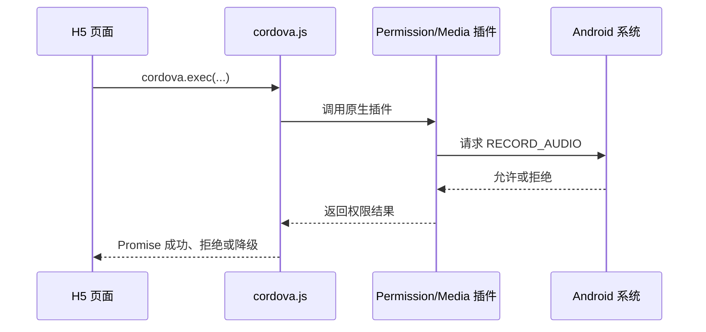

# 内嵌 H5 为什么拿不到麦克风：Cordova 权限桥接与能力探测

## 一句话理解

普通 H5 只能通过 `getUserMedia` 请求网页麦克风，而内嵌 WebView 还受宿主 App 的系统权限和 WebView 权限委托控制。Cordova 的作用，是在 JavaScript 和 Android/iOS 原生能力之间建立桥梁，让 H5 能够调用宿主提供的权限、录音和文件插件。

它不是登录组件，也不会替代浏览器录音 API。它解决的是“网页已经运行在 App 里，但网页能力不足以主动完成原生授权”的问题。

## 为什么浏览器里正常，App 里却失败

一个内嵌 H5 能否获得麦克风，至少经过三层许可：

1. 操作系统是否允许宿主 App 使用麦克风；
2. 宿主 App 是否把音频采集能力交给当前 WebView；
3. 当前页面是否通过 `getUserMedia` 获得媒体流。


普通浏览器会自行处理其中的大部分交互，但企业 App 的 WebView 配置、插件版本和权限弹窗行为可能不同。因此，“浏览器能录音”不能证明“峰云 App 内也能录音”。

## Cordova 在这条链路中的位置

Cordova 提供两部分能力：

- Web 侧的 `cordova.js` 和插件 JavaScript；
- App 侧已经编译进安装包的原生 Cordova 运行时和插件。

调用链大致如下：



只有把 `cordova.js` 放进网页并不够。如果宿主 App 没有集成相同的原生插件，JavaScript 调用仍然会失败。反过来，App 集成了插件但页面没有等待 Cordova 初始化完成，也会出现偶现的“插件不存在”。

## 一套分层的麦克风准备流程

当前实践采用了四步检查，而不是把任何单一 API 的成功当作最终结论。

### 1. 识别是否处于目标宿主

页面先通过 User-Agent 判断是否运行在目标企业 App 中。普通浏览器不加载体积较大的 Cordova 资源，也不尝试调用原生插件。

UA 只能用于选择适配策略，不能作为安全认证依据。User-Agent 可以被修改，真正的登录和数据权限仍必须由服务端校验。

### 2. 等待原生桥接就绪

动态加载 `cordova.js` 后，页面等待 `deviceready`，再把内部状态标记为可用。为了避免无限等待，当前桥接等待设置为 5 秒。

判断桥接是否可用不能只检查 `window.cordova` 是否存在，还要确认：

```javascript
window.__aimeetingCordovaReady === true
    && typeof window.cordova?.exec === 'function'
```

脚本对象存在只说明文件可能已经加载，不代表原生侧已经完成初始化。

### 3. Android 主动请求系统权限

桥接就绪后，Android 通过 Permission 插件申请：

```text
permissionGroup: RECORD_AUDIO
```

结果需要区分：

- 明确允许：继续后续探测；
- 明确拒绝：提示用户前往手机设置开启；
- 插件不存在或返回未知值：记录告警，降级到网页能力检查。

这里选择降级，是为了兼容没有携带 Permission 插件的旧版宿主。但降级不等于假装成功，最终仍要让 `getUserMedia` 证明网页确实获得了音频流。

### 4. 用短暂原生录音触发权限，再做端到端验证

部分 Android WebView 中，仅调用权限插件不一定触发完整的录音通路。当前实现会尝试通过 Cordova Media 插件创建一次约 1 秒的临时录音：

1. 优先写入 Cordova 缓存目录；
2. 启动原生录音；
3. 运行约 1 秒后停止；
4. 释放 Media 资源；
5. 等待约 1 秒，让 Android 释放音频输入；
6. 删除临时探测文件；
7. 最后调用 `getUserMedia` 获取真正用于会议的音频流。

原生探测的价值是触发和验证宿主侧能力，`getUserMedia` 才是 H5 录音链路的端到端检查。两者不能互相替代。

## 为什么释放后还要等待

Android 原生录音停止回调发生时，底层音频输入设备不一定已经完全释放。如果 H5 紧接着调用 `getUserMedia`，可能遇到设备占用或启动失败。

因此当前实现增加了短暂释放等待，并为旧版 Media 插件补充停止回调兜底。这个延时不是为了让界面显得稳定，而是在两个录音实现交接麦克风时避免资源竞争。

## iOS 为什么没有照搬 Android 流程

当前原生权限和短录音探测只对 Android 启用。iOS 继续以 WebView 的 `getUserMedia` 作为最终能力检查。

原因不是 iOS 不需要权限，而是不同平台的宿主权限契约和插件行为不同。在没有明确确认 iOS 原生探测行为前，不应为了“代码一致”而创建一次无业务意义的原生录音。跨平台适配应共享目标，不必强行共享全部实现步骤。

## 降级设计要满足什么

插件失败时回退到 `getUserMedia`，能够兼容一部分旧宿主，但降级路径必须满足以下条件：

- 明确记录插件未就绪或调用失败；
- 不把未知返回值误判成已授权；
- `getUserMedia` 失败时给出可理解的用户提示；
- 关闭探测和媒体流时始终释放 Track、Media 和临时文件；
- 遥测失败不能阻塞真正的录音流程。

如果宿主既没有原生插件，也没有正确实现 WebView 权限委托，前端代码无法凭空获得麦克风。这时需要移动端团队修改 App，而不是继续在 H5 中重复重试。

## 当前实现需要重点验证的兼容点

当前业务判断能够识别包含 `MideaConnect` 或 `Misson` 的 UA，但外层 Cordova 资源加载脚本主要判断 `MideaConnect`。如果某个峰云版本的 UA 只有 `MissonWebKit/1.0`，可能出现：

```text
业务层认为处于峰云容器
        +
资源加载层没有注入 cordova.js
        =
原生权限路径无法启用，只能回退 getUserMedia
```

这是基于当前源码发现的兼容风险，尚需用目标版本真机确认。修复时应让“是否为宿主容器”的判断只有一个来源，避免加载层和业务层分别维护正则表达式。

## 真机验证矩阵

移动端权限问题不能只在电脑浏览器模拟。至少应覆盖：

| 场景 | 预期结果 |
| --- | --- |
| Android 首次进入，App 尚无麦克风权限 | 弹出系统授权，允许后可以录音 |
| Android 明确拒绝 | 页面提示到系统设置开启 |
| Android 永久拒绝后返回 | 重新检测能给出稳定提示，不无限弹窗 |
| 旧版宿主没有 Permission 插件 | 记录降级信息，并尝试 `getUserMedia` |
| 原生 Media 插件不存在 | 不阻塞网页端能力检查 |
| 切后台再返回 | 音频 Track 和 AudioContext 能恢复或提示重试 |
| 连接蓝牙耳机或切换输入设备 | `devicechange` 后重新检查录音链路 |
| iOS 峰云入口 | 不执行 Android 原生探测，网页录音行为正常 |
| 普通手机浏览器 | 不加载 Cordova，继续走标准网页授权 |
| OA 桌面入口 | 不受 Cordova 资源和宿主判断影响 |

## 总结

内嵌 H5 的麦克风问题不是一个 `getUserMedia` 调用就能完整解释的。操作系统权限、宿主 App、WebView 委托、Cordova 插件和网页媒体流共同组成了能力链。

可靠的实现应采用分层探测：先确认容器和桥接，再请求原生权限，必要时触发短暂原生录音，最后仍以网页媒体流作为端到端验证。同时保留安全降级，并承认一个边界：宿主没有提供的原生能力，H5 无法自行补齐。
