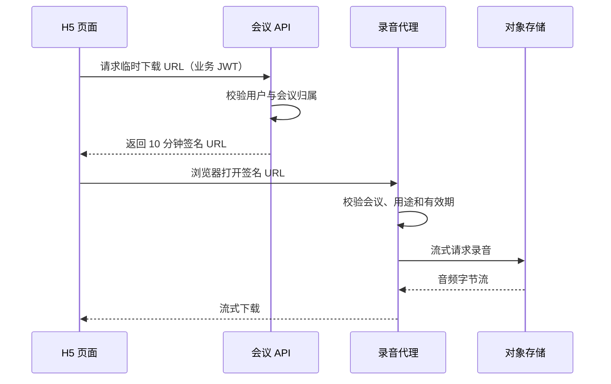

# 长会议 H5 如何避免越用越卡：有界状态、音频自愈与大文件下载

## 问题不一定发生在启动时

很多 H5 页面打开时运行正常，真正的问题要到一两个小时后才出现。会议录音尤其容易同时积累：

- 不断增加的实时转写分句；
- Vue 响应式对象和对应 DOM 节点；
- WebSocket 消息与重连状态；
- MediaStream Track、AudioContext 和 AudioWorklet；
- 大文件下载产生的 Blob；
- 页面切到后台后被系统暂停的音频资源。

因此，长时间页面的性能目标不能只看首屏速度。更重要的是：**让资源占用有明确上限，让外部中断可以被检测，让大文件的数据路径绕开前端堆内存。**

## 实时列表必须有上限

实时转写通常采用最直接的实现：

```javascript
segments.value.push(segment)
```

如果会议持续三小时，分句数组会一直增长。每条数据不仅占用 JavaScript 内存，还会参与响应式追踪、列表 Diff 和 DOM 渲染。即使单条对象很小，累计成本也会逐渐放大。

当前实践将实时页面保留的最终分句限制为最近 600 条：

```javascript
const maxLiveTranscriptSegments = 600

function trimLiveTranscriptSegments() {
  const overflow = segments.value.length - maxLiveTranscriptSegments
  if (overflow > 0) {
    segments.value.splice(0, overflow)
  }
}
```

首次加载会议时同样只取末尾部分：

```javascript
function recentTranscriptSegments(transcript) {
  if (!Array.isArray(transcript)) return []
  return transcript.slice(-maxLiveTranscriptSegments)
}
```

这样把实时页面的列表成本从随会议时长增长的 `O(n)`，限制在固定上限附近。

### 有界展示不等于删除数据

600 条限制只用于实时录音页面的展示状态，不代表服务端删除了更早的转写内容。实时页的职责是让用户看到最近进展，不应该同时承担完整历史文档阅读。

更完整的产品边界可以是：

- 实时页：最近若干条，优先保证录音稳定；
- 详情页：分页或虚拟列表查看完整转写；
- 导出：由服务端生成完整文本或文档。

如果业务要求实时回看全场内容，应该采用虚拟滚动或服务端分页，而不是简单取消上限。

## 不完整分句和最终分句要分开

实时转写服务通常会连续推送同一句话的中间结果。如果每次都追加到数组，会制造大量重复节点。

更合理的模型是：

- 中间结果存入一个独立的 `partialText`；
- 最终结果按 `sentenceId` 更新或追加到正式列表；
- 只有最终结果进入 600 条上限计算；
- 每次合并后再滚动到列表底部。

这样既避免中间结果反复膨胀，也能保持用户看到“正在说的半句话”。

## 音频链路不能只监听网络

WebSocket 仍然连接，不代表麦克风仍在输出。移动系统可能在锁屏、切后台、电话占用或音频设备变化后暂停 AudioContext，甚至把 MediaStream Track 置为静音或结束。

当前实践同时观察：

- `MediaStreamTrack.onended`；
- `MediaStreamTrack.onmute`；
- `AudioContext.onstatechange`；
- `document.visibilitychange`；
- `window.pageshow`；
- `navigator.mediaDevices.devicechange`；
- 浏览器 `online` 事件；
- WebSocket 关闭事件。

其中 `pageshow` 需要特别处理。普通首次加载也会触发它，若无条件执行恢复，可能和自动开始录音竞争。只有页面从浏览器前进后退缓存恢复，即 `event.persisted === true` 时，才复用页面可见性检查。

`devicechange` 则覆盖了蓝牙耳机连接、输入设备切换等场景。检测到变化后不应直接创建多套 AudioContext，而是进入统一的音频恢复函数，避免并发恢复。

## 自愈逻辑要防止重入

多个事件可能在很短时间内同时到达。例如从后台返回时，可能依次发生：

```text
pageshow
visibilitychange
AudioContext statechange
Track mute
devicechange
```

如果每个事件都独立重建麦克风，会造成重复申请权限、多个 MediaStream 并存和设备占用。恢复函数需要使用“正在恢复”标记或 Promise 门闩，让同一时间只有一个恢复过程执行。

清理旧资源时也应覆盖：

- 停止全部 MediaStream Track；
- 断开 AudioNode；
- 关闭 AudioContext；
- 清除定时器和重连任务；
- 释放 Wake Lock；
- 移除页面和设备事件监听器。

性能优化不只是减少创建，还包括确保旧对象能被垃圾回收。

## 为什么把录音读成 Blob 风险很高

旧的前端下载方式是：

```javascript
const response = await fetch(url)
const blob = await response.blob()
const objectUrl = URL.createObjectURL(blob)
```

这种写法简单，但 `response.blob()` 必须等浏览器把响应组装成 Blob 后才能继续。对于数百 MB 的会议录音，移动 WebView 可能面临明显的内存和临时存储压力，下载完成前页面也难以给用户稳定反馈。

更适合大文件的方式是：

1. 前端携带业务登录态请求一个短期下载链接；
2. 后端验证当前用户是否拥有这场会议；
3. 后端生成最长 10 分钟、且不超过上游录音地址有效期的签名 URL；
4. 前端创建普通 `<a>` 元素并打开该 URL；
5. 浏览器或 WebView 的下载链路直接处理响应，业务 JavaScript 不再构造完整 Blob。



这项优化降低的是前端 JavaScript 持有完整文件的压力。后端仍应使用流式代理，不能改成 `readAllBytes()` 后再一次性响应。关于代理白名单、SSRF 和 Range 的设计，可继续参考[录音安全中转与签名链接设计](secure-recording-proxy-and-signed-links.md)。

## 临时链接为什么仍需要业务鉴权

前端获取临时 URL 的接口必须先校验会议归属，不能让任意登录用户只凭会议 ID 生成下载链接。

临时 URL 本身还应绑定：

- 会议 ID；
- 固定用途，例如录音下载；
- 明确过期时间；
- 不可伪造的签名。

当前实践使用 10 分钟作为页面下载入口的最大有效期，并取以下两者的较早值：

```text
最终过期时间 = min(当前时间 + 10 分钟, 上游播放地址过期时间)
```

因此，性能优化并没有绕过已有下载安全边界，只是把“先完整读入 Blob”改成“让浏览器直接进入受控流式下载”。

## 上传校验也是鲁棒性边界

会议系统还支持上传已有音频生成纪要。大文件如果直到第三方处理阶段才失败，会浪费上传带宽、临时磁盘和外部调用资源。

当前实现把上传边界明确为：

- 最大 1GB；
- 允许 `MP3、WAV、M4A、AAC、FLAC、OGG、OPUS、WebM`；
- 同时检查扩展名和浏览器提供的 MIME；
- 对空 MIME 和 `application/octet-stream` 保留兼容；
- 前端提前提示，服务端再次强制校验。

前端校验用于改善体验，服务端校验才是安全和资源边界。因为调用者可以绕过页面直接请求 API，不能只依赖 `<input accept>`。

同时也要认识到，扩展名和 MIME 只能过滤明显错误，不能证明文件内容一定是真实音频。若后续出现伪造文件、解码漏洞或资源消耗问题，还需要在隔离环境中检查文件头或使用音频工具做受限探测。

## 如何验证优化确实有效

当前文章基于源码差异总结，性能收益仍应通过目标设备测试确认。建议至少记录以下指标：

1. 30 分钟、1 小时和 3 小时会议中的 JS Heap；
2. 转写分句持续增加时的 DOM 节点数量；
3. 页面滚动和新分句合并耗时；
4. 切后台、锁屏、接电话后音频是否恢复；
5. 连接和断开蓝牙耳机时是否出现多条录音流；
6. 下载 100MB、500MB 和接近上限的录音时，WebView 是否被系统回收；
7. 临时链接过期、上游链接过期和无权限访问的错误表现；
8. 前端绕过校验直接上传超大或错误格式文件时，后端是否拒绝。

浏览器开发工具中的短时快照只能发现一部分问题。移动 WebView 最终仍要在目标 Android/iOS 版本、目标宿主 App 和弱网条件下验证。

## 技术决策与边界

600 条不是通用最佳值，而是当前实时页面的工程上限。它应结合平均分句长度、DOM 复杂度和用户回看需求调整。

临时直链也不是所有下载场景的最终方案。高并发、大流量时，应用服务器的代理带宽可能成为瓶颈，可以进一步评估鉴权 CDN 或短期对象存储签名。

音频自愈同样不能保证修复所有宿主问题。如果 App 没有麦克风权限、没有正确委托 WebView，或者系统中有其他应用长期独占音频设备，H5 应明确提示用户，而不是无限重试。

## 总结

长会议 H5 的稳定性来自三类“有界设计”：

- 实时 UI 状态有界，只保留完成当前任务所需的数据；
- 音频恢复过程有界，统一串行恢复并彻底释放旧资源；
- 大文件数据路径有界，不让 JavaScript 为完整录音分配 Blob。

这些改动看似分散，实际都在解决同一个问题：让页面运行时间和文件大小不再无条件转化为前端内存压力，并让移动系统带来的外部中断能够被发现、解释和恢复。
