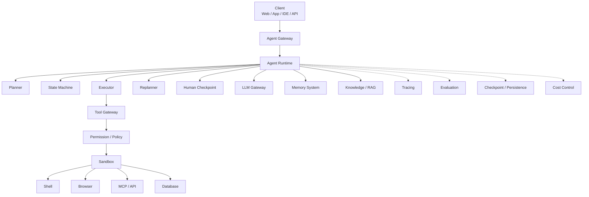
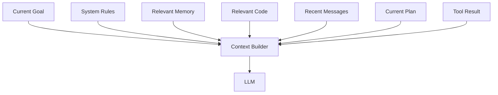
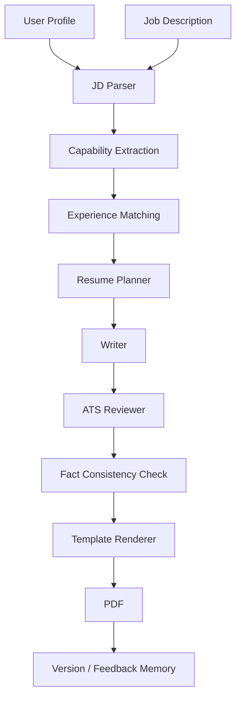

# 一个成熟的 Agent 系统应该具备什么：从 LLM + Tool 到生产级智能体架构

## 一句话理解

**成熟 Agent 不是“LLM + Prompt + 几个 Tool”，而是一套围绕模型建立的完整软件系统。**

其中：

```text
LLM
负责认知、推理和决策

Agent Runtime
负责状态和任务调度

Tools
负责与真实世界交互

Memory
负责跨时间保持连续性

Context Engineering
负责决定当前给模型看什么

Sandbox / Permission
负责限制行动边界

Observability / Evaluation
负责判断系统是否可靠
```

因此，真正的 Agent Engineering，核心并不只是“调用一个更强的模型”。

---

## 为什么 LLM + Tool 还不算成熟 Agent

最简单的 Tool Calling：

```text
User
  ↓
LLM
  ↓
Tool Call
  ↓
Tool Result
  ↓
LLM
  ↓
Answer
```

已经可以完成很多任务。

但只要任务变长，就会出现新的问题：

```text
执行到哪一步了？
失败后怎么恢复？
是否应该重新规划？
工具调用失败怎么办？
历史信息如何保存？
高风险操作是否允许？
为什么 Agent 做出这个决定？
换模型以后是否变差了？
```

这些问题无法只靠 Prompt 解决。

于是 Agent 系统开始需要真正的软件工程能力。

---

## Agent 与 Workflow 的区别

在设计系统之前，先区分两个概念。

### Workflow

流程主要由程序预先定义：

```text
A
↓
B
↓
C
↓
D
```

例如：

```text
上传简历
↓
解析
↓
提取字段
↓
生成 PDF
```

优点：

```text
稳定
可控
容易测试
```

---

### Agent

模型可以根据环境动态决定下一步：

```text
Goal
  ↓
Observe
  ↓
Decide
  ↓
Act
  ↓
Observe
  ↓
Replan
```

优点：

```text
灵活
适合开放任务
能够处理未知情况
```

缺点：

```text
不确定性更高
成本更高
更难测试
更难控制
```

Anthropic 在《Building Effective Agents》中强调了一个很实用的工程原则：

> 应优先寻找能够完成任务的最简单方案，只在确实需要时增加 Agent 自主性和系统复杂度。

因此：

```text
能用确定性 Workflow 解决
不要为了“看起来高级”强行 Multi-Agent
```

---

## 一个生产级 Agent 的总体结构



接下来逐层理解。

---

## 1. Agent Runtime：系统真正的“骨架”

Agent Runtime 负责：

```text
任务状态
执行循环
步骤调度
中断
恢复
重试
人工介入
```

一个成熟 Agent 不应该只是：

```python
while True:
    call_llm()
```

而应该有明确状态。

例如：

```json
{
  "task_id": "task-123",
  "goal": "修复登录 Bug",
  "status": "executing",
  "current_step": 4,
  "completed_steps": [1, 2, 3],
  "artifacts": [],
  "errors": []
}
```

这使系统能够回答：

```text
现在做到哪里？
什么已经完成？
为什么停止？
能不能继续？
```

LangGraph 这类框架的价值之一，就是显式管理：

```text
State
Node
Edge
Persistence
```

让 Agent 不再只是一个不可见的 LLM 循环。

---

## 2. Planning：把目标拆成可执行步骤

用户目标往往是：

```text
帮我部署这个项目。
```

但 Agent 实际需要执行：

```text
1. 分析项目结构
2. 检查依赖
3. 运行测试
4. 构建产物
5. 检查服务器环境
6. 部署
7. 配置反向代理
8. 验证
```

因此成熟 Agent 通常需要：

```text
Planner
Executor
Replanner
```

关键不是“一开始生成一个很长的计划”，而是支持：

```text
Plan
  ↓
Execute
  ↓
Observe
  ↓
发现新情况
  ↓
Replan
```

例如：

```text
原计划：
直接 Docker Build

实际发现：
项目没有 Dockerfile

Replan：
创建 Dockerfile
↓
本地验证
↓
再部署
```

这种：

```text
动态修正
```

才是 Agent 与静态 Workflow 的重要区别。

---

## 3. Tool System：Agent 的“手”

LLM 本身无法直接：

```text
修改文件
运行命令
查数据库
打开网页
发邮件
```

必须通过 Tool。

一个成熟 Tool 应至少描述：

```text
name
description
input schema
output schema
permission level
timeout
retry policy
side effects
```

例如：

```json
{
  "name": "delete_file",
  "risk": "high",
  "requires_approval": true
}
```

关键原则：

> **LLM 不应该直接操作底层资源。**

推荐：

```text
LLM
  ↓
Tool Call
  ↓
Tool Gateway
  ↓
Policy
  ↓
Sandbox
  ↓
Real Resource
```

而不是：

```text
LLM
  ↓
任意 os.system()
```

---

## 4. Memory：让 Agent 不必每次从零开始

成熟 Agent 通常需要区分：

```text
Working Memory
Session Memory
Semantic Memory
Episodic Memory
Procedural Memory
Project Memory
```

例如：

```text
Working：
当前 Bug、当前 Plan、最近 Tool Result

Session：
这一轮开发已经做了什么

Project：
项目架构、关键技术决策

Semantic：
用户环境和稳定偏好

Episodic：
以前解决过什么类似问题

Procedural：
AGENTS.md、Coding Rules、SOP
```

Memory 最重要的不是“存下来”，而是完整生命周期：

```text
Extract
Store
Retrieve
Use
Update
Merge
Forget
```

---

## 5. Context Engineering：这一轮到底应该给模型看什么

这是容易被低估的一层。

一个项目可能存在：

```text
几万行代码
几百篇文档
几千条聊天
上千条 Memory
```

但模型当前真正需要的可能只有：

```text
当前 Goal
当前 Plan
3 个相关文件
5 条相关 Memory
最近 Tool Result
```

因此需要：

```text
Context Builder
```

例如：



Agent 的能力差异，很多时候不只来自：

```text
Model
```

还来自：

```text
给模型构造了什么 Context
```

---

## 6. Knowledge / RAG：让 Agent 使用外部知识

Memory 和 Knowledge 不同。

例如：

```text
Memory：
用户项目使用 Spring Boot。

Knowledge：
Spring Boot 官方文档。
```

Knowledge Layer 可以包含：

```text
Document Loader
Parser
Chunking
Embedding
Keyword Index
Metadata
Reranker
Citation
```

成熟检索通常不应该只依赖：

```text
Vector Top K
```

还可以结合：

```text
Semantic Search
+
Keyword Search
+
Metadata Filter
+
Reranking
```

---

## 7. Permission + Sandbox：让 Agent 有能力但不能失控

Agent 越强，安全越重要。

可以给 Tool 分级：

```text
Low Risk
├── read_file
├── search
└── list

Medium Risk
├── write_file
├── install package
└── git commit

High Risk
├── delete
├── deploy
├── send_email
└── database write

Critical
├── sudo
├── production destructive operation
└── force push
```

再对应：

```text
ALLOW
ASK
DENY
```

同时使用：

```text
Filesystem Sandbox
Network Sandbox
Process Isolation
Secret Isolation
Audit Log
```

安全原则是：

> **Prompt 永远不能替代真正的权限控制。**

---

## 8. Human-in-the-loop：什么时候必须让人决定

真正成熟的 Agent 不应该追求：

```text
任何事情都不问用户
```

更好的目标是：

```text
该自主的时候自主
该确认的时候确认
```

例如：

```text
自动：
读取代码
搜索
修改工作区文件
运行测试

审批：
发送邮件
发布生产
删除数据
修改权限
支付
Force Push
```

一个合理的人机协作节点：

```text
已完成：
✓ Build
✓ Test

下一步：
发布 Production

影响：
会修改线上服务

[Approve]
[Edit]
[Reject]
```

LangGraph 的 Interrupt / Persistence 机制就是一种典型实现思路：在关键节点暂停，把状态持久化，等待人工输入后继续执行。

---

## 9. Persistence 和 Checkpoint：让长任务真正可靠

假设 Agent 已执行：

```text
Step 1 ✓
Step 2 ✓
Step 3 ✓
Step 4 API Timeout
```

错误设计：

```text
重新从 Step 1 开始
```

正确设计：

```text
读取 Checkpoint
↓
从 Step 4 恢复
```

生产级 Agent 必须考虑：

```text
进程崩溃
网络超时
模型失败
人工暂停
机器重启
长任务跨小时甚至跨天
```

因此需要：

```text
Checkpoint
Resume
Idempotency
Retry
Timeout
```

LangGraph 官方将 Durable Execution、Persistence 和 Human-in-the-loop 作为长时间有状态 Agent 的核心能力之一。

---

## 10. Fault Tolerance：错误本身也是 Workflow 的一部分

Agent 会依赖很多不稳定系统：

```text
LLM
API
Network
Browser
Shell
Database
External Service
```

因此失败不是异常情况，而是：

```text
正常工程场景
```

应该区分：

### Transient Error

例如：

```text
网络超时
503
限流
```

处理：

```text
Retry + Backoff
```

### LLM Recoverable Error

例如：

```text
命令参数错误
代码编译失败
```

处理：

```text
把错误返回 Agent
↓
重新推理
↓
修复
```

### User Fixable Error

例如：

```text
缺少凭据
缺少必要信息
需要授权
```

处理：

```text
Pause
↓
Human Input
↓
Resume
```

### Fatal Error

例如：

```text
核心依赖损坏
安全策略禁止
```

处理：

```text
Fail Fast
+
清晰错误报告
```

---

## 11. Observability：必须知道 Agent 为什么失败

Agent 的执行链通常是：

```text
LLM
→ Tool
→ Observation
→ LLM
→ Tool
→ ...
```

如果不记录 Trace，问题发生时只能看到：

```text
“任务失败”
```

却不知道：

```text
哪一步错了？
模型做了什么决策？
调用了哪个 Tool？
用了什么输入？
Memory 检索了什么？
花了多少 Token？
```

因此应该记录：

```text
Task
├── Model Call
├── Tool Call
├── State Transition
├── Memory Retrieval
├── Permission Decision
├── Error
└── Cost / Latency
```

至少支持：

```text
Tracing
Logging
Metrics
Audit
Replay
```

---

## 12. Evaluation：不能靠“感觉更聪明了”

Agent 最大的工程难点之一是：

```text
结果具有不确定性
```

同一个任务执行两次，轨迹可能不同。

因此需要分层 Eval：

```text
Tool Unit Test
      ↓
Workflow Test
      ↓
Task Evaluation
      ↓
Model / LLM Judge
      ↓
Human Evaluation
```

例如 Coding Agent 修 Bug：

```text
任务成功
≠
它说“我修好了”
```

真正应该检查：

```text
测试是否通过？
功能是否正确？
是否破坏旧功能？
是否只修改必要文件？
是否违反安全规则？
```

Anthropic 关于 Agent Eval 的工程文章特别强调：Agent 会进行多轮 Tool Call、修改环境状态并根据中间结果调整行为，因此评测也必须覆盖整个执行过程，而不仅仅看最后一段文本。

---

## 13. Skills 和 Multi-Agent：不要为了复杂而复杂

Agent 可以扩展为：

```text
General Agent
├── Coding Skill
├── Research Skill
├── Writing Skill
├── Deployment Skill
└── Data Analysis Skill
```

或者：

```text
Supervisor
├── Research Agent
├── Coding Agent
├── Testing Agent
└── Reviewer Agent
```

但需要警惕：

```text
Multi-Agent ≠ 一定更强
```

很多任务：

```text
1 个 Agent
+
10 个高质量 Tool
```

比：

```text
10 个 Agent 相互聊天
```

更稳定、更便宜、更容易 Debug。

只有在存在明显需求时才拆分：

```text
上下文隔离
专业角色差异
并行工作
权限边界
任务独立性
```

---

## 14. Model Routing：不同任务用不同模型

成熟系统通常不会：

```text
任何步骤
都调用最昂贵模型
```

可以设计：

```text
Router
├── 简单分类        → Small Model
├── 信息抽取        → Fast Model
├── 复杂推理        → Strong Model
├── Coding          → Coding-oriented Model
├── Vision          → Multimodal Model
└── Embedding       → Embedding Model
```

同时设置：

```text
Token Budget
Cost Budget
Max Steps
Timeout
Tool Limits
```

否则 Agent 可能：

```text
循环几十次
```

为一个简单任务消耗远高于必要成本。

---

## 15. Scheduler / Queue：从“聊天工具”走向真正任务系统

真正生产化以后，Agent 不一定只响应：

```text
用户当前的一句话
```

还可能执行：

```text
定时任务
后台任务
Webhook
批处理
异步长任务
```

于是需要：

```text
Task Queue
Scheduler
Worker
Priority
Concurrency Control
```

例如：

```text
每晚 2:00
↓
检查项目 Issues
↓
分类
↓
生成日报
```

这时 Agent 已经更像：

```text
智能任务执行系统
```

而不是聊天机器人。

---

## 一个成熟 Agent 应该形成五个闭环

这是最适合整体记忆的方式。

### 认知闭环

```text
Understand
↓
Plan
↓
Act
↓
Observe
↓
Reflect
↓
Replan
```

解决：

```text
会不会做事
```

---

### 记忆闭环

```text
Observe
↓
Extract
↓
Store
↓
Retrieve
↓
Use
↓
Update / Forget
```

解决：

```text
会不会积累
```

---

### 安全闭环

```text
Action
↓
Risk
↓
Permission
↓
Sandbox
↓
Execution
↓
Audit
```

解决：

```text
会不会乱做事
```

---

### 质量闭环

```text
Run
↓
Trace
↓
Evaluate
↓
Find Failure
↓
Improve
↓
Regression Test
```

解决：

```text
能不能越来越可靠
```

---

### 生命周期闭环

```text
Created
↓
Running
↓
Checkpoint
↓
Interrupted
↓
Resume
↓
Completed
↓
Artifacts / Memory
```

解决：

```text
能不能长期运行
```

---

## Agent 系统成熟度可以怎么划分

### Level 1：LLM Application

```text
Prompt
+
LLM
```

主要解决：

```text
生成内容
```

---

### Level 2：Tool Agent

```text
LLM
+
Tools
+
Agent Loop
```

已经可以：

```text
真正执行动作
```

---

### Level 3：Engineering Agent

```text
LLM
Tools
State
Workflow
Memory
RAG
Permission
Checkpoint
Tracing
```

开始具备：

```text
真实工程可用性
```

---

### Level 4：Production Autonomous Agent

```text
Dynamic Planning
Long-Term Memory
Sandbox
Human-in-the-loop
Durable Execution
Evaluation
Observability
Fault Tolerance
Model Routing
Cost Control
Scheduling
Security Governance
```

这时系统才真正接近：

```text
可长期运行
可审计
可恢复
可评测
可控制
```

的生产级 Agent。

---

## 用“简历生成 Agent”理解如何逐步升级

一个最简单版本：

```text
个人信息
+
JD
↓
LLM
↓
Resume PDF
```

这更接近：

```text
LLM Application
```

进一步可以变成：



再加入：

```text
State
Memory
Tool System
Evaluation
Sandbox
Observability
Human Review
```

就逐渐从：

```text
Prompt 工程
```

变成：

```text
Agent Engineering
```

---

## 实际设计时最值得优先做什么

对于个人或小团队项目，我认为优先级可以是：

```text
1. 明确任务边界
2. Tool 设计
3. State / Workflow
4. Context Engineering
5. Memory
6. Permission / Sandbox
7. Evaluation
8. Observability
9. Multi-Agent
```

其中一个非常重要的原则是：

> **不要过早 Multi-Agent。**

先保证单 Agent：

```text
能稳定完成任务
能恢复
能测试
能观察
```

再考虑复杂协作。

---

## 常见误区

### 误区一：模型越强，系统就越成熟

错误。

强模型可以提高：

```text
Reasoning
```

但不能自动解决：

```text
权限
状态
恢复
审计
评测
持久化
成本
```

---

### 误区二：Agent = ReAct Loop

ReAct 是一个重要模式，但成熟 Agent 系统远不止：

```text
Thought
Action
Observation
```

还需要大量外围基础设施。

---

### 误区三：Multi-Agent 一定比单 Agent 高级

复杂度增加后可能出现：

```text
信息重复
上下文污染
沟通成本
Token 爆炸
责任不清
难以 Debug
```

所以复杂度应该由任务需求驱动。

---

### 误区四：只看最终回答

Agent 的真正结果可能包括：

```text
代码修改
文件
数据库变化
邮件
Git Commit
部署
```

因此 Evaluation 必须看：

```text
Environment State
```

而不只是最后一句：

```text
“任务已完成”
```

---

## 总结

成熟 Agent 可以用一句公式概括：

```text
Production Agent
=
LLM
+
Runtime
+
Tools
+
State
+
Memory
+
Context
+
Knowledge
+
Security
+
Human Control
+
Persistence
+
Observability
+
Evaluation
+
Fault Tolerance
```

其中最重要的认知转变是：

```text
Agent 不只是一个“更聪明的聊天机器人”
```

而是：

> **一个以 LLM 为认知核心、能够感知环境、调用工具、维持状态、积累记忆、接受约束并持续执行任务的软件系统。**

当一个 Agent 开始拥有真实行动能力以后，决定它是否成熟的，不再只是：

```text
模型回答得聪不聪明
```

而是：

```text
是否可靠
是否可控
是否可恢复
是否可观察
是否可评测
是否能长期维护
```

这才是从 Agent Demo 走向生产系统真正需要跨过的门槛。

---

## 延伸阅读

- [Anthropic：Building Effective Agents](https://www.anthropic.com/engineering/building-effective-agents)，访问于 2026-07-24。
- [Anthropic：Demystifying Evals for AI Agents](https://www.anthropic.com/engineering/demystifying-evals-for-ai-agents)，访问于 2026-07-24。
- [LangGraph Overview](https://docs.langchain.com/oss/python/langgraph/overview)，访问于 2026-07-24。
- [LangGraph Persistence](https://docs.langchain.com/oss/python/langgraph/persistence)，访问于 2026-07-24。
