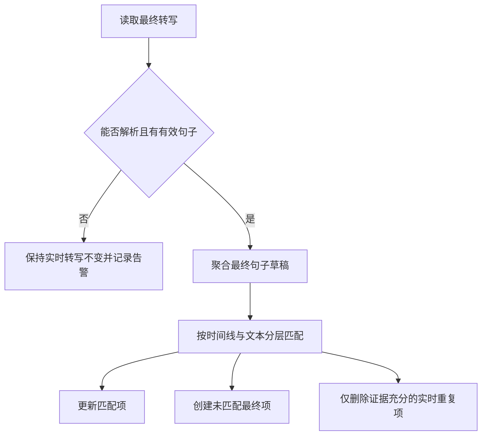

# 同一句话为什么出现两遍：实时转写与最终转写的时间线对齐

## 两份转写各有价值，也各不完整

实时会议系统通常会收到两套转写：

- **实时转写**：会议进行中逐句到达，适合即时展示和故障观测；
- **最终转写**：会议结束后由服务商生成，通常经过合句、断句和纠错，更适合作为最终结果。

最直接的实现是把两者都按服务商的 `sentenceId` 保存，最终结果到达时用相同 ID 覆盖实时行。但一次测试会议暴露了这个假设的问题：前面多出一条实时重复句后，最终转写的句子编号整体发生偏移。同一句话在两份结果里拥有不同 ID，按 ID 更新就会留下重复内容，甚至把最终文本覆盖到错误的实时句子上。

根因是把服务商的临时标识当成了跨阶段稳定主键。

## `sentenceId` 为什么会漂移

实时识别和离线整理不是同一条不可变流水线。服务商可能在最终处理时：

- 合并实时阶段的两句话；
- 拆分一句过长内容；
- 删除重复或无效片段；
- 调整标点、说话人和分段；
- 重新编号最终句子。

因此，`sentenceId` 可以作为一份结果内部的定位符，却未必能作为“实时句子 = 最终句子”的事实依据。

更稳定的证据是声音发生在录音中的时间区间。即使句子编号变化，同一段语音的开始和结束时间通常仍然接近。

## 第一步：实时阶段就要保存时间证据

最终对账的质量取决于实时阶段保存了什么。若实时表只有文本和句子 ID，事后就没有足够信息区分两次相同的发言。

服务商的不同事件可能使用不同时间字段，例如：

```text
beginTimeMs / endTimeMs
beginTime / endTime
start / end
```

有些句级事件没有时间，但内部 `words` 数组带有每个词的时间。解析层应：

1. 优先读取句级支持字段；
2. 缺失时使用首个词的开始时间和末个词的结束时间；
3. 后续同句更新不带时间时，保留已经落库的时间，而不是写成 `null`。

第三点很重要。实时事件经常先给出完整时间，后续修订只更新文本。若每次都把缺失字段原样覆盖，最有价值的匹配证据会在会议结束前被自己擦掉。

## 第二步：先把最终单词聚合成句子草稿

最终转写常以段落和单词数组返回。对账前先按最终 `sentenceId` 分组，形成草稿：

```text
SegmentDraft {
  finalSentenceId,
  text,
  speakerId,
  minBeginMs,
  maxEndMs
}
```

文本拼接也有语言细节。中文词之间通常不应强行插入空格，而连续 ASCII 字母或数字需要空格，否则 `hello` 和 `world` 会被拼成 `helloworld`。当前实现只在前后边界都是 ASCII 单词字符时插入空格，是一个简单但实用的折中。

时间区间取组内最小开始值和最大结束值，以覆盖完整句子。

## 第三步：按证据强度分层匹配

一个稳妥的匹配顺序是：

1. **时间线接近且文本相同**；
2. **时间线接近**；
3. **句子 ID 相同，且时间线没有明确冲突**；
4. **归一化文本唯一相同**。

顺序不能随意交换。

时间线加文本是最强证据。仅按时间也允许最终结果修正识别文本。相同 ID 只能作为后备条件，并且不能推翻明确的时间冲突。纯文本匹配必须要求候选唯一，否则会议中两次“好的”很容易被错误合并。

当前项目对开始时间允许约 `1.5` 秒偏差，对结束时间允许约 `3` 秒偏差。结束容差更宽，是因为最终断句和实时断句的尾部差异通常更大。这里的数值不是通用标准，应结合服务商输出和真实样本校准。

可以把候选评分表示为：

```text
score = |realtime.begin - final.begin|
      + |realtime.end   - final.end|
```

任一已知时间差超过容差，候选直接淘汰；双方都没有可比较时间时，不能假装分数为零，而应判定为“无时间证据”。

## 第四步：匹配后原位更新，未匹配才新增

对于匹配成功的实时行，直接写入最终文本、说话人、时间区间，并标记为 final。这样可以保留数据库主键以及其他可能关联该行的信息。

没有匹配项时再创建新行。最终 `sentenceId` 若已被占用，应生成带前缀或后缀的唯一 ID，而不是触发唯一约束失败，也不能覆盖另一句。

每个实时候选最多匹配一次。成功匹配后立即从候选集合移除，避免多个最终句子争用同一实时行。

## 删除比新增更危险

最终对账后可能仍有未匹配的实时行，其中一部分确实是实时阶段产生的重复句。但不能简单执行“删除所有未匹配实时行”，原因包括：

- 最终快照可能不完整；
- 某些实时内容可能被服务商错误漏掉；
- 时间字段可能缺失；
- 解析规则可能尚未覆盖新的响应结构。

当前策略只删除有双重证据的重复项：

```text
归一化文本相同
AND
时间线落在允许容差内
```

文本归一化会移除标点和空白、统一字母大小写，以容忍“好的。”与“好的”的格式差异。仅文本相同但时间不同的两次发言必须保留。

这体现了一个适合数据对账的原则：**新增错误通常可见且可修，误删原始事实往往不可恢复，所以删除门槛应高于匹配门槛。**

## 空快照和坏快照必须是 no-op

最终转写是权威结果，不代表每次获取到的文件都有效。网络、对象存储、供应商异步任务或结构变化，都可能产生：

- 空字符串；
- 非法 JSON；
- `paragraphs` 为空；
- 有段落但没有任何有效句子。

这些情况不能解释为“会议没有内容”，更不能先清空实时表再导入。正确行为是保留既有实时转写，并记录警告，让原始最终快照留在重试或原始数据表中供后续修复。



## 必测场景

对账算法至少要覆盖：

- 最终句子 ID 整体偏移，但时间线仍对应；
- 最终文本修正了实时识别错误；
- 同一文本在不同时间出现两次，不能误合并；
- 同一句的后续实时更新缺少时间，旧时间仍保留；
- 句级时间缺失，可从词级时间回退；
- 没有任何实时行时，最终转写可以完整创建；
- 最终快照为空或损坏时，不查询、更新或删除现有转写；
- 已持久化的实时重复项只有在文本和时间都吻合时才删除。

## 当前方案的边界

分层贪心匹配对一般会议足够直观，也便于解释，但它不是全局最优算法。如果大量句子时间重叠、多人同时发言，或最终服务频繁合并与拆分句子，局部最优候选可能影响后续匹配。

更复杂的系统可以把问题建模为二分图匹配，综合时间重叠率、编辑距离、说话人和相邻顺序求全局最优。但复杂算法只有在真实样本证明现有方法不足后才值得引入；否则会增加不可解释性和调参成本。

## 总结

实时转写和最终转写不是两个可以按 ID 直接覆盖的版本，而是对同一段音频的两次独立解释。可靠对账需要把时间、文本、说话人和顺序视为证据，并对更新、新增、删除设置不同的确信门槛。

最关键的实践是：实时阶段提前保存时间证据；最终阶段优先按时间线匹配；坏快照保持 no-op；删除动作保持保守。这样既能获得最终转写的质量，也不会轻易丢掉实时链路已经捕获的事实。

有关如何在管理端同时观察实时文本、最终文本和链路事件，可参考[从“录音正常”到证据链完整](../projects/observable-mobile-recording-pipeline.md)。
