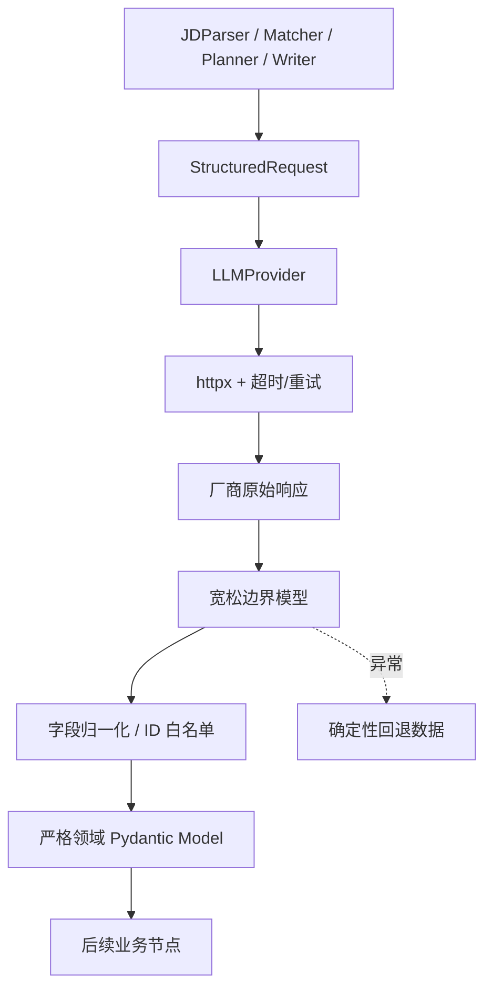

# 结构化大模型调用如何可靠落地：Provider、宽松边界与确定性降级

## 一句话理解

可靠的结构化模型调用不是“让模型每次都输出完美 JSON”，而是把厂商协议、网络错误、响应容错、领域约束和业务降级拆成不同层，每层只解决自己能够确定的问题。

本文来自 ResumeTailor Agent 的本地实践。系统当前接入 DeepSeek、OpenAI 和无密钥 Mock Provider，所有业务节点只依赖统一的 `LLMProvider`。

## 为什么需要 Provider 适配层

不同模型厂商可能都提供聊天接口，但以下行为并不完全一致：

- 结构化输出参数和 JSON Schema 支持方式；
- 响应对象层级和 usage 字段；
- 错误状态、错误体和限流语义；
- Base URL 和模型命名；
- 对非法 JSON 或 Markdown 代码块的处理。

如果业务节点直接拼接 DeepSeek 请求，未来增加 OpenAI 时就会复制认证、超时和错误处理逻辑，Prompt 也容易散落到 Service 和路由中。

统一接口只暴露业务真正需要的能力：

下面是省略具体参数后的接口示意；项目实现使用抽象基类：

```python
class LLMProvider(ABC):
    def generate_text(...) -> LLMTextResponse: ...
    def generate_structured(...) -> StructuredResponse: ...
    def health_check(...) -> LLMHealth: ...
    def count_usage_if_available(...) -> LLMUsage | None: ...
```

Provider 负责厂商差异，Agent 节点负责业务语义，两者不互相越界。

## 分层结构



这里有两个容易混淆的 Schema：

1. **边界模型**允许部分类型和额外字段，用于接住模型的近似结构；
2. **领域模型**表达业务真正接受的严格合同。

如果直接让外部响应一步进入最严格模型，一个枚举大小写或单个非关键字段错误就可能让整个节点失败。反过来，如果业务全程使用宽松字典，错误又会扩散到后续步骤。

## 宽松边界不等于放松业务约束

以简历规划为例，模型可能返回：

- 未知 section 类型；
- 字符串形式的页数；
- 不存在的 Evidence ID；
- 空 section；
- 超出范围的 `max_items`。

边界层先接住响应，归一化程序再执行：

- 只允许已知 section 类型；
- 页数限制为 1 或 2；
- 风格限制为已知枚举；
- Evidence ID 必须在输入白名单；
- 数量字段裁剪到安全范围；
- 缺失模块和条目与确定性基线合并。

最后才构造严格 `ResumePlan`。因此，宽松只发生在外部输入入口，领域内部仍然保持严格。

## 超时应该按节点分层

早期实现使用同一个模型超时。实际运行中，模型健康检查很快成功，但较长 JD 的结构化解析仍然可能超时。把所有请求都延长会让健康接口和普通操作变慢，而保持统一短超时又会让生成节点频繁降级。

当前配置拆为：

```dotenv
LLM_TIMEOUT_SECONDS=45
LLM_JD_TIMEOUT_SECONDS=180
LLM_GENERATION_TIMEOUT_SECONDS=120
LLM_MAX_RETRIES=2
```

这些数值是当前项目的本地配置基线，不是所有模型和网络环境的通用最优值。关键思路是按用途拆分：

- 普通健康检查需要快速反馈；
- JD 解析输入较长，使用独立窗口；
- 匹配、规划和写作属于生成节点，使用另一组窗口；
- 前端轮询时间必须大于后端可能的完整处理时间。

“模型健康”只能证明基本连接和认证可用，不能证明每个长任务都会在业务窗口内完成。

## 错误分类和有限重试

重试策略不应该对所有错误一视同仁：

| 错误 | 处理方式 | 原因 |
| --- | --- | --- |
| 401 | 不重试，返回认证失败 | 重试不会修复错误密钥 |
| 403 | 不重试，返回权限失败 | 通常需要修改权限或配置 |
| 429 | 有限退避重试 | 限流可能是暂时的 |
| 部分 5xx | 有限退避重试 | 上游可能短暂异常 |
| timeout/transport | 有限重试 | 网络抖动可能恢复 |
| 非法 JSON/Schema | 明确响应错误或节点降级 | 无限自修复可能形成不可控循环 |

重试次数必须有限，并且日志只记录必要元数据和异常类型。完整 Prompt、姓名、电话、邮箱和 API Key 不应出现在普通日志中。

## 节点级降级

一个生成任务包含匹配、规划和写作等多个模型节点。某个节点失败时，有三种选择：

1. 整个任务失败；
2. 无限让模型修复自己；
3. 使用确定性、安全但可能不够精细的结果继续。

当前项目选择第三种，并记录 `model_fallbacks` 元数据。Mock Provider 接收调用方提供的、已经符合 Schema 的回退数据，因此不需要网络，也不会新增事实。

降级的底线是：

- 只使用已有 Evidence；
- 不跳过事实校验；
- 在最终文档中加入需要人工复核的警告；
- 保留是哪个节点、哪类异常触发了降级；
- 不保存包含完整个人资料的原始 Prompt。

降级不是把错误伪装成模型成功，而是让系统在可解释的能力下降状态下完成安全结果。

## Prompt 管理

Prompt 不应写在路由函数或大型 Service 中。当前做法是为每个节点建立独立 `PromptSpec`，包含：

- system prompt；
- user prompt 模板；
- 输入和输出模型；
- 版本号；
- 说明和测试样例。

生成任务保存 Prompt 版本，而不是默认保存完整 Prompt。这样既能追踪行为变化，也减少个人资料在日志和数据库中的复制。

## 最小测试矩阵

Provider 和结构化边界至少应覆盖：

- DeepSeek 成功响应和 usage 映射；
- OpenAI 成功响应和 Schema 参数；
- 401/403 不重试；
- 429、5xx 和网络超时有限重试；
- 非法 JSON 和不符合 Schema 的响应；
- Provider 环境变量切换；
- 未配置 API Key 时的明确错误；
- Mock Provider 的可重复结构化结果；
- 模型返回不存在的 Evidence ID 时被白名单清理；
- 节点超时后降级结果仍通过事实闸门。

截至 2026-07-17，所属项目已实际通过 Ruff、MyPy、30 项后端/集成测试、9 项前端测试和生产构建。这个结果说明当前适配合同有自动化保护，但不等于覆盖所有厂商未来的 API 变化。

## 常见误区

### 假设兼容 OpenAI 协议就完全相同

请求路径相似不代表结构化参数、错误体和 usage 一致。Provider 仍应独立映射，不要让业务节点依赖某个厂商的原始响应对象。

### 把超时一味调大

延长超时可以减少部分误判，但不能修复结构异常、上下文过长或前端重复提交。需要同时处理幂等、状态轮询、节点降级和输入规模。

### 用 `dict[str, Any]` 贯穿全流程

字典在边界处方便，但会让错误延迟到渲染或数据库阶段。边界之后应尽快归一化到严格领域模型。

### 降级时跳过校验

本地规则或 Mock 结果同样可能包含字段错误。降级只能替换模型能力，不能跳过 Schema、Evidence 和事实检查。

## 适用边界

这种模式适合结构化业务工作流，不适合需要自由探索、未知工具链和开放式长程自治的 Agent。确定性回退的质量依赖业务是否能够构造合理基线；如果某个任务完全依赖模型创造性，降级可能只能明确失败，而不能生成替代结果。

## 总结

结构化模型调用的可靠性来自多层合同：Provider 隔离厂商差异，HTTP 层分类错误和重试，宽松边界接住近似响应，归一化程序执行白名单和范围约束，严格领域模型保护内部流程，确定性回退提供安全下限。

模型不需要每次都完美，系统需要保证模型不完美时仍然可解释、可测试、可恢复。

相关项目设计见：[从岗位 JD 到可追溯 PDF](../projects/resume-tailor-agent-controlled-workflow.md)。
