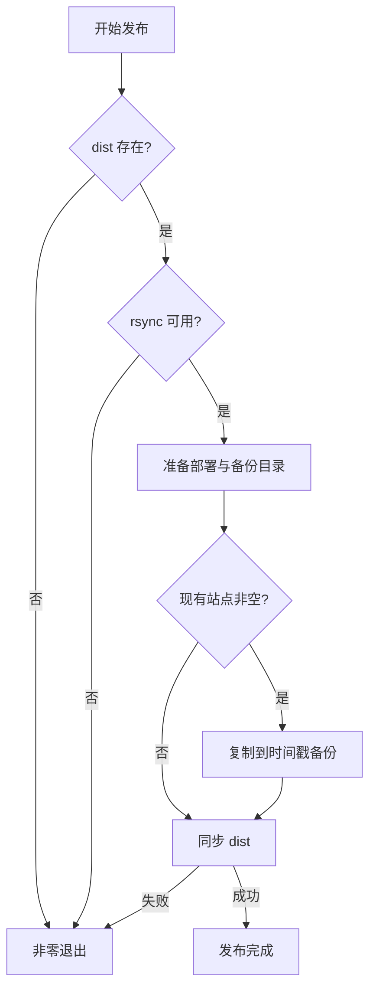
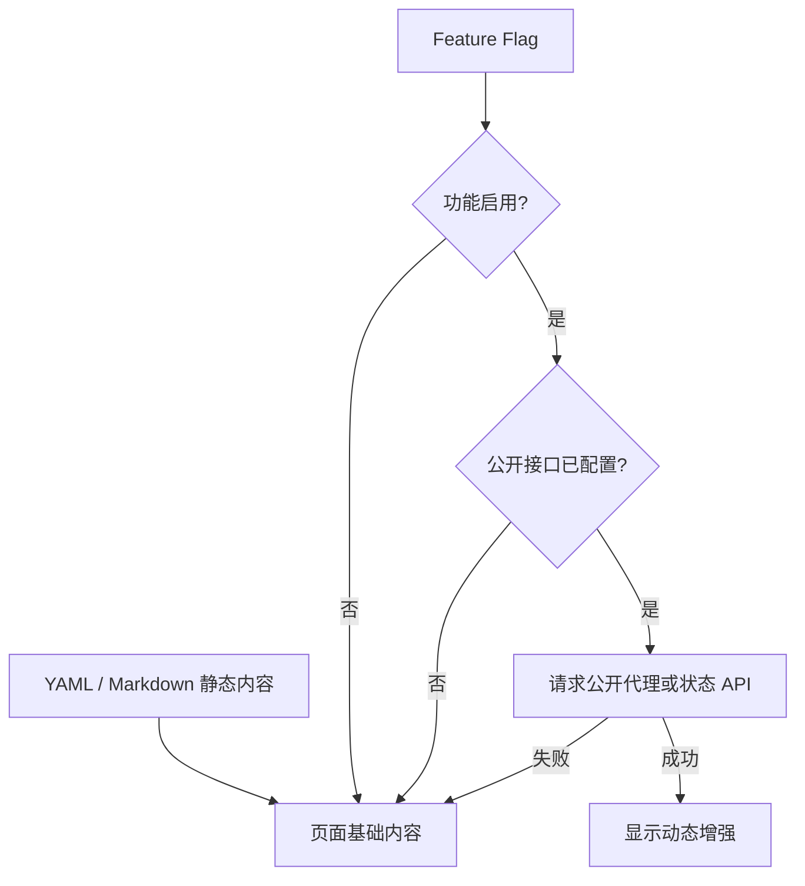

# 静态网站也需要工程化：备份发布、功能开关与动态接口边界

## 一句话理解

静态网站不需要常驻应用服务器，但仍然需要可靠发布、失败退出、备份回滚、功能隔离和安全的动态数据边界。

ZGLab 的主路径始终是：

```text
内容文件 -> Astro 构建 -> dist/ -> Nginx
```

项目在线状态、最近部署时间和 GitHub 数据属于可选增强。它们不能反过来成为首页能否显示的前置条件。

## 为什么静态网站仍会发布失败

静态页面没有数据库迁移和服务启动，并不意味着部署没有风险。常见问题包括：

- 忘记构建，部署目录为空或仍是旧版本；
- 覆盖前没有备份，发现问题后无法快速恢复；
- `rsync --delete` 目标写错，删除了其他文件；
- 复制中断后返回成功，自动化流程误判；
- 部署目录权限错误，Nginx 无法读取；
- 新页面依赖尚未配置的接口，首页出现异常；
- 把 GitHub Token 放进 `PUBLIC_` 环境变量并打包到浏览器。

因此静态发布仍需要把每个风险转化为明确检查。

## 发布脚本的状态机



这里最重要的不是 Bash 写法，而是：**失败路径必须比成功日志更可信。**

## 使用严格 Shell 模式

脚本开头：

```bash
#!/usr/bin/env bash

set -Eeuo pipefail
```

含义：

- `-e`：未处理的失败命令使脚本退出；
- `-E`：让 `ERR` trap 在函数等上下文中继承；
- `-u`：读取未定义变量时失败；
- `pipefail`：管道中任意阶段失败都会影响最终状态。

再增加错误提示：

```bash
on_error() {
  printf '部署失败：请检查上方错误信息。现有备份不会被删除。\n' >&2
}

trap on_error ERR
```

错误提示不能替代原始命令输出，所以这里只补充上下文，不吞掉上方错误。

## 先检查发布源

```bash
if [[ ! -d "${SOURCE_DIR}" ]]; then
  printf '部署失败：未找到构建目录 %s，请先运行 npm run build。\n' \
    "${SOURCE_DIR}" >&2
  exit 1
fi
```

检查目录存在只是最低要求。更严格的版本还可以检查：

```bash
test -f "${SOURCE_DIR}/index.html"
```

如果站点必然存在首页，这能避免一个空 `dist/` 通过检查。

截至 2026-07-17，ZGLab 脚本已经实际验证：当 `SOURCE_DIR` 不存在时会返回退出码 1，并输出明确错误。真实生产目录仍需单独验证。

## 环境变量覆盖路径

脚本提供安全默认值：

```bash
SOURCE_DIR="${SOURCE_DIR:-${PROJECT_ROOT}/dist}"
DEPLOY_DIR="${DEPLOY_DIR:-/var/www/zglab.fun}"
BACKUP_ROOT="${BACKUP_ROOT:-/var/backups/zglab.fun}"
```

这样同一脚本可以在临时测试和生产环境中使用：

```bash
SOURCE_DIR=/tmp/zglab-release \
DEPLOY_DIR=/tmp/zglab-preview \
BACKUP_ROOT=/tmp/zglab-backups \
DEPLOY_USE_SUDO=0 \
./scripts/deploy.sh
```

路径可配置不等于允许调用者随意填写。执行 `rsync --delete` 前必须确认目标是专用部署目录。

## 为什么备份必须发生在同步之前

同步使用：

```bash
rsync --archive --delete "${SOURCE_DIR}/" "${DEPLOY_DIR}/"
```

`--archive` 保留常用文件属性并递归复制；`--delete` 删除目标中源目录不存在的文件，使部署目录与构建结果一致。

它非常适合不可变静态产物，但也意味着旧文件会消失。因此先执行：

```bash
rsync --archive "${DEPLOY_DIR}/" "${BACKUP_DIR}/"
```

备份目录使用时间戳：

```bash
TIMESTAMP="$(date +%Y%m%d-%H%M%S)"
BACKUP_DIR="${BACKUP_ROOT}/${TIMESTAMP}"
```

尾部斜杠也有语义：

- `source/` 表示同步目录中的内容；
- `source` 可能把目录本身作为一层复制。

部署和回滚都应保持路径写法一致。

## 备份策略的边界

当前脚本不自动删除任何备份，能保证最近一次备份不会被清理。但长期运行后必须处理容量问题。

合理的后续策略可以包括：

- 始终保留最近 N 份；
- 每周或每月保留一个长期版本；
- 清理前先确认目标目录格式；
- 将清理逻辑和发布逻辑分开；
- 对备份目录设置容量监控。

清理是破坏性操作，不能在没有验证的情况下直接加入发布脚本。

## 如何测试部署脚本而不碰生产目录

先做语法检查：

```bash
bash -n scripts/deploy.sh
```

再准备临时目录：

```bash
TEST_ROOT="$(mktemp -d)"
mkdir -p "${TEST_ROOT}/site"
mkdir -p "${TEST_ROOT}/source"
mkdir -p "${TEST_ROOT}/backups"
```

在 `source` 中放一个最小静态文件，在 `site` 中放一个旧文件，然后执行：

```bash
SOURCE_DIR="${TEST_ROOT}/source" \
DEPLOY_DIR="${TEST_ROOT}/site" \
BACKUP_ROOT="${TEST_ROOT}/backups" \
DEPLOY_USE_SUDO=0 \
./scripts/deploy.sh
```

验证：

```bash
test -f "${TEST_ROOT}/site/index.html"
find "${TEST_ROOT}/backups" -type f
```

测试完成后删除临时目录属于破坏性操作。执行前先输出并确认变量：

```bash
printf '%s\n' "${TEST_ROOT}"
```

确认它确实是本次创建的临时目录后，再由操作人员决定是否清理。

ZGLab 当前脚本已经在临时目录中实际通过“先备份旧文件，再同步新构建”的测试。

## 功能开关解决什么问题

网站未来计划增加 Notes、工具、运行状态和 GitHub 活动，但首版并没有这些完整页面和可靠数据。

功能开关：

```ts
export const features = {
  notes: false,
  tools: false,
  runtimeStatus: false,
  githubActivity: false,
  downloadResume: false,
};
```

导航过滤：

```ts
export const visibleNavigation = navigation.filter(
  (item) => !item.feature || features[item.feature],
);
```

它解决的是**入口与实现不同步**的问题：

- 关闭时不显示导航；
- 打开前必须先完成页面和验证；
- 不需要在组件中删除大量代码；
- 可以保留未来设计，但不向访问者展示空功能。

Feature flag 不是权限系统。前端隐藏一个链接不能保护敏感接口。

## 静态主路径与动态增强如何分层



无论动态请求在哪一步失败，静态内容都应继续显示。

## 空配置时不发送请求

服务层先读取公开环境变量：

```ts
const statusApiBaseUrl = import.meta.env.PUBLIC_STATUS_API_BASE_URL?.trim();
```

查询函数：

```ts
export const getProjectRuntimeStatus = async (endpoint: string | undefined) => {
  if (!statusApiBaseUrl || !endpoint) return null;

  const url = new URL(
    endpoint.replace(/^\//, ""),
    `${statusApiBaseUrl.replace(/\/$/, "")}/`,
  );

  return fetchJson(url.toString());
};
```

这个早返回保证：

- 没有配置地址时不发请求；
- 不会因为 `fetch('')` 产生当前页面请求；
- 首版构建不依赖外部服务；
- 组件可以把 `null` 视为“不展示动态状态”。

`fetchJson()` 还将非 2xx 和网络错误归一化为 `null`。是否需要日志或错误提示，应根据调用发生在构建期还是浏览器端决定。

## `PUBLIC_` 环境变量为什么危险

Astro 中带 `PUBLIC_` 前缀的变量用于客户端可见配置。它们可能进入浏览器构建产物，因此只能存放公开信息，例如：

```dotenv
PUBLIC_STATUS_API_BASE_URL=
PUBLIC_GITHUB_PROXY_URL=
```

绝不能写：

```dotenv
PUBLIC_GITHUB_TOKEN=<secret>
PUBLIC_PRIVATE_API_KEY=<secret>
```

即使仓库是私有的，构建产物也会发送到访问者浏览器。私密 Token 必须留在受控服务端，由代理接口执行认证和数据裁剪。

## 为什么 GitHub 数据需要代理边界

如果未来需要展示最近提交或仓库数据，有三种情况：

1. 公开仓库的公开信息可以在构建阶段拉取；
2. 私有仓库数据需要服务端凭据；
3. 浏览器直接访问 GitHub API 还会遇到限流、认证和隐私问题。

当前设计只给浏览器一个公开代理地址：

```ts
export interface GitHubRepositorySnapshot {
  repository: string;
  lastCommitAt?: string;
  defaultBranch?: string;
}
```

代理应只返回页面需要的字段，而不是转发完整 GitHub 响应，更不能把上游 Token 返回给客户端。

## 运行状态的数据合同

```ts
export type RuntimeState = "operational" | "degraded" | "offline" | "unknown";

export interface ProjectRuntimeStatus {
  project: string;
  state: RuntimeState;
  version?: string;
  lastDeployedAt?: string;
  checkedAt?: string;
}
```

`unknown` 很重要。请求失败、未配置和服务离线并不是同一个事实：

- `offline` 应来自可靠探测结果；
- `unknown` 表示当前无法确认；
- 未配置时可以直接隐藏，不必制造一个红色离线状态。

不要把“没有收到状态”解释成“服务已经离线”。

## 最小测试矩阵

发布脚本：

- `dist/` 缺失时非零退出；
- rsync 缺失时非零退出；
- 目标为空时正常部署；
- 目标非空时先产生备份；
- 同步失败时不输出成功；
- `SOURCE_DIR`、`DEPLOY_DIR` 和 `BACKUP_ROOT` 可覆盖；
- 备份中保留旧版本文件。

动态接口：

- 基础 URL 未配置时不发请求；
- endpoint 未配置时不发请求；
- 非 2xx 返回 `null`；
- 网络异常返回 `null`；
- 成功响应满足明确类型；
- 页面在 `null` 状态下仍显示静态内容；
- 构建产物不包含 Token、密码和私有 API Key。

功能开关：

- `false` 时入口不渲染；
- `true` 时对应页面实际存在；
- 直接访问未启用路由时不会泄露半成品；
- 开关变化后重新执行完整静态构建。

## 常见误区

### 认为静态部署只需要 `cp -r`

直接复制没有备份、删除策略和明确失败状态。少量手工部署可以使用 `cp`，但长期维护更需要可审计流程。

### 把 `rsync --delete` 用在混合目录

部署目录必须只保存构建产物。上传文件、日志、证书和数据库文件不能与静态站点混在一起。

### 用前端开关保护私有功能

前端构建中的开关和代码都可以被访问者查看。真正的权限必须由服务端执行。

### 动态接口失败时清空整个页面

运行状态只是增强信息，不应覆盖项目标题、摘要和技术栈等静态事实。

### 把请求失败显示为离线

网络超时只能证明本次请求没有获得结果，不能证明目标服务离线。

## 适用边界

这种“静态优先、动态增强”的模式适合：

- 个人网站；
- 项目档案；
- 文档和博客；
- 低频更新的公开门户；
- 对运行成本和可用性有要求的轻量站点。

如果页面核心内容必须依赖用户身份、实时数据库或私有权限，应该使用受控后端或 SSR，而不是不断把服务端逻辑塞进浏览器。

## 总结

静态网站的可靠性来自四条边界：

1. 构建结果是唯一发布源；
2. 覆盖前备份，失败时非零退出；
3. 未实现功能通过开关隐藏；
4. 动态数据只能增强静态内容，不能决定基础页面是否可用。

在这个基础上，未来增加项目状态、部署时间和 GitHub 活动时，系统仍然能够保持安全、可回滚和可解释。

相关笔记：

- [从构建到上线：Ubuntu 24.04 + Nginx 部署 Astro 静态网站](../projects/deploy-astro-static-site-with-nginx.md)
- [用 Astro Content Collections、YAML 与 Zod 构建配置驱动网站](astro-content-collections-config-driven-content.md)

## 参考资料

- [Astro 部署指南](https://docs.astro.build/en/guides/deploy/)，访问于 2026-07-17。
- [rsync 官方手册](https://download.samba.org/pub/rsync/rsync.1)，访问于 2026-07-17。
