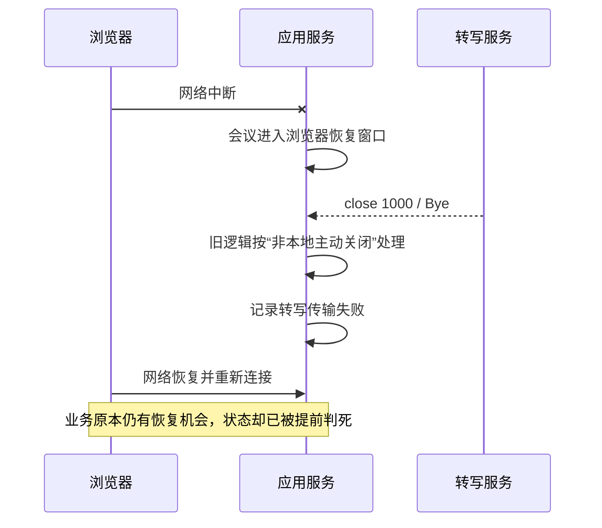

# 1000 / Bye 明明是正常关闭，为什么却被记成录音失败

## 问题背景

浏览器实时录音通常不只有一条连接。以当前会议系统为例，音频会经过两段 WebSocket：


浏览器断网后，应用服务会保留会议一段时间，等待浏览器恢复；与此同时，上游转写服务可能因为长时间收不到音频而主动结束自己的 WebSocket。一次线上排查中，上游连接以 `1000 / Bye` 关闭，旧逻辑却把会议记成了 `RECORDING_FAILED`。

表面上看很矛盾：`1000` 是 WebSocket 的正常关闭码，为什么会进入失败分支？真正的问题并不在关闭码本身，而在于系统把“连接终止”和“业务失败”当成了同一件事。

## 关闭码只描述协议结果

RFC 语义中的 `1000` 只说明某一条 WebSocket 连接正常完成了关闭握手。它没有回答以下问题：

- 是本端主动关闭，还是远端主动关闭？
- 是用户点击了暂停、结束，还是服务商因空闲超时关闭？
- 浏览器此时仍在线，还是正处于允许恢复的窗口？
- 这条连接关闭后，业务任务应完成、失败，还是重新创建？

因此，不能建立下面这种简单映射：

```text
1000 -> 成功
非 1000 -> 失败
```

更可靠的判断至少需要三个维度：

| 维度 | 典型取值 | 决定的问题 |
| --- | --- | --- |
| 发起方 | 本地主动、远端主动 | 是否属于预期关闭 |
| 业务阶段 | 录音中、暂停中、结束中、等待恢复 | 关闭后应进入什么状态 |
| 协议结果 | `1000`、`1011`、网络异常 | 能否安全恢复，是否需要告警 |

## 这次误判是怎样发生的

故障链路可以简化为：



旧逻辑只知道“这不是应用服务主动执行的 close”，于是把回调包装成异常并进入统一失败处理。它没有把“浏览器已经掉线、会议正在等待恢复”带入判断。

这会造成两个后果：

1. 健康状态出现假失败，管理端看到的故障结论与用户实际经历不一致。
2. 后续浏览器即使成功回来，也可能面对一个已被标记失败或已经关闭的上游会话。

## 修复一：保留关闭事件的结构化信息

如果底层只向上传递一段错误字符串，例如：

```text
Tingwu WebSocket closed unexpectedly: code=1000, reason=Bye
```

上层就只能解析文本，容易受到文案变化影响。更合适的做法是使用带字段的异常或事件对象：

```java
final class ProviderWebSocketClosedException extends IllegalStateException {
    private final int statusCode;

    ProviderWebSocketClosedException(int statusCode, String reason) {
        super("provider websocket closed: code=" + statusCode + ", reason=" + reason);
        this.statusCode = statusCode;
    }

    int statusCode() {
        return statusCode;
    }
}
```

上层状态机可以依据类型和 `statusCode` 判断，而不是依赖 `message.contains("1000")` 之类的脆弱规则。

## 修复二：原子地区分本地主动关闭与远端关闭

关闭是并发事件。本地线程可能刚把连接标记为关闭，远端的 `onClose` 回调也同时到达。如果先读取、后写入两个独立操作，回调可能把本地主动关闭误认为远端异常。

当前处理使用一次原子交换：

```java
boolean locallyClosed = closedFlag.getAndSet(true);
if (!locallyClosed) {
    onError.accept(new ProviderWebSocketClosedException(statusCode, reason));
}
```

这段代码表达的是：只有第一个把状态从“未关闭”改为“已关闭”的路径，才有资格解释关闭原因。后续迟到回调只做资源收尾，不重复制造故障。

需要注意，原子变量只能解决竞争，不能替代业务判断。远端主动发来的 `1000` 仍会作为结构化事件上报，交给更高层状态机分类。

## 修复三：只在精确上下文中把 `1000` 视为可恢复

这次修复没有全局忽略 `1000`，而是使用一个窄条件：

```text
浏览器正在恢复窗口内
AND 根因是上游 WebSocket 关闭事件
AND statusCode == 1000
```

满足条件时，系统不把会议标记为失败，而是：

- 把当前上游会话标记为不可继续使用；
- 设置“浏览器恢复后需要重建上游任务”的标志；
- 记录 `PROVIDER_CLOSED_DURING_RECOVERY` 中性事件；
- 保留会议的断线/恢复状态，不覆盖成传输失败。

浏览器重连后，服务端重新创建上游转写会话，再恢复音频发送。

为什么条件必须这么窄？因为同一个 `1000` 出现在不同阶段，业务含义完全不同：

| 场景 | 处理 |
| --- | --- |
| 用户正常结束，上游随后 `1000` | 作为结束流程的一部分收尾 |
| 用户请求暂停，上游随后 `1000` | 完成暂停，不记失败 |
| 浏览器恢复窗口中，上游 `1000` | 保留恢复机会，重建上游会话 |
| 浏览器仍在持续送音频，上游突然 `1000` | 仍需视为异常并调查 |
| 恢复窗口中收到 `1011` | 不能伪装成正常关闭，仍按服务端错误处理 |

## 修复四：给重建后的会话加代际隔离

重建上游会话后，旧会话仍可能迟到地触发 `onClose` 或 `onError`。如果回调没有携带所属代际，旧会话就能再次污染新会话状态。

因此，每次创建上游会话都递增 generation。回调执行前先比较：

```text
callback.generation == activeProviderGeneration
```

不相等说明它属于已经退役的连接，只记录调试信息，不再改变会议状态。这和浏览器端的生命周期代际控制是同一种 fencing 思路，详见[页面没有线程锁，为什么仍会发生竞态](../knowledge/generation-fencing-for-browser-realtime-lifecycles.md)。

## 应该怎样测试

这类修复不能只测一个成功例。最小测试矩阵应包括：

- 恢复窗口中收到 `1000`，判定为可恢复；
- 非恢复状态收到 `1000`，不能被吞掉；
- 恢复窗口中收到 `1011`，仍进入失败处理；
- 异常被多层包装后，仍能识别根因类型和状态码；
- 本地主动关闭后再收到 `onClose`，不重复上报错误；
- 旧 generation 的回调晚于新会话到达，不改变新会话状态；
- 中性恢复事件不会覆盖当前断线健康状态和最后故障字段。

测试的重点不是“代码有没有走到某一行”，而是验证状态机没有把三个不同概念混在一起：协议关闭、传输异常和业务终态。

## 最终认识

`1000 / Bye` 既不天然代表业务成功，也不天然代表故障。它只是连接层事实。实时系统必须把连接层事实放进业务上下文中解释，并保留足够的结构化信息供上层决策。

这次问题最值得复用的经验有三点：

1. 不要把协议状态码直接映射成业务状态。
2. 关闭分类必须同时考虑发起方、当前阶段和恢复意图。
3. 重建连接后要隔离旧回调，否则一次正确恢复仍可能被迟到事件推翻。

关于完整的浏览器断线恢复窗口和业务状态设计，可继续阅读[断线不等于结束：实时会议录音的可恢复会话设计](../projects/recoverable-realtime-recording-session.md)；关于如何让这些状态在管理端形成证据链，可参考[从“录音正常”到证据链完整](../projects/observable-mobile-recording-pipeline.md)。
