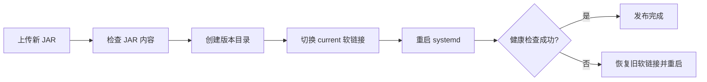

# 应用已经启动，却被发布脚本自动回滚：一次过期健康检查的排查复盘

## 问题现象

一次 Spring Boot 发布中，JAR 校验、版本目录创建、软链接切换和 `systemctl restart` 都正常完成，服务日志也显示 Web 容器和数据库连接池已经启动。然而发布脚本仍然等待约两分钟，最后报告“应用未就绪”，随后自动把 `current` 软链接切回旧版本。

最容易产生的误判是：既然脚本回滚，说明新 JAR 启动失败。实际原因却是**应用已经启动，发布脚本探测的业务接口已经在新版本中删除**。

这类问题的价值不局限于某个项目。只要发布流程把“接口返回成功”作为自动回滚条件，健康检查和应用接口之间就形成了需要共同维护的契约。

## 环境与发布模型

本次实践采用的模型是：

- Linux + systemd 管理单个 Spring Boot 服务；
- 每个版本放在独立目录；
- `/opt/app/current` 是指向当前版本的软链接；
- 发布脚本切换软链接、重启服务并轮询本机 HTTP 接口；
- 超时或服务退出时自动恢复旧软链接。



## 原因分析

旧版本使用 `/api/auth/portal/status` 作为探测地址。认证改造后，这个 Controller 和接口被删除，新的状态接口变成 `/api/auth/iam/status`。

应用启动后，旧地址稳定返回 404。脚本只关心 `curl` 是否成功，没有保留 HTTP 状态和响应体，因此日志看起来像“服务一直无法访问”。循环结束后，自动回滚逻辑按设计执行。

这个故障包含两个层面：

1. **直接原因**：健康检查地址没有随应用接口变更；
2. **可观测性问题**：脚本吞掉了 HTTP 状态和响应体，无法快速区分 404、连接失败和 500。

## 排查顺序

面对“发布失败并自动回滚”，推荐按以下顺序检查，而不是立即重新上传 JAR。

### 1. 确认服务是否真的退出

```bash
systemctl is-active <service-name>
systemctl --no-pager --full status <service-name>
journalctl -u <service-name> -n 100 --no-pager
```

如果服务为 `active`，且日志显示 Spring Boot 已完成启动，就不应先从 JVM 崩溃方向排查。

### 2. 手工请求脚本中的原始探测地址

```bash
curl --noproxy '*' -i http://127.0.0.1:<port>/<health-path>
```

这里不要只用 `curl -f`，因为排查阶段需要看到 404、401、500 等具体状态。

### 3. 对照当前 JAR 的路由或 Controller

确认脚本里的 URL 是否仍存在。必要时检查 JAR 内容和当前软链接：

```bash
readlink -f /opt/app/current
jar tf /opt/app/current/backend.jar | grep '<ExpectedController>.class'
```

### 4. 区分代理问题和本机服务问题

服务器环境变量有时设置了 HTTP 代理。本机 `127.0.0.1` 探测应显式使用 `--noproxy '*'`，避免请求意外进入代理。

## 改进后的健康检查模式

下面是从本次实践抽象出的示例。它保存最后一次 HTTP 状态和响应体，并在服务已经退出时提前结束等待。

```bash
READY_URL="http://127.0.0.1:${BACKEND_PORT}/api/health/ready"
READY_BODY="$(mktemp)"
trap 'rm -f "$READY_BODY"' EXIT

READY=false
HTTP_STATUS="000"

for _ in $(seq 1 60); do
  HTTP_STATUS="$(curl --noproxy '*' -sS \
    --connect-timeout 2 \
    --max-time 5 \
    -o "$READY_BODY" \
    -w '%{http_code}' \
    "$READY_URL" 2>/dev/null || true)"

  if [[ "$HTTP_STATUS" == "200" ]]; then
    READY=true
    break
  fi

  if ! systemctl is-active --quiet "$SERVICE_NAME"; then
    break
  fi

  sleep 2
done

if [[ "$READY" != "true" ]]; then
  echo "Readiness URL: $READY_URL" >&2
  echo "Last HTTP status: ${HTTP_STATUS:-000}" >&2
  if [[ -s "$READY_BODY" ]]; then
    sed -n '1,40p' "$READY_BODY" >&2
  fi
  systemctl --no-pager --full status "$SERVICE_NAME" || true
  journalctl -u "$SERVICE_NAME" -n 100 --no-pager || true
  rollback
  exit 1
fi
```

这段脚本解决了四个问题：

- 明确输出实际探测 URL；
- 区分 HTTP 状态，不把 404 伪装成“连接不上”；
- 保存有限长度的响应体，方便定位配置错误；
- 服务退出时立即停止空等。

## 健康检查接口应该检查什么

健康检查至少可以分为三层：

| 层级 | 回答的问题 | 示例 |
| --- | --- | --- |
| 进程存活 | JVM 是否仍在运行 | `systemctl is-active` |
| 应用就绪 | Web 容器是否能稳定处理请求 | `/actuator/health/readiness` 或稳定自定义接口 |
| 业务配置 | IAM、外部服务等是否配置完整 | `/api/auth/iam/status` |

发布脚本的自动回滚条件不宜绑定到经常变动的页面或临时业务接口。更好的长期做法是提供语义稳定的 readiness 地址，并将外部依赖配置检查放在发布前置校验或独立验收中。

例如，IAM 暂时关闭不一定意味着应用进程不可用。如果发布脚本要求 IAM 必须 `enabled=true` 才认为应用启动成功，就可能在计划内关闭认证时错误回滚。**进程就绪和业务环境验收应该相关，但不应混为一个布尔值。**

## 为什么自动回滚仍然值得保留

问题不在自动回滚本身。软链接版本目录加自动回滚是一个简单、有效且容易审计的发布方案。需要改进的是触发条件和诊断信息。

回滚函数还应注意：

- 切换前记录旧软链接的真实路径；
- 只有旧版本目录仍存在时才回滚；
- 回滚后再次重启服务；
- 不删除失败版本，保留 JAR 和日志供排查；
- 禁止用模糊的“最新文件”覆盖已经归档的版本目录。

## 验证方法

修改脚本后至少验证以下场景：

1. 新版本正常启动，200 后结束循环；
2. 服务启动较慢，脚本能在窗口内等待；
3. 探测地址返回 404，日志能显示 404 和响应体；
4. 应用启动后立即退出，循环提前终止；
5. 服务器设置代理时，本机请求仍直连；
6. 发布失败后 `current` 指回旧版本，旧服务恢复；
7. 临时文件在成功和失败路径上都被清理。

脚本提交前可先做语法检查：

```bash
bash -n update.sh
```

## 经验总结

这次故障的核心教训是：**健康检查也是版本化接口。**应用删除或重命名接口时，必须同步检查发布脚本、容器探针、监控告警和运维文档。与此同时，自动化脚本不能只输出“失败”，还应保留足够证据，让人能够快速判断是连接失败、权限失败、业务错误还是探针本身过期。
