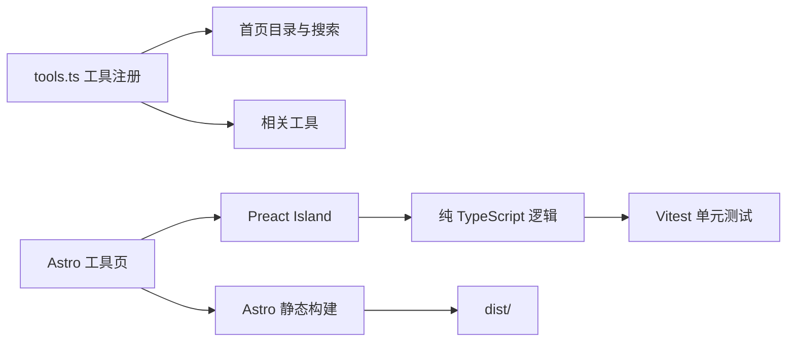

# 从五个小工具到可扩展平台：Astro + Preact 构建本地优先工具箱

## 背景与目标

浏览器工具网站看起来很容易实现：准备几个输入框，监听按钮点击，再把处理结果写回页面。如果目标只是做一个临时 Demo，这种方式足够。但当工具数量从一个增加到五个、十个甚至更多时，问题会逐渐出现：

- 首页、导航和搜索分别维护工具名称与路由；
- 每个页面复制相同的输入输出框，只替换标题；
- 算法直接写在 UI 事件中，无法独立测试；
- 所有页面加载同一份客户端 JavaScript；
- 新工具上线需要同时修改多个页面；
- 用户输入是否上传、是否持久化没有明确边界；
- 复制、下载、错误提示和移动端布局缺少统一标准。

ZGLab Tools 的目标不是把五个独立页面放在一起，而是先建立一个能够长期增加工具的静态平台。首批工具包括：

1. JSON 格式化器；
2. 时间戳转换器；
3. 文本统计器；
4. 文本去重与排序；
5. 二维码生成器。

这些工具全部在浏览器本地运行，不依赖数据库、用户登录或后端接口。生产环境只需要把 Astro 构建出的 `dist/` 交给 Nginx。

## 技术边界

当前项目采用：

- Astro 7.1.0；
- TypeScript 6.0.3 严格模式；
- Preact 10.29.7 islands；
- Vitest 4.1.10；
- 原生 CSS 与 CSS Variables；
- `qrcode` 1.5.4；
- 静态构建，不启用 SSR。

这里并不是为了追求“最少依赖”，而是让依赖与问题规模匹配。Astro 负责页面骨架、路由、SEO 和静态构建，Preact 只负责需要持续状态和事件处理的局部工具界面。



## 先建立统一工具注册表

所有工具的公开信息集中在 `src/config/tools.ts`，类型定义位于 `src/types/tool.ts`。

```ts
interface ToolDefinition {
  id: string;
  name: string;
  shortName?: string;
  description: string;
  route: string;
  category: "format" | "time" | "text" | "generator";
  status: "online" | "beta" | "planned" | "disabled";
  featured: boolean;
  order: number;
  keywords: string[];
  icon: string;
  privacyMode: "local-only";
  visible: boolean;
}
```

这份配置同时驱动：

- 首页工具列表；
- 中文名称、英文关键词和描述搜索；
- 分类筛选；
- Online、Beta、Planned 等状态；
- 相关工具推荐；
- 工具顺序和重点展示。

当 `visible` 为 `false` 时，首页和搜索不再显示该工具。`planned` 或 `disabled` 可以展示状态，但不提供可用入口。

配置驱动不代表所有内容都必须塞进一个对象。工具的页面说明、FAQ、交互状态和算法仍然放在各自职责层中。注册表只维护目录需要知道的事实。

## Astro 页面与 Preact Island 如何分工

每个工具页由 Astro 输出完整静态 HTML，包括：

- 页面标题和描述；
- Canonical 与 Open Graph 元信息；
- 面包屑；
- 本地处理提示；
- 使用说明；
- FAQ；
- 相关工具。

真正需要交互的部分使用：

```astro
<JsonFormatter client:load />
```

实际检查构建页面时：

- 首页加载主题切换和工具搜索；
- 隐私页只加载主题切换；
- JSON 页面只额外加载 JSON island；
- 其他工具页只额外加载自己的 island。

这种拆分避免访问文本统计器时，同时下载二维码和时间戳工具的全部交互代码。

### 顶部导航不是越多越好

初版 Header 同时提供“工具首页、隐私说明、工具下拉菜单”，但首页本身已经承担工具索引功能，页脚和工具页也存在返回路径。实际本地查看后，这三个入口让顶部显得拥挤，信息价值不高。

后续调整删除了整组顶部主导航和对应移动端菜单，只保留：

- ZGLab Tools 品牌入口；
- 返回 ZGLab；
- GitHub；
- 主题切换。

页脚也删除了重复的“工具中心”。这个调整说明：配置驱动可以降低维护成本，但不能替代信息架构判断。一个入口能够自动生成，不等于它必须出现在页面上。

## 工具逻辑与 UI 必须分开

目录采用：

```text
src/
├── components/tools/
│   ├── JsonFormatter.tsx
│   ├── TimestampConverter.tsx
│   ├── TextCounter.tsx
│   ├── TextLineProcessor.tsx
│   └── QrCodeGenerator.tsx
└── tools/
    ├── json/
    ├── timestamp/
    ├── text-counter/
    ├── line-processor/
    └── qrcode/
```

`components/tools/` 负责：

- 表单状态；
- loading、disabled、成功和错误反馈；
- 键盘事件；
- 复制和下载动作；
- 将结果渲染给用户。

`tools/` 负责：

- 输入解析；
- 转换、统计和排序算法；
- 类型与错误结果；
- 可由 Vitest 直接调用的纯函数。

例如文本去重与排序的固定流程是：

```text
标准化换行
-> Trim
-> 空行处理
-> 去重
-> 排序、随机或反转
-> 合并输出
```

流程顺序固定后，大小写不敏感、保留首次或末次、自然排序和数字排序才能得到可预测结果。

## 大 JSON 为什么需要 Web Worker

最初仅在输入超过 1 MB 时提示性能风险，然后在主线程执行 `JSON.parse` 和 `JSON.stringify`。这种提示不能真正避免页面卡顿。

后续将 JSON 处理移到独立 Worker：

```ts
import JsonProcessingWorker from "./worker?worker";

const worker = new JsonProcessingWorker();
worker.postMessage({ input, options });
```

Worker 内部继续调用已经测试过的纯逻辑，完成：

- JSON 解析；
- 递归键名排序；
- 格式化或压缩；
- 元数据统计；
- 错误位置分析。

主线程只接收输出和元数据。处理结束或失败后立即 `terminate()`，避免 Worker 长期占用资源。

Web Worker 不能消除内存成本，也不能让任意大文件都能成功处理，但可以把计算密集任务从交互线程移开，使页面在处理期间仍能响应。

## 五个工具中的关键实现取舍

### 时间戳转换

自动单位识别使用明确阈值，同时允许用户手动指定秒或毫秒。日期转换不依赖服务器时间，时区优先读取 `Intl.supportedValuesOf("timeZone")`，旧浏览器使用常用时区列表降级。

### 文本统计

字符统计优先使用 `Intl.Segmenter` 按可见字素处理，避免把常见 Emoji 代理对简单算成两个字符。换行先统一 CRLF 与 LF，空文本行数定义为 0，阅读时间明确标注为估算值。

### 文本去重排序

自然排序、字典序和数字排序是三个不同概念。随机打乱使用 Fisher–Yates，而不是 `sort(() => Math.random() - 0.5)`。数字排序只将整行有限数字作为数字比较，其他文本不会被丢弃。

### 二维码生成

二维码库只在 `src/tools/qrcode/logic.ts` 中封装。UI 不直接散落第三方 API 调用。PNG 和 SVG 都在浏览器生成，颜色对比度不足时提示风险，但不自动打开二维码中的 URL。

## 测试与验证

截至 2026-07-17，当前项目实际完成：

- `npm ci` 成功；
- npm 安全审计为 0 个已知漏洞；
- Prettier 格式检查通过；
- ESLint 通过；
- Astro Check 为 0 errors、0 warnings、0 hints；
- 5 个测试文件共 60 项测试全部通过；
- Astro 生产构建成功；
- 构建生成首页、五个工具页、隐私页和 404，共 8 个页面；
- 首页、工具页和隐私页在本地开发服务器返回 200；
- 未知路径返回自定义 404。

此前版本已由用户上传到服务器。删除顶部导航和页脚重复入口属于此后的本地调整，本文不把这次最新界面修改写成已经重新上线。

## 如何增加第六个工具

最短流程是：

1. 在 `src/tools/<tool-id>/` 添加类型、逻辑和测试；
2. 在 `src/components/tools/` 添加 Preact island；
3. 在 `src/pages/` 添加 Astro 工具页；
4. 在 `src/config/tools.ts` 注册；
5. 添加本地图标；
6. 运行格式、lint、Astro Check、测试和构建。

新增工具不需要修改首页布局，但仍需要判断它是否真的值得进入顶部或页脚。目录自动化和信息架构是两件不同的事。

## 经验总结

一个可维护的浏览器工具平台需要同时解决四类问题：

1. 用统一注册表管理“有哪些工具”；
2. 用 Astro 与 Preact islands 控制“哪些页面加载哪些脚本”；
3. 用纯逻辑和测试保证“结果是否正确”；
4. 用本地处理边界回答“用户数据去了哪里”。

真正的扩展性不是准备一个万能表单，而是让每个工具拥有合适的交互，同时共享稳定的目录、布局、操作和测试规范。

相关笔记：

- [浏览器本地处理不等于天然安全](../knowledge/browser-local-processing-privacy-boundaries.md)
- [不靠免密 sudo 的静态站发布](sudo-free-static-deployment-and-strict-health-check.md)
- [从一张静态页面到可维护的个人数字档案](from-zero-to-maintainable-astro-personal-site.md)

## 参考资料

- [Astro 前端框架组件指南](https://docs.astro.build/en/guides/framework-components/)，访问于 2026-07-17。
- [Astro Client Directives](https://docs.astro.build/en/reference/directives-reference/#client-directives)，访问于 2026-07-17。
