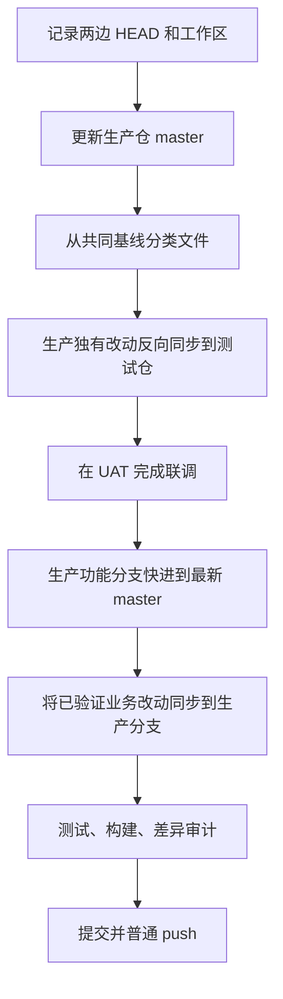

# 两个长期分叉仓库如何安全同步：以测试仓与生产仓联调为例

## 背景与目标

有些项目并不是一个仓库从开发分支合并到主分支，而是同时维护两个长期仓库：

- 测试仓库承担新功能开发、UAT 配置和测试服务器验证；
- 生产仓库包含正式发布脚本、生产文档，以及其他同事直接提交的功能。

随着时间推移，两边都会产生独立修改。此时“把测试仓整个复制到生产仓”会覆盖其他人的新功能；“把生产仓整个复制回测试仓”又会丢失 UAT 配置和未提交联调代码。

本文总结一次真实同步过程中的方法。目标不是提供一条神奇 Git 命令，而是建立一套能够解释、审查和回滚的同步流程。

## 最重要的三个原则

### 以共同基线判断变化，而不是只比较最终文件

两个文件当前内容不同，可能有三种原因：

1. 只有测试仓修改；
2. 只有生产仓修改；
3. 两边都从共同基线修改。

只有第三类才是真正需要人工合并的冲突。若只比较两个最终目录，会把所有差异都当成同一种问题。

### 同步业务代码，不无差别覆盖环境资产

以下内容通常需要按仓库职责保留：

- 正式域名和 UAT 域名；
- ClientID、外部服务地址及开关；
- 生产发布脚本和 UAT 预检脚本；
- 数据库红线与环境专属文档；
- 私有记忆、交接文件和本地配置；
- 生产仓中其他人新增的后台或性能功能。

### 先验证，再提交；先提交，再推送

同步产生的大工作区必须先通过构建和测试。提交前检查暂存区，推送前确认远端没有新提交。不能用强制推送把“远端又更新了”当成一个需要消除的障碍。

## 推荐流程



### 1. 记录现场

在任何复制、合并或切分支之前，先保存可复核的状态：

```bash
git status --short --branch
git log -10 --oneline --decorate
git remote -v
git stash list
```

如果工作区已经有用户修改，不要自行执行 `git reset --hard` 或 `git checkout -- <file>`。这些命令可能直接丢失尚未归档的内容。

### 2. 让生产主分支先追上远端

生产仓库是正式基线，先由有权限的人员完成：

```bash
git switch master
git pull --ff-only origin master
```

`--ff-only` 的价值是：如果本地和远端已经分叉，命令会停止并要求人工判断，而不是悄悄生成一次无法解释的合并。

### 3. 建立或更新功能分支

```bash
git switch feature/unified-auth
git merge --ff-only master
```

功能分支必须基于最新生产主线，否则刚同步完成就可能和其他人的新提交冲突。

### 4. 按文件来源分类

可以先列出生产主线新增的文件和变更类型：

```bash
git diff --name-status <old-production-base>..master
git diff --stat <old-production-base>..master
```

再结合测试仓工作区判断：

| 类型 | 判断 | 处理方式 |
| --- | --- | --- |
| 生产独有 | 测试仓仍等于旧基线 | 可直接同步到测试仓 |
| 测试独有 | 生产仓仍等于旧基线 | UAT 验证后同步到生产功能分支 |
| 双边修改 | 两边都偏离旧基线 | 人工按语义合并 |
| 环境专属 | 配置、部署或私有材料 | 保留各自版本，不直接覆盖 |

对大量文件做机械复制时，也应先生成明确清单，而不是复制整个 `src` 或仓库根目录。

## 双边修改怎样合并

双边修改不能简单选择“较新的文件”。以认证改造为例：

- 测试仓新增 IAM-CAS 和移动端回退逻辑；
- 生产仓同时新增后台登录、页面调整和性能优化；
- 最终结果必须保留 IAM 业务改造，也必须保留后台原认证逻辑。

合理做法是先识别职责边界：

- 普通业务路由进入 IAM；
- `/admin/**` 保持独立后台认证；
- 统一认证不修改管理员服务；
- 环境配置只替换身份相关字段，不覆盖性能参数。

这类合并的审查重点不是“文件有没有冲突标记”，而是**两个功能是否仍然同时成立**。

## 配置文件为什么最危险

配置经常同时包含三类内容：

- 业务新增项，例如 IAM 开关；
- 环境值，例如 UAT 和生产域名；
- 性能或运维值，例如连接池和管理端口。

直接复制配置文件可能让生产连接 UAT IAM，也可能把新加的并发限制覆盖回旧值。更稳妥的方式是逐项合并，并使用占位符保存示例：

```bash
IAM_AUTH_ENABLED=false
IAM_BASE_URL="https://iam.example.com"
IAM_CLIENT_ID="<production-client-id>"
IAM_SERVICE_URL="https://meeting.example.com/api/auth/iam/callback"
IAM_COOKIE_SECURE=true
```

真实密码、Token、Cookie、Client Secret 和私有地址不能进入仓库。测试 ClientID 也不应因为“已经能用”而复制到生产。

## 暂存区审计比工作区审计更重要

一次实际操作中，工作区同时存在新配置示例和旧文件删除。如果直接执行：

```bash
git add -A
```

两个变化都会进入提交，即使本次只打算新增示例文件。更安全的方式是精确暂存：

```bash
git add app.config.example
git diff --cached --check
git diff --cached --stat
git diff --cached --name-status
```

提交前还应检查敏感信息和环境串用：

```bash
git grep --cached -n -E 'uat|client_secret|CHANGE_ME_REAL_SECRET'
```

这里的规则要按项目调整。示例文档中出现单词 `uat` 不一定错误，但生产配置中出现真实 UAT 域名或 ClientID 就应停止提交。

## 验证应该覆盖什么

代码能编译并不代表同步成功。双仓库合并至少需要：

1. 后端完整单元测试；
2. 桌面前端生产构建；
3. H5 前端生产构建；
4. 完整 Spring Boot JAR 打包；
5. 部署脚本 `bash -n`；
6. `git diff --check`；
7. 关键业务边界的定向审查。

本次实践中特别检查了：

- IAM Controller、CAS 验票和本地 JWT；
- 移动宿主 Token 失败后的 IAM 回退；
- 管理员认证源码和测试没有被修改；
- 新健康检查接口与应用路由一致；
- 正式配置不包含 UAT 凭据；
- 桌面和 H5 静态资源都进入最终 JAR。

## 推送冲突的正确处理

如果普通 `git push` 被拒绝，说明远端存在本地没有的提交。正确动作是重新获取和审查：

```bash
git fetch origin
git log --oneline --left-right HEAD...origin/feature/unified-auth
```

然后根据团队流程执行 rebase 或 merge。除非团队明确授权并充分理解影响，否则不要使用：

```bash
git push --force
```

强推可能覆盖其他人的生产修改，而且远端历史一旦被改写，后续审计和回滚都会更困难。

## 哪些方法没有采用

### 整个目录覆盖

它无法保留双边修改，尤其危险于配置、部署脚本和别人新增的功能。

### 在脏工作区直接 pull

未提交内容和远端更新混在一起后，很难区分冲突来源。应先记录现场，必要时只对明确内容使用 stash，并在恢复后立刻审查。

### 为减少冲突而改写别人功能

同步的目标是组合两边已经成立的需求，不是借机统一所有代码风格。若后台固定密码逻辑不在本次认证改造范围内，就应保留并用路由边界隔离，而不是顺手重构。

## 当前方法的边界

双仓库长期同步的成本会随分叉时间增长。本文方法能降低风险，但不能消除结构性维护成本。条件允许时，长期更推荐：

- 一个主仓库加环境分支或发布分支；
- 环境差异全部外置为部署配置；
- 生产脚本作为同一仓库中的受控资产；
- 通过 CI 构建同一提交，而不是手工同步源文件。

在组织流程暂时无法调整时，至少要维护共同基线、同步清单、验证记录和明确的仓库职责。

## 经验总结

双仓库同步不是“复制代码”，而是一次小型集成工程。真正重要的是知道每项变化来自哪里、为什么要保留、在哪个环境验证过，以及如何证明没有覆盖别人功能。共同基线、语义合并、精确暂存和普通推送，是这套流程中最值得复用的四个习惯。
