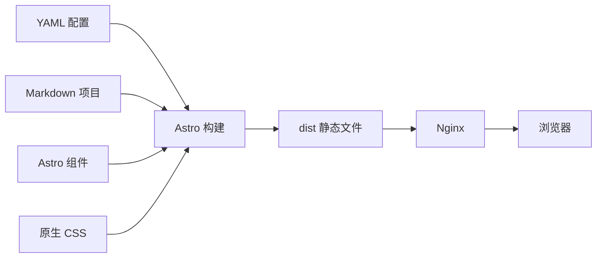

# 从一张静态页面到可维护的个人数字档案：Astro 个人网站从零搭建实践

## 背景与目标

个人网站很容易从一个 `index.html` 开始：姓名、简介、几个项目链接，再加一点 CSS。这种方式足以快速上线，但当内容逐渐扩展到项目详情、论文、竞赛、想法、时间线和未来博客时，维护成本会迅速上升。

典型问题包括：

- 同一份个人信息散落在多个页面，修改时容易漏掉；
- 每增加一个项目，都要复制组件或手工添加路由；
- 项目字段没有约束，状态、日期和链接格式不一致；
- 为了展示完整而留下空按钮、空图片或无效链接；
- 页面依赖常驻 Node 服务，但实际服务器资源有限；
- 视觉效果和内容结构耦合，后续换头像或调整项目顺序需要改组件。

ZGLab 的目标不是制作一张更复杂的在线简历，而是把网站建设为一个长期维护的“个人数字研究档案 + 工程实验室门户”。

## 读者对象与学习目标

本文适合已经了解 HTML、CSS、npm 和基础 TypeScript，但没有系统搭建过 Astro 内容型网站的读者。

读完后应能够：

1. 判断个人网站为什么适合静态生成；
2. 从零初始化严格 TypeScript 的 Astro 项目；
3. 将配置、内容、组件和页面路由分层；
4. 设计不依赖大型 UI 框架的响应式视觉系统；
5. 使用统一命令检查格式、类型和静态构建结果；
6. 为后续 Nginx 部署和动态数据接入保留边界。

## 需求边界

本次实现首先明确了几条工程边界：

- 使用 Astro + TypeScript；
- 默认静态构建，不启用 SSR；
- 项目使用 Content Collections 和 Zod 校验；
- 不引入 React、Vue、Tailwind 或大型组件库；
- 不依赖字体 CDN、图片 CDN 和运行时第三方脚本；
- 个人资料、项目、论文、竞赛和想法从配置或内容文件读取；
- 没有可靠数据时，不展示仓库地址、在线状态、访问量或项目时间；
- 构建后的 `dist/` 可以直接交给 Nginx；
- 动态接口未配置时，网站仍然能够完整构建和浏览。

这些限制并不是为了追求“零依赖”，而是为了让架构与实际部署条件一致。

## 为什么选择 Astro 静态构建

这个网站的大部分内容在发布前已经确定，访问者不需要登录，也没有必须在服务器实时渲染的个性化页面。此时使用 SSR 会引入额外成本：

- 服务器需要长期运行 Node 进程；
- 需要管理进程守护、端口、日志和运行时依赖；
- 页面可用性与应用进程绑定；
- 低配置服务器承担了没有必要的模板渲染工作。

Astro 可以在构建阶段把页面生成成 HTML、CSS 和少量必要 JavaScript。生产环境只需让 Nginx读取静态文件。



这个选择的适用前提是：核心内容允许在发布时更新。如果内容必须按秒变化、依赖登录状态或需要服务端权限校验，就需要重新评估静态构建是否仍然合适。

## 初始化项目

当前项目实际使用了以下命令初始化最小 Astro 工程：

```bash
npm create astro@latest zglab-website -- \
  --template minimal \
  --typescript strict \
  --no-install \
  --no-git \
  --yes
```

参数含义：

- `--template minimal`：只使用官方最小骨架，不套用个人主页模板；
- `--typescript strict`：启用严格 TypeScript 配置；
- `--no-install`：先生成骨架，完成依赖调整后再统一安装；
- `--no-git`：避免初始化过程替代后续明确的 Git 操作；
- `--yes`：在自动化执行中使用默认确认。

项目的核心脚本为：

```json
{
  "scripts": {
    "dev": "astro dev",
    "build": "astro build",
    "preview": "astro preview",
    "check": "astro check",
    "format": "prettier --write .",
    "format:check": "prettier --check ."
  }
}
```

`astro.config.mjs` 明确指定站点地址和静态输出：

```js
import { defineConfig } from "astro/config";

export default defineConfig({
  site: "https://zglab.fun",
  output: "static",
  build: {
    format: "directory",
  },
});
```

`format: 'directory'` 会为页面生成类似 `projects/index.html` 的目录结构，适合 Nginx 使用 `/projects/` 访问。

## 目录如何分层

最终目录不是按“首页组件、项目页组件”简单堆放，而是按职责拆分：

```text
src/
├── components/        # 可复用的纯展示组件
├── config/            # 站点、导航和功能开关
├── content/
│   ├── projects/      # 每个项目一份 Markdown
│   └── logs/          # 实验室日志
├── data/              # 个人资料、论文、竞赛等 YAML
├── layouts/           # HTML 壳、SEO、Header 和 Footer
├── lib/               # 数据解析、查询和状态映射
├── pages/             # 路由入口
├── services/          # 未来公开接口访问边界
├── styles/            # 全局 CSS 变量与响应式规则
└── types/             # 跨层共享类型
```

这套结构解决了三个问题：

1. **内容修改不进入组件层**：修改学校、论文状态或项目摘要，只编辑 YAML/Markdown；
2. **页面不直接解析所有文件**：数据加载和校验集中在 `lib/` 与 Content Collections；
3. **未来能力不会污染首版**：动态状态和 GitHub 数据先定义接口层，不要求首页立即接入。

## 页面与组件的职责

页面负责组合内容，组件只负责可复用展示。

例如：

- `BaseLayout.astro` 统一设置语言、标题、描述、Canonical URL 和全局样式；
- `SiteHeader.astro` 从导航配置读取可见菜单；
- `ProjectCard.astro` 根据项目数据展示状态、分类、技术栈和详情入口；
- `StatusPill.astro` 负责状态视觉，不保存具体项目状态；
- `src/pages/projects/[slug].astro` 根据 Content Collection 生成静态详情页。

项目数据不能写进 `ProjectCard.astro`。否则新增项目时仍要修改组件，配置驱动就失去了意义。

## 视觉系统的实现思路

ZGLab 使用原生 CSS Variables 维护颜色、尺寸和字体栈：

```css
:root {
  --color-bg: #151b20;
  --color-text: #e6e2d8;
  --color-text-soft: #b1b4ae;
  --color-line: #354149;
  --color-accent: #78b7aa;
  --color-warm: #e4b66d;
  --site-width: 1240px;
}
```

视觉方向强调“研究档案”和“工程索引”，没有使用终端窗口、粒子背景或满屏霓虹。信息层级主要通过以下方式建立：

- 大标题和较高信息密度；
- 编号、状态和时间使用少量等宽字体；
- 细分割线代替大面积卡片阴影；
- 代表项目使用大面积布局，次级项目使用紧凑布局；
- 首页、项目、研究等页面共享排版规则，但不强制所有内容三等分。

响应式设计采用两个主要断点：

- `1000px` 以下将主导航折叠为键盘可访问的菜单；
- `760px` 以下将双栏和复杂网格调整为单栏；
- `480px` 以下进一步压缩按钮、时间线和标签布局。

同时加入：

```css
@media (prefers-reduced-motion: reduce) {
  html {
    scroll-behavior: auto;
  }

  *,
  *::before,
  *::after {
    transition-duration: 0.01ms !important;
    animation-duration: 0.01ms !important;
  }
}
```

这不是“关闭所有设计”，而是尊重用户减少动态效果的系统偏好。

## 内容安全与空值处理

页面必须允许内容暂时不完整，但不能把不完整状态暴露为坏体验。

项目链接先构造候选列表，再过滤空值：

```ts
const projectLinks = [
  { label: "在线演示", href: data.links.demo },
  { label: "代码仓库", href: data.links.repository },
  { label: "项目文档", href: data.links.documentation },
].filter((link): link is { label: string; href: string } => Boolean(link.href));
```

模板只有在数组非空时才渲染：

```astro
{projectLinks.length > 0 && (
  <div class="project-links">
    {projectLinks.map((link) => <a href={link.href}>{link.label}</a>)}
  </div>
)}
```

图片、项目时间、进度和运行状态使用相同原则。不要使用 `href="#"` 或空字符串伪装“未来功能”。

## 本地开发与验证

安装和开发：

```bash
npm install
npm run dev
```

提交或部署前执行：

```bash
npm run format:check
npm run check
npm run build
```

截至 2026-07-17，本项目已经实际验证：

- `npm install` 成功；
- npm 审计报告 0 个已知漏洞；
- `astro check` 为 0 errors、0 warnings、0 hints；
- 静态构建生成 10 个页面；
- 首页、项目列表、四个项目详情、研究、想法和关于页面返回 HTTP 200；
- `dist/` 当时约为 188 KB；
- 构建产物没有外部字体、CDN 脚本、空链接或空图片。

这些结果只说明当时提交的项目状态通过检查，不代表后续每次修改都会自动保持相同结果，因此命令需要持续执行。

## 技术决策与取舍

### 没有引入前端框架

项目筛选和移动端菜单只需要少量原生 JavaScript。为这两个交互引入 React 或 Vue 会增加客户端代码和维护面，没有明显收益。

### 没有把所有数据放进 Content Collections

项目和日志属于多条、同结构、需要独立 Markdown 正文的内容，适合 Collection。个人资料、技能和论文当前是少量集中数据，使用 YAML 更便于整体编辑。

### 没有首版接入实时状态

项目没有可靠的公开状态 API，也不应在浏览器中保存私密 Token。首版只定义接口和类型，在未配置时返回 `null`，保证静态内容始终可用。

### 没有为视觉完整补造数据

未提供的 DOI、项目起止时间、仓库地址和在线状态都保持缺省。一个紧凑但真实的页面，比字段齐全但事实不可靠的页面更有长期价值。

## 当前边界与后续方向

当前版本适合作为个人档案、项目索引和研究成果入口，但还没有实现：

- Notes 内容同步到网站；
- 浏览器工具集；
- GitHub 最近提交和仓库数据；
- 项目运行状态与最近部署时间；
- 自动化 CI/CD；
- 线上服务器和 HTTPS 的本次完整验收记录。

这些能力已经通过 feature flags、服务层和内容目录预留，但只有真正实现并验证后才应打开入口。

## 经验总结

从零搭建个人网站，最重要的不是先选一个漂亮模板，而是先确定内容如何增长、事实由谁维护、页面如何在数据缺失时保持可靠，以及生产环境真正需要运行什么。

ZGLab 的核心思路可以概括为：

1. 用静态构建降低运行复杂度；
2. 用配置和 Markdown 分离内容与展示；
3. 用 Zod 把错误提前到构建阶段；
4. 用原生 CSS 保持视觉系统可控；
5. 用明确的空值策略拒绝伪造和无效入口；
6. 用服务层和功能开关为未来扩展保留边界。

相关笔记：

- [用 Astro Content Collections、YAML 与 Zod 构建配置驱动网站](../knowledge/astro-content-collections-config-driven-content.md)
- [从构建到上线：Ubuntu 24.04 + Nginx 部署 Astro 静态网站](deploy-astro-static-site-with-nginx.md)
- [静态网站也需要工程化：备份发布、功能开关与动态接口边界](../knowledge/static-site-release-and-runtime-boundaries.md)

## 参考资料

- [Astro 安装指南](https://docs.astro.build/en/install-and-setup/)，访问于 2026-07-17。
- [Astro Content Collections 指南](https://docs.astro.build/en/guides/content-collections/)，访问于 2026-07-17。
- [Astro 部署指南](https://docs.astro.build/en/guides/deploy/)，访问于 2026-07-17。
