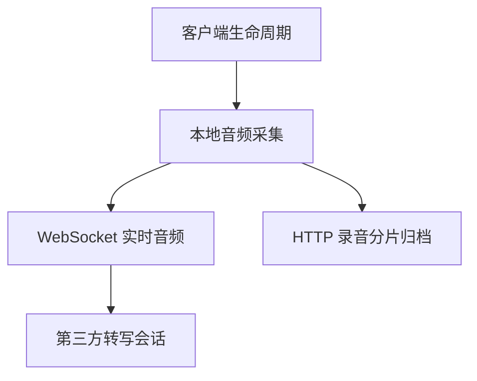

# 从“录音正常”到证据链完整：移动会议录音的可观测性改造

## 背景与目标

移动会议录音横跨麦克风、Web Audio、WebSocket、HTTP 分片上传、后端桥接和第三方转写服务。用户看到的一个“录音正常”标签，往往只能覆盖其中一段。

实际排障中出现过几类难以仅凭截图回答的问题：

- 页面显示录音中，但服务器已经很久没有收到音频；
- WebSocket 转写正常，录音分片 HTTP 上传却持续积压；
- 管理后台把已经恢复的历史抖动仍判为坏会议；
- 转写有内容，但所有分句时间都是 `00:00`；
- 同一个问题只在某个手机、WebView 或 App 版本出现，却没有客户端环境记录；
- 会议显示进行中，但实时资源早已释放。

本次改造的目标不是“多打一些日志”，而是让管理员能够回答：

1. 会议当前处于什么状态；
2. 它怎样走到这个状态；
3. 问题发生在哪一条链路；
4. 使用了什么客户端环境；
5. 异常是否仍然存在；
6. 哪些信息可以用于排障，哪些信息不应采集。

## 观测对象必须拆成多条链路

移动录音至少包含四个相互关联但不等价的健康维度：



因此不能用一个布尔值概括所有状态。

| 维度 | 可以回答什么 | 不能替代什么 |
| --- | --- | --- |
| 客户端生命周期 | 页面是否隐藏、恢复或被卸载 | 麦克风是否真的输出 |
| 最后音频时间 | 后端最近何时收到 PCM | HTTP 分片是否持久化 |
| WebSocket/第三方状态 | 实时转写是否在线 | 原始录音是否完整 |
| 分片归档状态 | 编号分片是否上传、校验和完成 | 实时转写是否低延迟 |

后台展示“录音链路正常”时，应明确它指的是哪一条链路。

## 快照和事件分别解决什么

只保存事件，查询当前状态成本高；只保存快照，又会丢失演变过程。当前实践采用二者结合。

### 健康快照

每场会议保存一条当前快照，包含：

- 管道状态；
- 派生健康状态；
- 浏览器和第三方连接时间；
- 最后音频、最后第三方事件和最后转写时间；
- 断线时间与恢复截止时间；
- 累计音频字节和分片数；
- 重连次数；
- 最近错误代码与有限长度详情。

快照适合运营总览、当前告警和列表排序。

### 状态事件

事件表记录关键变化：

```text
BROWSER_CONNECTED
PROVIDER_READY
AUDIO_STARTED
AUDIO_STALLED
AUDIO_RECOVERED
BROWSER_DISCONNECTED
RECOVERY_WINDOW_EXPIRED
RECORDING_FINISHING
RECORDING_COMPLETED
CLIENT_PAGE_HIDDEN
CLIENT_AUDIO_CONTEXT_INTERRUPTED
```

事件适合还原时间线。它不是完整业务 Event Sourcing，不承担重建全部会议状态的职责，因此只记录排障所需的有限信息。

## 健康状态应由当前事实派生

一个简单的派生规则可以是：

```text
CONNECTING                  -> STARTING
STREAMING 且音频新鲜        -> HEALTHY
STREAMING 且音频超过阈值    -> DEGRADED
DISCONNECTED / RECOVERING   -> OFFLINE
FAILED                      -> FAILED
PAUSED / FINISHING / DONE   -> STOPPED
```

派生的好处是避免数据库中保存的旧 `HEALTHY` 永久不变。例如一条快照最后写入时仍健康，但两小时后再查询，应该根据 `lastAudioAt` 重新得到 `DEGRADED`，而不是盲信旧状态。

同时要避免只依据最后音频时间判定业务结束。安静、后台限制和断网都会导致音频变旧，它只说明链路需要关注。

## “坏会议”不能由一条历史事件决定

早期异常筛选容易采用：

```text
只要历史上出现 AUDIO_STALLED，就判为异常
```

这会产生大量误报。一场会议可能先停滞，数秒后恢复并正常完成；历史事件仍然存在，但它应作为审计证据，而不是当前故障结论。

更合理的判断顺序是：

1. 当前会议是否仍处于活动或处理状态；
2. 当前健康是否为 `DEGRADED/OFFLINE/FAILED`；
3. 终态会议是否仍保留未解决错误；
4. 历史异常后是否出现对应恢复或完成事件；
5. 错误是否属于正常结束阶段的预期连接关闭。

例如第三方在完成时关闭输出流，可能产生 `output closed`。如果会议已经进入结束阶段并成功生成纪要，这类关闭不应再被解释为传输故障。

后台应同时保留“历史发生过什么”和“现在是否仍异常”两种视角，而不是删除历史事件来消除误报。

## 客户端环境信息如何采集

移动问题常与特定系统和宿主版本有关。仅保存通用 User-Agent，可能不足以判断 Cordova、网络和屏幕环境；直接采集设备 UUID、电话号码等稳定标识又超过排障需要。

当前实践采集非唯一性诊断字段：

- 入口类型：普通浏览器、企业 App WebView；
- 平台与系统版本；
- 厂商和机型；
- 浏览器内核及版本；
- 宿主 App 和 Cordova 版本；
- 屏幕尺寸与像素比；
- 网络类型；
- 是否检测到目标宿主容器；
- User-Agent；
- 采集时间和来源。

这些字段以结构化 JSON 放入现有健康事件，不新增设备主表，也不把客户端信息当作身份认证依据。

### 为什么事件比用户表更合适

同一个用户可能从多个设备进入，同一个设备也可能升级 App。将机型写入用户表会制造错误的一对一关系。

按会议事件保存可以回答“这次录音使用了什么环境”，同时避免把临时诊断信息变成长期设备画像。

### 数据最小化边界

不应采集：

- 设备 UUID、IMEI、MAC；
- 电话号码；
- 精确定位；
- 通讯录；
- 原始 Cookie、Token 或 JWT；
- 与录音排障无关的宿主数据。

客户端上报内容不可信。服务端必须限制字段长度、规范化枚举，并把它视为诊断线索而不是安全事实。

## 转写时间也是可观测性的一部分

转写文字正常但时间全部为 0，说明内容链路成功、数据质量链路失败。若只统计“有多少条转写”，后台会把它视为正常会议。

第三方事件可能在不同层级提供时间：

- 句级开始和结束字段；
- 嵌套结果字段；
- 单词数组中的首尾时间；
- 后续事件省略时间，只更新文本或最终标记。

持久化层应：

1. 兼容明确支持的句级字段；
2. 缺失时从 `words` 计算；
3. 新事件没有时间时保留数据库中的已有值；
4. 将无法恢复时间的比例纳入数据质量诊断。

这类兼容不应靠前端猜测。服务端保存正确时间后，H5、桌面端和导出才能共享一致结果。

## 管理后台如何组织证据

一个有用的会议详情页可以分为三层。

### 当前结论

展示：

- 业务状态；
- 录音管道状态；
- 当前健康；
- 最后音频距今多久；
- 是否仍有活动资源；
- 异常摘要。

### 事件时间线

按时间倒序展示连接、音频、恢复、结束和客户端生命周期事件。对于详情较长的事件应折叠，不要让原始 JSON 淹没关键顺序。

### 客户端与数据质量

展示本次会议的客户端类型、系统、机型、浏览器和版本，同时给出转写数量、时间范围、归档分片状态等数据质量信息。

这样管理员看到异常后，不必先登录数据库拼接多个表；需要进一步核实时，后台信息仍能指向准确的会议 ID、时间和实例。

## 遥测不能破坏主流程

客户端诊断属于 best-effort。采集失败、Cordova 尚未就绪或事件保存失败时，不能阻止：

- 麦克风授权；
- WebSocket 建立；
- PCM 发送；
- 录音分片上传；
- 用户暂停或结束会议。

服务端保存健康事件同样要限制失败影响。事件写入失败可以记录脱敏日志并重试，但不能回滚已经转发的音频。

## 测试与验证

自动化测试应覆盖：

1. 音频超过阈值后健康状态由查询时动态派生；
2. `AUDIO_STALLED` 后出现 `AUDIO_RECOVERED`，会议不再判为当前异常；
3. 正常结束阶段的预期输出关闭不判为传输故障；
4. 当前 `DISCONNECTED/OFFLINE` 会议仍进入异常列表；
5. 客户端 JSON 的平台、机型和版本能被规范化解析；
6. 超长字段被截断，未知字段不影响读取；
7. 不带时间的转写更新不会覆盖已有时间；
8. 单词级时间能够回退生成句级时间；
9. 遥测保存失败不阻断实时音频；
10. 管理员列表与详情对同一会议给出一致结论。

真机验证还应覆盖 Android/iOS、普通浏览器、不同宿主版本、前后台切换、锁屏、弱网和网络类型变化。

## 技术决策与边界

当前方案使用数据库快照和事件，适合单实例或规模有限的系统。高吞吐、多实例环境可以把指标送入 Prometheus，把结构化日志送入集中日志平台，但会议级证据仍需要稳定的业务关联键。

健康事件也不是越多越好。每个 PCM 分片都写一条数据库事件会制造写放大。更适合记录状态变化、首个音频、停滞、恢复、断线、结束和有限的客户端生命周期节点。

客户端信息可以缩小排查范围，却不能证明根因。某机型上频繁发生异常只是一条相关性线索，仍需结合宿主版本、系统日志和真机复现。

## 当前结果

改造后，管理员能够把“录音有问题”拆成更具体的结论：

- 实时音频是否仍到达；
- WebSocket 是否断开；
- 恢复窗口是否过期；
- HTTP 分片是否仍待上传；
- 转写时间是否完整；
- 使用了什么客户端环境；
- 历史异常是否已经恢复。

仍未完全解决的是长期失联会议的最终业务收口。当前可观测性能够准确发现和解释它，但自动结束、标记中断或人工处理仍需独立的产品与状态机决策。

## 经验总结

可观测性不是给每个函数加日志，而是围绕用户问题建立证据模型。快照回答“现在怎样”，事件回答“如何变成这样”，客户端信息回答“发生在哪种环境”，数据质量指标回答“结果是否可信”。

当这些信息能够在同一场会议下关联，排障就不再依赖截图和猜测。与此同时，遥测必须保持最小化、可失败，并与身份认证和主录音流程隔离。
