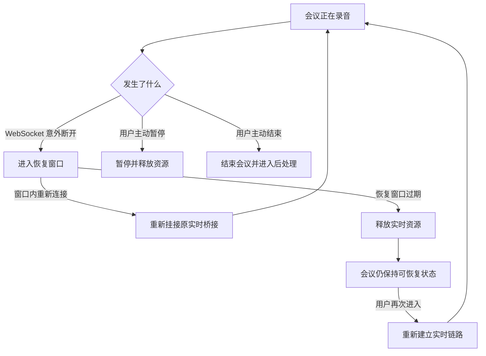

# 断线不等于结束：实时会议录音的可恢复会话设计

## 背景与目标

实时会议录音同时依赖浏览器麦克风、WebSocket、后端音频桥接和第三方转写服务。在桌面浏览器中，短暂断网通常只需要重连；但在移动 App 的内嵌 WebView 中，切到后台、锁屏、系统回收页面或宿主重新创建 WebView，都可能直接关闭连接。

旧逻辑把“浏览器断线超过一段时间”解释为“用户已经结束会议”。这样虽然能及时释放资源，却可能带来更严重的业务后果：

- 一次网络抖动触发会议结束；
- 用户还没确认，系统已经开始生成纪要；
- 页面恢复后只能看到已结束会议，无法继续录音；
- 后台切换和主动结束在服务端表现相同，难以排查。

本次改造的核心目标是：**把连接状态和业务状态分开。WebSocket 断开只表示实时链路暂时不可用，只有用户明确结束会议时，才改变会议的结束语义。**

## 先分清四种状态

实时系统容易把下面四件事混为一谈：

1. 页面是否仍然可见；
2. WebSocket 是否连接；
3. 第三方实时转写会话是否占用资源；
4. 会议在业务上是否已经结束。

它们并不等价。用户锁屏后页面可能不可见，WebSocket 也可能关闭，但会议仍然处于录音中的业务状态。反过来，用户点击“结束会议”时，即使 WebSocket 尚未关闭，也应立即进入结束流程。

因此，断线恢复设计需要同时维护两条状态线：



恢复窗口过期时关闭第三方实时连接，是资源治理；不自动结束会议，是业务语义。两者可以同时成立。

## 服务端如何保存恢复窗口

服务端在浏览器连接异常关闭后，不再立即结束会议，而是创建一个按会议 ID 管理的待恢复任务：

```text
meetingId -> PendingRecovery(bridge, scheduledFuture)
```

当前配置项为：

```bash
# 浏览器或 WebView 断开后的实时链路保留时间，默认 5 分钟。
RECORDING_DISCONNECT_RECOVERY_GRACE_MS=300000
```

实现中还设置了 5 分钟的下限。即使配置成更小的值，实际恢复窗口也不会低于 5 分钟。这种保护适合避免误配置把恢复能力重新退化成“稍一断线就结束”，但也意味着运维人员不能通过配置把它缩短到一分钟。

窗口内发生重连时，服务端会：

1. 找到同一会议的 `PendingRecovery`；
2. 取消过期任务；
3. 把新的 WebSocket Session 挂回原有音频桥接；
4. 保留已建立的第三方实时转写上下文；
5. 将健康状态重新标记为连接中。

如果窗口到期仍未重连，服务端会记录 `RECOVERY_WINDOW_EXPIRED`，释放实时音频和连接资源，但不会执行以下动作：

- 不把会议标记为结束；
- 不启动会议纪要生成；
- 不伪造一次用户主动结束操作。

这样既避免第三方长连接永久占用，也不会因移动端生命周期事件破坏业务数据。

## 前端为什么还需要恢复标记

服务端保存的是实时资源状态，但用户重新打开 H5 后，前端还需要知道应该返回哪一场会议。因此页面会在以下事件发生时写入本地恢复标记：

- WebSocket 已建立；
- WebSocket 意外关闭；
- 页面进入后台；
- 页面触发 `pagehide`；
- 录音组件被卸载。

标记内容包括会议 ID、用户 ID、事件类型、有限长度的诊断信息和更新时间。它使用按会议区分的 `localStorage` Key，并设置 30 分钟有效期。

这里存在两个不同的时间窗口：

| 窗口 | 当前时长 | 作用 |
| --- | --- | --- |
| 服务端实时资源恢复窗口 | 至少 5 分钟 | 尽量复用原第三方实时会话 |
| 前端恢复标记有效期 | 30 分钟 | 帮助用户重新找到尚未结束的会议 |

前端标记更长并不表示服务端会保留实时连接 30 分钟。超过 5 分钟后重新进入，可能需要重新创建实时链路，但会议仍可以保持可恢复的业务状态。

首页读取恢复标记后，不能直接跳转。它还会向服务端查询会议当前状态，只有会议仍为 `RECORDING` 时才进入实时页面。若会议已在其他客户端结束、用户无权访问或记录不存在，则删除过期标记。

## 显式操作必须清理恢复状态

恢复机制最容易出现的错误，是用户明明主动结束了会议，首页却又把他带回录音页。因此以下操作必须和恢复标记同步：

- 收到服务端 `speech-end` 后清理；
- 用户主动暂停时清理；
- WebSocket 正常可用时主动结束，发送结束消息后清理；
- WebSocket 不可用时通过 HTTP 结束，成功后再清理。

这里不能简单地在组件卸载时一律清理。移动 WebView 的页面重建同样会触发卸载，而这正是最需要保留恢复信息的场景。

## 生命周期事件既用于恢复，也用于诊断

前端还会通过已建立的 WebSocket 上报有限的客户端生命周期事件，例如：

```text
PAGE_HIDDEN
PAGE_VISIBLE
PAGE_HIDE
COMPONENT_UNMOUNT
WEBSOCKET_OPEN
```

服务端统一规范化事件名，并记录为 `CLIENT_*` 健康事件。这些事件属于诊断遥测，不应成为录音主流程的硬依赖。上报失败不能打断麦克风采集、WebSocket 重连或用户结束会议。

为了防止日志和状态字段被任意内容污染，事件名应只保留大写字母、数字和下划线，并限制事件名和详情长度。

## 为什么不采用“断线后自动结束”

自动结束的优点是实现简单、资源释放确定。但它隐含了一个不可靠假设：

```text
连接不存在 = 用户决定结束会议
```

在桌面网页中这个假设已经不总成立，在移动 WebView 中更不成立。网络、操作系统和宿主 App 都可能关闭连接，只有“用户明确点击结束”才是可靠的业务意图。

更合理的处理是：

- 技术连接异常：进入恢复和资源回收流程；
- 用户明确操作：进入暂停或结束流程；
- 资源窗口到期：释放资源，但不替用户作业务决定。

## 验证清单

当前结论来自源码和提交差异审查，仍应在 UAT 环境覆盖以下场景：

1. 正常录音时断网，恢复网络后能够继续；
2. 峰云切到后台一分钟再返回，不会自动结束会议；
3. 在 5 分钟内重新打开页面，能够复用或恢复实时链路；
4. 超过 5 分钟后重新进入，会议仍未被自动结束；
5. 用户点击暂停后，首页不会再次自动跳回；
6. WebSocket 正常和异常两种情况下点击结束，恢复标记都能清除；
7. 同一设备切换用户后，不会恢复上一个用户的会议；
8. `localStorage` 不可用时，录音主流程仍可工作；
9. 多个页面同时打开同一场会议时，连接所有权行为符合预期；
10. 应用重启后，内存中的恢复任务消失，但会议业务状态仍可解释。

## 当前方案的边界

待恢复任务保存在单个应用实例的内存中。如果服务部署为多实例，WebSocket 重连落到另一实例，无法直接取得原实例中的桥接对象。此时需要会话粘滞、共享协调机制，或者接受跨实例时重新建立第三方连接。

同样，应用进程重启会丢失 `PendingRecovery`。因此数据库中的会议状态必须是最终事实，内存恢复对象只能作为性能优化，不能成为会议能否继续的唯一依据。

## 经验总结

实时录音系统的鲁棒性，不只来自“多重试几次”，更来自正确的状态边界。连接断开、资源回收和业务结束是三种不同事件。把它们拆开后，系统既能及时释放第三方实时资源，也能避免一次锁屏或网络抖动替用户结束会议。
