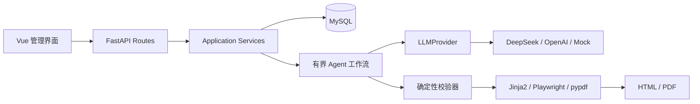

# 从岗位 JD 到可追溯 PDF：ResumeTailor Agent 的可控工作流设计

## 背景与目标

岗位定制简历并不是简单地把一份个人资料交给大模型，让它“写得更像目标岗位”。如果模型可以自由补充经历、数字和技能，输出越流畅，事实风险反而可能越难察觉。

ResumeTailor Agent 的目标是：解析岗位 JD，从候选人的真实经历中选择和重组内容，生成针对不同公司和岗位的结构化简历，并导出文字可选择的 PDF。同时，系统需要解释每项岗位要求对应了哪些原始证据、为什么选中这些内容，以及哪些能力仍然缺失。

这个目标带来三条必须始终成立的约束：

- 模型不能直接决定最终页面，也不能绕过事实校验；
- 每段简历内容必须能够追溯到候选人的原始 Evidence；
- 模型超时或结构化输出失败时，系统可以降级，但不能以虚构内容换取“看起来完整”。

## 需求范围

当前阶段已经覆盖：

- 本地账号、可撤销会话、默认个人资料和用户数据隔离；
- 教育、工作/实习、项目、论文、获奖、技能、证书和科研成果管理；
- JSON、Markdown/TXT、DOCX、PDF 资料导入；
- JD 结构化解析、人工修正和证据匹配；
- 简历规划、写作、真实性校验、ATS 启发式检查和 Critic 审查；
- 四个 A4 模板、HTML 预览和 Playwright PDF 导出；
- 多公司、多岗位、多版本简历历史管理。

当前仍然是模块化单体 MVP，没有引入微服务、外部消息队列、向量数据库或 Kubernetes。扫描 PDF 只有在本机已安装 Tesseract 时才尝试 OCR；任意 DOCX/PDF 模板的像素级复刻也不在当前承诺范围内。

## 技术选型

后端使用 Python、FastAPI、Pydantic v2、SQLAlchemy 2 和 Alembic，本地业务数据库使用 MySQL，自动化测试使用隔离的 SQLite。模型请求通过 `httpx` 发出，DeepSeek、OpenAI 和 Mock 都接入统一 Provider 接口。

前端采用 Vue 3、TypeScript、Vite、Pinia、Vue Router、Axios 和 Element Plus。简历先由 Jinja2 生成 HTML，再由 Playwright Chromium 打印为 PDF，最后使用 pypdf 检查正文是否可以提取。

选择这套技术栈的主要原因不是追求组件数量，而是让边界清晰：Pydantic 管结构合同，SQLAlchemy 管数据，Provider 管模型协议，Jinja2 和 CSS 管排版，Playwright 管最终 PDF。

## 系统设计

### 模块化单体



HTTP 路由只处理参数、依赖和响应；Service 负责事务、所有权、幂等和任务状态；Agent 节点只接收和返回 Pydantic 模型；Provider 独立处理认证、超时、重试和不同厂商协议；Renderer 只接收通过事实闸门的 `ResumeDocument`。

这种分层让“切换模型”和“修改简历模板”成为两件独立的事。业务代码不需要知道 DeepSeek 的请求细节，模板也不需要理解 Prompt。

### 固定工作流

系统没有使用无限 ReAct 循环，而是采用可观察、可中断的固定流水线：


对应的任务状态为：

```text
created → normalizing → parsing_jd → matching → planning
        → writing → validating → rendering → completed
```

任一处理中状态可以进入 `failed`，人工编辑后的 `completed` 简历可以重新进入 `validating`。非法状态转换由程序拒绝，而不是让前端任意修改。

## 关键技术点

### Evidence 是事实主键

候选人的每条教育、工作、项目或论文记录都有独立 `evidence_id`。模型输出的匹配项、简历条目和 bullet 都只能引用输入白名单中的 Evidence ID。

Evidence 同时保留原始文本和标准化文本。原始文本用于追溯，标准化文本用于模型匹配和确定性校验。这样，即使表达经过优化，也能回到原记录检查依据。

更详细的事实闸门设计见：[把大模型生成限制在事实边界内](../knowledge/evidence-grounded-resume-generation.md)。

### 结构化内容先于页面

模型不直接生成最终 HTML。`ResumeWriter` 先产生符合 Schema 的 `ResumeDocument`，其中包含页眉、模块、条目、bullet、Evidence ID 和验证状态。Jinja2 模板只负责把这个结构渲染成确定性的 HTML/CSS。

这条边界解决了两个问题：

1. 模型不能通过自由 HTML 改写事实、植入远程资源或破坏版式；
2. 同一份结构化简历可以切换不同模板，而不需要重新调用整个 Agent。

### 匹配优先级和内容覆盖下限

简历内容按“强匹配、中匹配、弱匹配、其他真实经历”排序。模型可以调整顺序和篇幅，但程序会保留启用模块的覆盖下限；模型漏掉整个模块或同模块中的真实条目时，确定性基线会补回候选内容，再由页数和条目上限控制篇幅。

这里的“补足”不是放松事实标准，而是扩大真实 Evidence 的覆盖范围。即使为了填充一页简历，也不会补造数字、技术或项目。

### 幂等和历史版本

生成请求支持显式 `idempotency_key`。没有 key 时，系统根据候选人、JD、模板、模型配置和生成选项构造规范化请求哈希，复用仍在处理的相同任务，避免连续点击生成多份重复任务。

每次完成的结果都保留 `resume_json`、分析报告、模型元数据、模板和输出路径。个人中心因此可以管理面向不同公司、不同岗位的多个版本，而不是覆盖唯一的一份简历。

## 遇到的问题

### PDF 和 DOCX 导入不能只依赖单一解析器

PDF 文本可能来自正常文字层、错误的阅读顺序或整页扫描图。当前实现使用 PyMuPDF 和 pypdf 多策略提取并择优，只有在系统已有 OCR 依赖时才尝试扫描回退。导入结果仍默认待确认，因为“成功提取文字”不等于“字段已经准确识别”。

### 模型健康不代表结构化节点一定成功

健康检查可能很快返回成功，但长 JD 解析、证据匹配和简历写作仍可能超时或返回不符合 Schema 的结构。项目后来把普通请求、JD 解析和生成节点拆成独立超时，并增加宽松边界模型与确定性降级。

### 匹配不少，最终简历仍可能为空

一次实际问题中，匹配报告包含多个强弱匹配，但模型规划只保留了字段不完整的教育记录。Writer 降级后生成占位标题，事实校验又删除了这些条目，最终只剩页眉。问题并不在匹配数量，而在多个节点之间缺少覆盖合同。

完整故障链和修复见：[匹配不少，为什么最终简历仍然是空的](../problems/resume-matches-but-generated-document-empty.md)。

## 测试与验证

项目统一检查入口为：

```bash
./scripts/check.sh
```

截至 2026-07-17，已实际执行并通过：

- Ruff 静态检查；
- MyPy 类型检查；
- 30 项后端及集成测试；
- 9 项前端测试；
- Vue/TypeScript 生产构建；
- A4 单页 PDF 生成和正文提取检查；
- DeepSeek Provider 健康检查。

测试中特别加入了事实越界用例：原始证据没有“提升 30%”，输出出现该数字时必须标记为 `unsupported`，并确认最终 HTML/PDF 不包含这句话。

这些结果只说明当前本地实现通过了既定测试，不代表已经满足公开互联网服务的全部安全要求。

## 技术决策与取舍

- 选择模块化单体，是为了让 MVP 先建立正确边界，而不是提前承担分布式一致性和运维成本。
- 选择固定工作流，是为了让每一步可观察、可测试、可解释，而不是追求 Agent 的自由行动能力。
- 选择程序级事实闸门，是因为“再调用一次模型检查自己”不能替代确定性验证。
- 使用进程内后台任务，可以降低本地运行门槛，但服务重启会影响处理中任务；生产化时应替换为可靠队列。
- 默认本地文件存储简单可控，但未来切换对象存储时仍需要重新设计加密、生命周期和访问授权。

## 当前结果与后续计划

当前系统已经能够从个人资料和岗位 JD 生成不同版本的结构化简历，展示匹配证据和缺失能力，允许人工编辑后重新校验，并导出文字可复制的 PDF。默认模板支持教育优先、描述式技能、论文标签和中文证件照布局。

后续优先级包括：可靠任务队列、公开部署所需的 HTTPS/CSRF/限流、密码恢复、恶意文件隔离、对象存储、导入字段人工确认流程，以及更系统的分页容量测量。

## 经验总结

这次实践最重要的认识是：简历 Agent 的价值不只在于“写得更像岗位”，而在于建立一条能够解释和审计的内容生产链。模型适合做语义理解、筛选和表达，但权限、状态、证据、事实和页面必须由程序掌控。

当一个生成式应用涉及个人信用和现实决策时，可追溯性不是附加功能，而是系统架构的主干。
