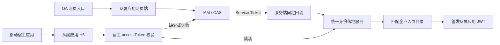
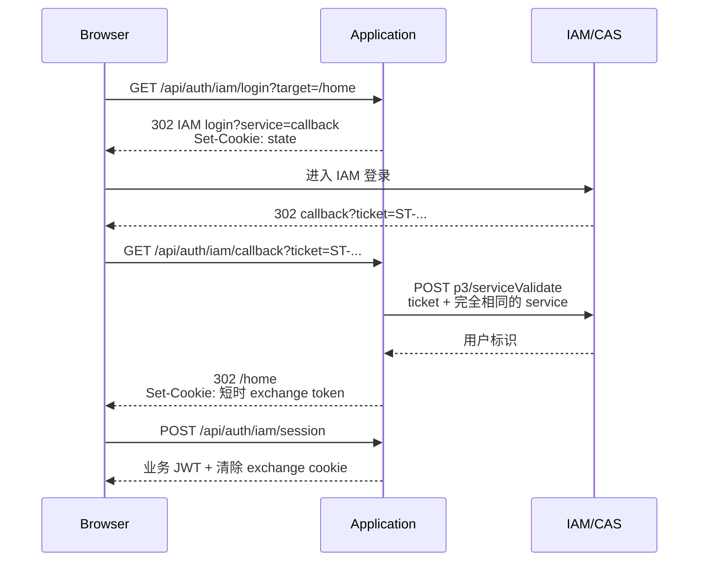

# 从多入口免登到统一身份：从属应用接入 CAS 的设计实践

## 这篇笔记解决什么问题

许多企业应用并不是从浏览器书签直接打开，而是从 OA 门户、移动工作台或其他宿主应用的快捷入口进入。用户真正关心的是：**已经在入口系统登录过，就不要在从属应用里再次输入账号密码。**

本次实践面对两个入口：

- OA 网页入口，共享企业 IAM 的登录状态；
- 移动 H5 入口，宿主应用能够提供自己的 `accessToken` Cookie。

改造目标不是简单增加一个登录按钮，而是让多个入口最终收敛到同一套用户映射和本地会话，同时删除 URL 中透传 `loginName` 的临时方案。

适合阅读本文的人包括：正在接入 CAS/IAM 的后端开发者、需要处理多个宿主入口的前端开发者，以及负责 SSO 联调和环境配置的工程师。

## 为什么不能继续透传 loginName

早期联调常见做法是让入口地址携带账号：

```text
https://meeting.example.com/?loginName=<username>
```

这种方式实现快，却没有证明“请求者就是该账号本人”。URL 还可能进入浏览器历史、代理日志、访问日志和分享链接。它适合作为短期、隔离环境中的联调手段，不应成为正式身份认证方式。

统一认证后的关键变化是：

1. 入口只负责打开从属应用，不再传递用户身份；
2. IAM 使用一次性 Service Ticket 证明用户已经登录；
3. 从属应用服务端验票后，再建立自己的业务会话。

## 整体架构



这里有两层会话：

- IAM 或移动宿主负责证明“这个人是谁”；
- 从属应用 JWT 负责控制本系统 API 和 WebSocket 的访问。

将两层会话分开，可以避免每个业务请求都访问 IAM，也能保留从属应用自己的权限和过期策略。

## CAS 登录链路

CAS 的核心参数是 `service`。它表示 IAM 登录完成后允许回到的固定地址，也是服务端验票时必须再次提交的地址。



在本次实现中，服务端暴露四个职责明确的接口：

- `GET /api/auth/iam/status`：检查功能是否启用、配置是否完整；
- `GET /api/auth/iam/login`：生成 state 并跳转 IAM；
- `GET /api/auth/iam/callback`：接收 Ticket、服务端验票并回跳前端；
- `POST /api/auth/iam/session`：将短时交换凭证换成本系统 JWT。

## 为什么需要 state 和短时交换 Cookie

只把 Ticket 验证成功后生成的 JWT 放在 URL 中，会让 JWT 进入浏览器历史和日志。更稳妥的做法是使用两枚短时、`HttpOnly` Cookie：

- state Cookie 保存客户端类型和站内目标，有效期约 5 分钟；
- exchange Cookie 只用于回调后的单次会话交换，有效期约 2 分钟。

Cookie 使用 `SameSite=Lax`，HTTPS 环境启用 `Secure`，并将路径限制在认证接口下。前端拿到业务 JWT 后存入 `sessionStorage`，关闭当前标签页后不继续复用旧登录态。

回跳目标还必须限制为站内相对路径。以下输入都应拒绝或回退到默认首页：

- `https://evil.example/path`；
- `//evil.example/path`；
- 含反斜杠、回车或换行的目标；
- 超过合理长度的目标。

这一步用于防止开放重定向。

## 移动 H5 的认证优先级

移动端不能简单复制网页端逻辑。它可能从 IAM 回调返回，也可能从已登录宿主应用首次进入，因此实际顺序是：

1. 先尝试消费 IAM 回调留下的短时 exchange Cookie；
2. 如果不存在，再调用宿主身份接口验证 `accessToken` Cookie；
3. 宿主凭证缺失、过期或无法匹配企业用户时，跳转 IAM-CAS；
4. 两条链路最终都进入同一个统一身份落地服务。

第一步看似排在宿主 `accessToken` 前面，实际只是为了完成已经开始的 IAM 回调。正常从宿主应用首次进入时没有 exchange Cookie，因此仍然会优先使用宿主免登。

统一身份落地服务只接受“已经由可信上游验证过的登录名”，然后完成：

1. 精确匹配企业人员目录；
2. 建立或更新从属应用用户；
3. 签发本系统 JWT。

这样可以避免 CAS 和移动桥接各自实现一套用户创建规则。

## 配置示例

下面使用公开占位域名，不包含真实 ClientID 或密钥：

```bash
IAM_AUTH_ENABLED=true
IAM_BASE_URL="https://iam.example.com"
IAM_CLIENT_ID="<application-client-id>"
IAM_SERVICE_URL="https://meeting.example.com/api/auth/iam/callback"

# 留空时可由 base URL 和 ClientID 自动生成；非标准端点再显式覆盖。
IAM_LOGIN_URL=""
IAM_LOGOUT_URL=""
IAM_TICKET_VALIDATE_URL=""
IAM_COOKIE_SECURE=true

PUBLIC_BASE_URL="https://meeting.example.com"
PUBLIC_API_BASE_URL="https://meeting.example.com"
FRONTEND_ORIGIN="https://meeting.example.com"
```

当前实践采用标准 CAS Service Ticket 验票，不在登录跳转或 `/p3/serviceValidate` 请求中发送 `client_secret`。如果组织使用的是厂商扩展协议，应以实际 IAM 文档为准，不能据此推断所有 CAS 实现都不需要 Secret。

## 两类典型联调错误

### invalid application id

同一个 ClientID 在错误的 IAM 环境中可能完全不存在。例如测试 Client 被注册在 IAM UAT，却把登录地址写成正式 IAM 域名。此时请求还没有进入回调匹配阶段，应先检查：

- IAM 主机是否属于当前环境；
- ClientID 是否属于这个 IAM 实例；
- 登录、登出和验票端点是否混用了不同环境。

### redirect_uri not configured

CAS 页面虽然显示 `redirect_uri`，在本项目里对应的就是 `service` 白名单没有登记或没有启用。必须逐字核对：

- 协议是 `https` 还是 `http`；
- 域名是否正确；
- 回调路径是否完整；
- 是否多了末尾斜杠；
- 验票时提交的 service 是否和登录时完全一致。

手工修改浏览器地址只能帮助定位问题，不能替代 IAM 管理端的正式登记。

## 需要单独保留的认证边界

统一认证不意味着所有入口都强行走 IAM。例如独立后台可能仍使用已有的管理员认证，这时前端路由应明确排除 `/admin/**`，后端也应保持独立权限规则。同步代码时尤其要避免顺手重写不在本次范围内的后台登录逻辑。

此外，从属应用通常不应主动执行 IAM 全局注销。用户退出会议系统时清除本地 JWT 即可，否则可能同时退出 OA、移动工作台和其他企业应用。是否允许全局注销应由统一身份平台和业务共同决策。

## 验证清单

- 无痕窗口从网页入口进入，能够跳转 IAM 并回到原目标页；
- 已登录 IAM 时仍可能发生一次 302 往返，但不再次要求输入账号密码；
- Ticket 只能成功使用一次，错误或过期 Ticket 被拒绝；
- service 与 IAM 白名单完全一致；
- 回跳目标不能跳到站外；
- H5 有有效宿主 Cookie 时直接进入；
- H5 缺少宿主 Cookie 时转入 IAM；
- IAM 回调后的 H5 能正确回到 Hash 路由；
- 普通业务路由进入 IAM，独立后台路由不进入 IAM；
- 日志中不出现 Ticket、Cookie、JWT 或 Secret 原文。

## 可以迁移到其他项目的结论

多入口统一认证的重点不是“所有入口调用同一个登录接口”，而是**多个可信身份来源共享同一个用户落地与业务会话边界**。CAS 负责证明身份，宿主 Token 负责移动端桥接，本地 JWT 负责业务访问。把这三层职责拆开，后续新增企业微信、钉钉或其他入口时，通常只需增加新的身份适配器，而不必重写整个用户体系。
