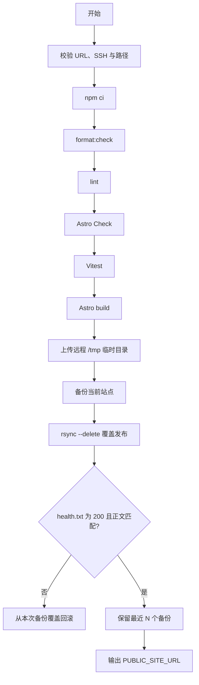

# 不靠免密 sudo 的静态站发布：目录授权、严格健康检查与重复覆盖

## 背景

ZGLab Tools 是一个 Astro 静态站点。生产环境只需要 Nginx 读取 `dist/`，日常发布不会修改 Nginx 配置，也不需要重启服务。

早期部署脚本为了操作 `/var/www` 和 `/var/backups`，在远程阶段通过 `sudo -n` 执行：

- `mkdir`；
- `rsync`；
- `chown`；
- `chmod`；
- `find`；
- `nginx -t`。

这种写法只有在服务器为这些命令配置免密 sudo 后才能自动运行。为了让一个静态文件发布脚本工作而放宽多条 root 命令，不符合当前个人服务器的最小权限目标。

后续方案改为：

1. 管理员首次创建目录并授权部署用户；
2. 日常部署完全不使用 sudo；
3. 静态文件更新不重复 chown；
4. 只有首次创建或修改 Nginx 配置时运行 `nginx -t`。

## 环境与目标目录

当前目标环境：

- Ubuntu 24.04；
- Nginx；
- 默认部署用户 `ubuntu`；
- Nginx 用户组 `www-data`；
- 站点目录 `/var/www/tools.zglab.fun`；
- 备份目录 `/var/backups/tools.zglab.fun`；
- 远程临时目录 `/tmp/zglab-tools-dist`。

首次由管理员执行：

```bash
sudo apt update
sudo apt install -y nginx rsync curl

sudo install -d -o ubuntu -g www-data -m 0755 \
  /var/www/tools.zglab.fun \
  /var/backups/tools.zglab.fun
```

目录所有者 `ubuntu` 负责写入，Nginx 只需要遍历 `755` 目录并读取 `644` 文件。日常脚本不需要 root 权限。

如果这些目录已经存在且包含文件，`chown -R` 和权限调整属于一次性迁移操作。执行前必须确认路径，不能把递归权限命令扩大到 `/var/www` 或 `/var/backups` 根目录。

## 日常发布流程



完整本地检查顺序是：

```bash
npm ci
npm run format:check
npm run lint
npm run check
npm run test
npm run build
```

任何一步失败都不会进入远程覆盖阶段。

## 为什么日常部署不需要 `nginx -t`

`nginx -t` 检查的是 Nginx 配置语法和引用文件，不是静态 HTML 是否正确。

日常部署只替换：

```text
/var/www/tools.zglab.fun/
```

不会修改：

```text
/etc/nginx/nginx.conf
/etc/nginx/sites-available/
/etc/nginx/sites-enabled/
```

因此，只有首次启用或修改站点配置时需要：

```bash
sudo ln -sfn \
  /etc/nginx/sites-available/tools.zglab.fun \
  /etc/nginx/sites-enabled/tools.zglab.fun
sudo nginx -t
sudo systemctl reload nginx
```

把 `nginx -t` 放进每次静态文件发布，不仅没有增加页面内容校验，还迫使部署用户获得额外 sudo 权限。

## 路径校验为什么必须在 rsync 之前

`rsync --delete` 会让目标目录与源目录一致。目标多出的文件会被删除，因此部署目录必须是专用静态目录。

当前脚本要求：

- `DEPLOY_ROOT` 位于 `/var/www/` 的非根子目录；
- `DEPLOY_TMP` 位于 `/tmp/` 的非根子目录；
- `DEPLOY_BACKUP_ROOT` 位于 `/var/backups/` 的非根子目录；
- 路径不能为空；
- 路径不能是 `/` 或前缀根目录本身；
- 拒绝 `.`、`..`、重复斜杠和非安全字符；
- `DEPLOY_SERVER` 必须使用安全的 `user@host` 格式；
- `DEPLOY_BACKUP_KEEP` 必须是大于 0 的整数。

已经实际执行过的拒绝测试包括：

- 把 `DEPLOY_ROOT` 设置为 `/var/www`；
- 把临时目录设置到 `/var/tmp`；
- 在备份路径中加入 `..`；
- 把备份保留数设置为 0；
- 在路径中加入 Shell 元字符；
- 将站点 URL 写成带凭据的形式；
- 显式传入空的部署路径。

这些输入都在 npm 和远程操作之前返回非零状态。

## 覆盖发布不是真正的原子发布

当前发布使用：

```bash
rsync -a --delete --chmod=D755,F644 \
  "${deploy_tmp}/" \
  "${deploy_root}/"
```

它会覆盖同名文件并删除新构建中不存在的旧文件。再次执行部署脚本时，会自动用新的 `dist/` 覆盖服务器版本，不需要手工删除旧站。

但这不是原子切换。同步过程中，目标目录会逐步变化。即使窗口很短，访问者理论上仍可能看到新旧资源混合状态。

当前方案通过三项措施降低风险：

1. 覆盖前完整备份旧站；
2. 在 rsync 开始前将 `published=true`，确保中途失败也进入回滚；
3. 发布后立即执行严格健康检查。

如果未来需要真正的原子发布，可以采用版本目录加 `current` 软链接切换，但这会增加 Nginx 路径、软链接权限和备份管理复杂度。对于当前低频更新的个人静态工具站，覆盖发布加失败回滚是可以接受的取舍。

## 健康检查必须验证状态和正文

只执行：

```bash
curl --fail <site-url>
```

不足以证明新版本已经正确发布。首页可能被缓存，301/302 也可能让检查逻辑产生误判，错误页面还可能返回 200。

项目新增：

```text
public/health.txt
```

固定内容为：

```text
zglab-tools-ok
```

构建后它应出现在：

```text
dist/health.txt
```

发布脚本请求：

```text
${PUBLIC_SITE_URL}/health.txt
```

并同时要求：

1. HTTP 状态码严格等于 `200`；
2. 响应正文与构建产物逐字节一致。

脚本不跟随重定向，所以 301 和 302 都会失败。正文不匹配时，即使状态是 200，也会触发回滚。

这条健康检查验证的是“指定静态构建是否已经能够通过公开站点读取”，而不是 Nginx 进程的全部健康状态。

## 失败回滚为什么要覆盖原目录

发布前创建时间戳备份：

```text
/var/backups/tools.zglab.fun/20260717T120000Z/
```

失败后执行：

```bash
rsync -a --delete --chmod=D755,F644 \
  "${backup_dir}/" \
  "${deploy_root}/"
```

回滚也使用 `--delete`，因为目标可能已经写入只属于失败版本的新哈希资源。如果回滚只复制旧文件而不删除新文件，目录会残留两套资源。

首次部署没有旧站时，脚本创建空备份目录作为回滚源。如果发布失败，空备份可以清除已经写入的部分文件；成功后这个空目录会被移除。

## 备份清理必须限制作用域

默认配置：

```dotenv
DEPLOY_BACKUP_KEEP=10
```

成功发布后，脚本只扫描备份根目录的直接子目录：

```bash
find "$backup_root" \
  -mindepth 1 \
  -maxdepth 1 \
  -type d \
  -name '20??????T??????Z'
```

随后按名称倒序保留最近 N 个。

这里的安全边界是：

- 不递归搜索其他位置；
- 只处理时间戳格式目录；
- 删除前再次确认候选目录的父目录就是备份根目录；
- 健康检查成功后才开始清理。

备份清理是破坏性操作。即使已有前缀和格式校验，也应定期人工检查目录与磁盘空间。

## 重复部署时会发生什么

再次运行：

```bash
./scripts/deploy.sh
```

会自动：

1. 重新安装锁定依赖并运行全部检查；
2. 重新构建 `dist/`；
3. 上传远程临时目录；
4. 备份当前线上版本；
5. 覆盖同名文件；
6. 删除不再属于新 `dist/` 的旧文件；
7. 检查 `health.txt`；
8. 失败回滚，成功清理超量备份。

因此，**不要直接在服务器站点目录手工修改 HTML、CSS 或图片**。这些改动下次部署会被覆盖或删除。本地仓库和构建结果应成为唯一发布源。

## 当前验证状态

截至 2026-07-17，已经验证：

- 部署脚本通过 `bash -n`；
- 本地完整检查链通过；
- 5 个测试文件共 60 项测试通过；
- Astro 构建成功并生成 8 个页面；
- `dist/health.txt` 存在且内容精确匹配；
- 多组危险路径和配置被脚本拒绝；
- 脚本中不存在日常 `sudo`、`chown` 和 `nginx -t`；
- 用户已完成一次服务器上传。

最新的顶部导航精简仍处于本地调试阶段，本文不声称该界面版本已经再次部署。

## 经验总结

静态站点发布的最小权限原则可以概括为：

1. 管理员只在首次准备目录和 Nginx 配置时使用 sudo；
2. 部署用户只写自己拥有的站点、备份和临时目录；
3. 日常发布不修改 Nginx，不重复 chown；
4. `rsync --delete` 前必须验证路径并完成备份；
5. 覆盖发布要诚实说明它不是原子发布；
6. 健康检查同时验证固定路径、精确状态码和固定正文；
7. 回滚与备份清理都要限制作用域。

相关笔记：

- [从构建到上线：Ubuntu 24.04 + Nginx 部署 Astro 静态网站](deploy-astro-static-site-with-nginx.md)
- [静态网站也需要工程化](../knowledge/static-site-release-and-runtime-boundaries.md)
- [应用已经启动，却被发布脚本自动回滚](../problems/stale-health-check-causes-false-rollback.md)
